# Especificação mestre do marketplace de serviços locais

| Metadado | Valor |
|---|---|
| Documento | Especificação funcional, técnica, operacional e estratégica |
| Versão | 1.0-rc1 |
| Data-base | 18/07/2026 |
| Status | Especificação completa para validação executiva, jurídica, tributária e com PSP |
| Mercado inicial | Brasil |
| Idioma e moeda | Português do Brasil, BRL |
| Canal inicial | Web responsiva |
| Responsáveis | Produto, Engenharia, Operações, Risco, Financeiro, Segurança, Privacidade e Jurídico |

> Este documento não é parecer jurídico, contábil, tributário, regulatório ou securitário. Os fluxos marcados para validação não podem entrar em produção antes do aceite formal da área indicada.

## Convenções

| Marcador | Significado |
|---|---|
| **[OBR]** | Requisito obrigatório para a fase indicada |
| **[REC]** | Recomendação que pode ser alterada mediante decisão registrada |
| **[HIP]** | Hipótese a validar com pesquisa ou dados |
| **[DEP]** | Dependência externa ou organizacional |
| **[RISCO]** | Ameaça que exige mitigação e acompanhamento |
| **[PEND]** | Decisão pendente com dono e prazo |
| **[FDE]** | Fora do escopo da fase indicada |

Frases normativas sem marcador explícito que usem “deve”, “exige”, “não pode”, “é proibido” ou forma equivalente são **[OBR]** para a fase indicada no título/contexto. Hipótese, recomendação, dependência, risco, pendência e fora de escopo sempre usam marcador próprio.

Prioridades usadas neste documento:

- **P0**: bloqueia lançamento, integridade financeira, segurança ou conformidade.
- **P1**: necessário para validar a proposta de valor do MVP.
- **P2**: relevante após prova inicial de liquidez e operação.
- **P3**: otimização ou expansão.

---

# 1. Resumo executivo

## 1.1 Tese do produto

**[HIP]** Há demanda suficiente, em uma região piloto e em categorias de risco baixo ou moderado, por uma experiência que reduza quatro incertezas: encontrar oferta disponível, comparar escopo real, formalizar o combinado e pagar com rastreabilidade.

**[OBR]** A plataforma conectará clientes e profissionais independentes, mas não prometerá qualidade, segurança física, resultado, disponibilidade ou reembolso irrestrito. Ela fornecerá descoberta, registro das condições, processamento de pagamento por provedor autorizado, suporte e mediação privada dentro de regras publicadas.

**[OBR]** O objetivo econômico é aumentar a quantidade de **serviços concluídos com sucesso e pagos pela plataforma**, e não maximizar cadastros, leads vendidos ou GMV sem qualidade.

## 1.2 Corte recomendado do MVP

| Dimensão | Decisão do MVP | Razão |
|---|---|---|
| Geografia | Uma região metropolitana a definir | Concentra oferta, demanda, suporte e aquisição |
| Categorias | 3 a 5 categorias não reguladas, de risco baixo ou moderado | Reduz heterogeneidade operacional e física |
| Contratação | Pedido, proposta personalizada e contratação imediata apenas para serviços padronizados | Valida os dois principais modos sem motor genérico excessivo |
| Pagamento | Pix e cartão, pagamento integral, um PSP de marketplace com split/regras de recebedor | Reduz reconciliação e risco regulatório |
| Repasse | Conforme agenda e capacidades contratuais do PSP; plataforma não custodia recursos | Evita atividade financeira própria |
| Agenda | Disponibilidade semanal, exceções e bloqueio temporário no checkout | Resolve o risco de dupla reserva |
| Comunicação | Chat de texto, imagem e documento com moderação e antimalware | Preserva evidência sem complexidade de áudio/vídeo |
| Confiança | Identidade, telefone, e-mail e conta de recebimento verificadas de forma progressiva | Distingue identidade de qualificação |
| Operação | Administração, suporte, moderação, disputa simples e conciliação diária | Torna o piloto operável e auditável |
| Canais | Web responsiva | Menor custo e tempo de aprendizado |
| Monetização | Comissão explícita por transação concluída | Alinha receita ao valor entregue |

**[FDE MVP]** Pagamentos por etapas, recorrência, assinatura, patrocínio, compra de leads, carteira própria, antecipação própria, seguro próprio, apps nativos, B2B e serviços regulados.

## 1.3 Modelo econômico de referência

**[HIP]** Para permitir projeções antes da negociação comercial:

- Comissão cobrada do profissional: **15% do valor bruto contratado**, incluindo mão de obra, materiais vendidos no contrato e deslocamento.
- Taxa de processamento Pix/cartão: absorvida pela comissão no MVP e registrada separadamente no ledger como custo do PSP.
- Juros de parcelamento: pagos pelo cliente somente se optar por parcelamento; valor e CET/condições aplicáveis aparecem antes da confirmação.
- Taxa de conveniência do cliente: zero no MVP.
- Taxa de cancelamento: zero como receita da plataforma no MVP; valores de visita, deslocamento ou materiais só podem ser retidos conforme matriz publicada, evidência e lei.
- Antecipação: não oferecida pela plataforma no MVP.

**VALIDAÇÃO CONTÁBIL/TRIBUTÁRIA OBRIGATÓRIA.**
**VALIDAÇÃO JURÍDICA OBRIGATÓRIA.**
**VALIDAÇÃO COM PROVEDOR DE PAGAMENTO.**

Esta hipótese não autoriza cobrança. Antes do lançamento, uma tabela comercial versionada deverá definir base, arredondamento, incidência de desconto, responsável por custo do PSP, reembolso, chargeback e documentos fiscais.

## 1.4 Decisões que bloqueiam desenvolvimento financeiro

| Gate | Evidência necessária | Dono |
|---|---|---|
| Papel jurídico das partes | Parecer e contratos definindo plataforma, cliente, profissional e PSP | Jurídico |
| PSP | RFP concluída, contrato, sandbox homologado, split, KYC, reembolso, chargeback, agenda de repasse e webhooks validados | Financeiro + Engenharia |
| Tributação | Matriz PF/PJ, natureza da comissão e documentos fiscais | Contábil/Tributário |
| Categorias piloto | Política de permitidos, restritos e proibidos aprovada | Produto + Trust & Safety + Jurídico |
| Política de cancelamento | Simulações, direito de arrependimento e cenários presenciais/remotos validados | Jurídico + Operações |
| Retenção | Tabela de prazos e bases legais aprovada pelo encarregado | Privacidade + Jurídico |
| Unit economics | Margem após PSP, suporte, fraude, reembolso, aquisição e tributos | Financeiro + Growth |

## 1.5 Resultado esperado do piloto

O piloto é aprovado para expansão se, por duas coortes mensais consecutivas:

- a North Star e as métricas de liquidez atingirem os limiares definidos no plano de experimento;
- não houver falha P0 de integridade financeira ou exposição indevida de endereço;
- a conciliação fechar com divergência financeira não explicada igual a zero;
- disputas graves, cancelamentos e chargebacks ficarem abaixo dos limites aprovados por categoria;
- clientes e profissionais repetirem uso com margem de contribuição não negativa na coorte madura;
- suporte e verificação cumprirem os SLAs sem fila crescente.

---

# 2. Visão do produto

## 2.1 Visão

Ser o canal mais confiável e rastreável para contratar serviços locais no Brasil, transformando uma necessidade ambígua em escopo comparável, compromisso registrado, execução acompanhável e pagamento conciliável.

## 2.2 Problemas a resolver

| Ator | Problema atual | Resposta do produto | Limite da plataforma |
|---|---|---|---|
| Cliente | Não sabe quem atende, quando, por quanto e com qual histórico | Busca local, perfil, disponibilidade, pedido e propostas comparáveis | Não certifica qualidade futura |
| Cliente | Combinados mudam sem registro | Snapshot contratual, chat, anexos e aditivo com aceite explícito | Não substitui contrato específico exigido por lei |
| Profissional | Leads sem intenção, fora da área ou sem escopo | Elegibilidade por localização/categoria e pedido estruturado | Não garante contratação |
| Profissional | Dificuldade de agenda, cobrança e comprovação | Reserva, status, PSP, extrato e evidências | Não oferece conta, crédito ou custódia própria |
| Operação | Disputas sem fatos verificáveis | Linha do tempo, versões, auditoria e matriz de decisão | Mediação privada, não decisão judicial |
| Negócio | Receita desalinhada a valor | Comissão sobre transações internas | Não penaliza negociação externa sem processo proporcional |

## 2.3 Proposta de valor

### Para clientes

Encontrar, comparar, formalizar e acompanhar profissionais adequados à necessidade, com preço, políticas e histórico visíveis antes de contratar.

### Para profissionais

Receber oportunidades elegíveis, converter propostas em contratos, organizar agenda e acompanhar recebíveis e reputação sem depender de processos paralelos.

### Para o ecossistema

Reduzir assimetria de informação e disputas causadas por escopo, preço, prazo e evidência insuficientes.

## 2.4 Princípios de produto

1. **Transparência antes do aceite:** preço, taxas, políticas e papel das partes aparecem antes de qualquer confirmação.
2. **Consentimento verificável:** contratação, aditivo, cancelamento e decisões financeiras geram evidência datada e versionada.
3. **Separação de estados:** contrato, pagamento, ledger, repasse e disputa nunca compartilham um único status.
4. **Privacidade por padrão:** localização aproximada é pública; endereço completo é liberado somente por finalidade legítima.
5. **Automação reversível:** decisões de alto impacto admitem revisão humana e recurso.
6. **Operação antes da escala:** nenhum fluxo é lançado sem fila, SLA, alçada, runbook e dono.
7. **Complexidade ganha por evidência:** microsserviços, IA, carteira, recorrência e múltiplos PSPs exigem necessidade demonstrada.

## 2.5 Posicionamento e limites

**[OBR]** A plataforma deverá:

- identificar conteúdo patrocinado;
- diferenciar verificação de identidade, documento, empresa, conta bancária e habilitação regulada;
- informar quando uma avaliação deriva de contratação paga internamente;
- explicar a proteção transacional sem usar “100% seguro”, “risco zero”, “garantia total”, “pagamento garantido” ou equivalentes;
- informar que emergências devem ser direcionadas aos serviços públicos competentes, sem divulgar número de emergência sem validação regional na interface;
- preservar canais de denúncia e recurso.

**[OBR]** A plataforma não deverá:

- assumir a posição de empregadora por linguagem, controles ou promessas incompatíveis com o modelo aprovado;
- armazenar PAN completo, CVV ou credenciais bancárias;
- receber valores em conta operacional para repassar manualmente;
- chamar agenda do PSP de “escrow”, “custódia” ou “conta garantia”;
- vender posição orgânica de forma oculta;
- indexar endereço completo, documentos, conversas, pedidos privados ou páginas administrativas.

---

# 3. Objetivos e indicadores

## 3.1 North Star Metric

**Serviços concluídos com sucesso e pagos internamente (SCSP)** no período:

```text
SCSP = contagem distinta de contract_id
onde:
  Contract.status = COMPLETED
  AND completion_mode IN (CLIENT_CONFIRMED, AUTO)
  AND gross_paid_minor > 0
  AND net_paid_minor > 0
  AND unresolved_severe_dispute = false
  AND severe_dispute_confirmed = false
  AND fraud_confirmed = false
  AND test_account = false
  AND maturity_window_elapsed = true
```

Janela de qualidade recomendada: **30 dias após a conclusão**, sem impedir o fechamento operacional anterior. Relatórios preliminares usam coorte “a maturar”; relatórios executivos usam apenas coortes maduras.

`net_paid_minor` é o valor pago internamente menos reembolsos confirmados e chargebacks confirmados atribuíveis ao contrato. Disputa grave aberta mantém a coorte imatura até decisão. `completion_mode` descreve como se chegou a `COMPLETED`; não é estado. Elegibilidade ou falha de payout é guardrail operacional separado e não altera se o serviço resolveu a necessidade.

### Por que esta métrica representa valor

- Cadastro mede intenção, não solução.
- Visita mede distribuição, não correspondência.
- Proposta mede atividade da oferta, não aceite.
- GMV pode crescer com cancelamentos, fraude, reembolsos ou concentração.
- SCSP só cresce quando houve pagamento, execução registrada e ausência de sinal grave de falha.
- A métrica alinha Produto, Growth, Operações, Risco e Financeiro sem incentivar ticket artificial.

### Guardrails

SCSP nunca será analisado isoladamente. Deve ser acompanhado de:

- taxa de disputa grave;
- taxa de reembolso e chargeback;
- cancelamento por parte e motivo;
- incidentes de segurança física;
- satisfação de cliente e profissional;
- concentração de oferta e exposição patrocinada;
- margem de contribuição por categoria/região;
- taxa de contratação interna;
- tempo de resolução de suporte;
- acessibilidade e desempenho.

## 3.2 Árvore de métricas

| Grupo | Métrica | Definição auditável | Frequência | Dono |
|---|---|---|---|---|
| Valor | SCSP | Fórmula acima, por coorte madura | Diário/mensal | Produto |
| Demanda | Pedidos elegíveis | Pedidos publicados, não fraude/duplicado, com categoria e região atendidas | Diário | Growth |
| Oferta | Profissionais ativados | Perfil aprovado + serviço publicado + área + disponibilidade + recebedor apto | Diário | Supply |
| Liquidez | Coverage rate | Oportunidades com ao menos uma oferta elegível apresentada/notificada / oportunidades elegíveis | Diário | Marketplace |
| Liquidez | Proposal match rate | Pedidos com ao menos 1 proposta qualificada / pedidos elegíveis maduros | Diário | Marketplace |
| Liquidez | Fill rate | Pedidos convertidos em contrato / pedidos elegíveis | Semanal | Marketplace |
| Velocidade | Tempo até primeira proposta | p50/p90 entre publicação e primeira proposta elegível | Diário | Produto |
| Conversão | Proposta para aceite | Propostas aceitas / propostas visualizadas | Semanal | Produto |
| Pagamento | Internal payment rate | Contratos pagos internamente / contratos criados | Semanal | Pagamentos |
| Execução | Completion rate | Concluídos / confirmados com janela madura | Semanal | Operações |
| Retenção | Repeat SCSP rate 90d | Clientes com novo SCSP em 90 dias / clientes com primeiro SCSP | Mensal | Growth |
| Retenção | Repeat booking rate 90d | Clientes com nova contratação paga em 90 dias / clientes com primeira contratação paga | Mensal | Growth |
| Financeira | GMV capturado | Soma capturada, antes de reembolsos, sem duplicidade | Diário | Financeiro |
| Financeira | Net GMV | Capturas menos reembolsos e chargebacks confirmados | Diário | Financeiro |
| Financeira | Take rate bruta | Receita contratual da plataforma / Net GMV | Mensal | Financeiro |
| Financeira | Margem de contribuição | Receita menos PSP, fraude, suporte variável, promoções e tributos variáveis | Mensal | Financeiro |
| Qualidade | Taxa de sucesso sem disputa grave | SCSP / contratos confirmados e pagos internamente cuja coorte completou a janela de maturação | Mensal | Operações |
| Risco | Chargeback rate | Valor em chargeback / valor capturado por coorte e método | Semanal | Risco |
| Risco | Loss rate | Perda líquida confirmada / Net GMV | Mensal | Risco |
| Experiência | Taxa de resposta | Solicitações respondidas no SLA / solicitações entregues | Semanal | Produto |
| Reputação | Avaliações verificadas | Reviews publicadas ligadas a contrato elegível / concluídos | Mensal | Trust |

## 3.3 Segmentação obrigatória

Toda métrica executiva deverá aceitar cortes por:

- coorte temporal;
- região e distância;
- categoria/subcategoria;
- cliente novo/recorrente;
- profissional novo/maduro/parceiro;
- modo de contratação;
- dispositivo/canal;
- método de pagamento;
- faixa de preço;
- origem orgânica/paga;
- nível de verificação;
- grupo de experimento.

**[OBR]** Dashboards devem suprimir ou agregar células pequenas que permitam reidentificação.

## 3.4 Metas do MVP

**[PEND]** Limiares quantitativos só serão definidos após sizing da região, pesquisa de preço e 4 semanas de baseline. O go-live deverá conter metas para:

- profissionais ativados por categoria e microrregião;
- densidade mínima de horários disponíveis;
- p90 de primeira proposta;
- fill rate;
- SCSP semanal;
- cancelamento;
- disputa;
- margem de contribuição;
- SLA de suporte;
- divergência de conciliação.

Critério de aceite: cada meta possui fórmula SQL/semântica, fonte, dono, periodicidade, limite e ação quando violada.

---

# 4. Premissas

## 4.1 Premissas fornecidas

| ID | Premissa | Consequência de projeto |
|---|---|---|
| PRE-001 | Lançamento no Brasil | LGPD, CDC, Marco Civil, regras fiscais e PSP local entram no gate |
| PRE-002 | BRL e pt-BR | Valores em centavos inteiros; locale explícito; conteúdo jurídico em pt-BR |
| PRE-003 | Web responsiva primeiro | API independente de canal e design mobile-first |
| PRE-004 | Expansão regional/nacional | Região, fuso, moeda, idioma e políticas são dados configuráveis |
| PRE-005 | PSP autorizado e adequado a marketplace | Nenhum dado completo de cartão ou custódia pela plataforma |
| PRE-006 | Endereço protegido | Geohash/coordenada pública degradada; acesso ao endereço por ABAC |
| PRE-007 | WCAG 2.2 AA | Critérios automatizados e manuais no Definition of Done |
| PRE-008 | Categorias controladas | Taxonomia contém nível de risco e requisitos documentais |
| PRE-009 | Fuso do usuário | Instantes em UTC; zona IANA e offset persistidos no evento/agendamento |
| PRE-010 | Navegadores modernos | Matriz suportada publicada e telemetria de incompatibilidade |

## 4.2 Premissas e decisões adotadas

| ID | Tipo | Decisão | Por quê | Critério de revisão |
|---|---|---|---|---|
| PDA-001 | **[REC]** | Piloto em uma região metropolitana | Liquidez local e operação concentrada | SCSP e oferta sustentáveis por microrregião |
| PDA-002 | **[REC]** | 3 a 5 categorias de baixo/médio risco | Menor fraude, dano físico e carga documental | Política e capacidade operacional aprovadas |
| PDA-003 | **[OBR]** | Usuário único com contextos cliente/profissional | Evita identidade duplicada sem misturar permissões | Não revisar sem ADR |
| PDA-004 | **[OBR]** | IDs públicos UUIDv7 opacos; internos nunca expostos sequencialmente | Reduz enumeração e preserva ordenação operacional | Teste de contrato de API |
| PDA-005 | **[REC]** | Monólito modular e PostgreSQL | Menor custo cognitivo, transações fortes e migração posterior possível | Gargalo medido ou autonomia de equipes |
| PDA-006 | **[OBR]** | Outbox transacional para eventos | Evita atualização sem evento ou evento sem commit | Teste de falha e replay |
| PDA-007 | **[OBR]** | Ledger próprio de dupla entrada | Auditoria e conciliação independentes do PSP | Fechamento diário |
| PDA-008 | **[REC]** | Um PSP no MVP atrás de adapter | Reduz operação; limita lock-in técnico | Incidente/comercial ou escala justifica segundo PSP |
| PDA-009 | **[OBR]** | Plataforma não mantém saldo sacável nem recebe para repasse manual | Reduz risco regulatório e financeiro | Somente com parecer, licença/modelo e novo ADR |
| PDA-010 | **[REC]** | Conclusão automática após 72 horas corridas | Evita contratos indefinidos com tempo para contestar | Dados de disputa e validação jurídica |
| PDA-011 | **[HIP]** | Classe baseline de 5 anos para evidência selecionada ligada a contrato e 180 dias sem contrato | Equilíbrio entre defesa e minimização, sem reter conversa inteira por padrão | Tabela legal e teste de lifecycle |
| PDA-012 | **[OBR]** | Decisões de alto impacto não são irreversíveis e exclusivamente automáticas | Recurso, não discriminação e controle de falsos positivos | Auditoria trimestral |
| PDA-013 | **[REC]** | Busca inicial em PostgreSQL FTS + `pg_trgm` + PostGIS | Custo e consistência adequados ao piloto | p95, relevância ou volume exceder SLO |
| PDA-014 | **[OBR]** | Preço, taxas, juros, política e cronograma em snapshot antes do aceite | Transparência e prova | E2E e auditoria de contrato |
| PDA-015 | **[HIP]** | Comissão de 15% paga pelo profissional | Alinha receita e reduz fricção do cliente | Unit economics e pesquisa |

## 4.3 Restrições

- **[OBR]** Valores monetários usam inteiro em centavos e código ISO 4217; ponto flutuante é proibido.
- **[OBR]** Eventos e dados financeiros não podem ser apagados; correção é compensatória.
- **[OBR]** Operações externas não são tratadas como contratação verificada.
- **[OBR]** Mudança de preço, política ou serviço não altera snapshots aceitos.
- **[OBR]** Nenhum operador administrativo consulta dado pessoal sem finalidade, permissão, justificativa e log.
- **[DEP]** Capacidades de retenção de saldo, split, parcelamento, chargeback e repasse dependem do contrato e produto efetivamente habilitado pelo PSP.
- **[DEP]** Certificações profissionais dependem de fontes emissoras e processo operacional por categoria.
- **[RISCO]** Baixa densidade geográfica invalida ranking, agenda e promessa de tempo de resposta mesmo com software correto.

## 4.4 Inconsistências identificadas e correções adotadas

| Contradição | Impacto | Correção adotada | Decisão ainda necessária |
|---|---|---|---|
| “Pagamento por etapas” versus MVP enxuto | Eleva estados, conciliação, disputa e PSP | Modelo previsto, implementação na Fase 2 | Validar demanda e capacidade do PSP |
| “Retenção até conclusão” versus proibição de custódia própria | Risco regulatório | PSP controla agenda/liquidação; plataforma apenas instrui conforme contrato | Parecer e contrato do PSP |
| “Pedido público” versus proteção de localização | Risco físico e privacidade | Somente bairro/cidade ou célula geográfica; anexos privados por padrão | Granularidade por categoria |
| “Telefone e código” versus prevenção de SIM swap | Tomada de conta | OTP não basta para ação financeira; reautenticação e step-up | Fornecedor e regras de risco |
| “Avaliação paga não reembolsável” versus consumidor | Cláusula potencialmente inválida | Não lançar no MVP; política por cenário após parecer | **VALIDAÇÃO JURÍDICA OBRIGATÓRIA** |
| “Garantia do profissional” versus expectativa de plataforma | Risco de indução | Exibir emissor, escopo, prazo e exclusões; nunca como garantia da plataforma | Template jurídico |
| “Taxa em cancelamento” versus transparência/legalidade | Receita controversa | Plataforma não monetiza cancelamento no MVP | Revisar com dados e parecer |
| “Zero de nota” versus escala 1 a 5 | Distorce reputação | `rating = null` para ausência; zero só em apresentação analítica, nunca média | Nenhuma |
| “Disponibilidade pública” versus confirmação | Corrida e scraping | Mostrar faixas indicativas; confirmar slot no servidor e criar hold | Nenhuma |
| “Um usuário em dois papéis” versus dados financeiros separados | Vazamento e confusão contábil | Identidade única, perfis/contextos e recebedor separados | Nenhuma |

---

# 5. Escopo e não escopo

## 5.1 Escopo do MVP

| Capacidade | Entrega mínima | Problema resolvido | Critério de aceite resumido |
|---|---|---|---|
| Páginas públicas | Home, categorias, cidades, busca e perfil público | Descoberta sem cadastro | Indexáveis sem dado sensível; LCP alvo atendido |
| Identidade | E-mail/senha, telefone/OTP, verificação, recuperação e sessões | Acesso e rastreabilidade | Antienumeração, rate limit e revogação testados |
| Perfil profissional | Bio, serviços, área, mídia, preços, agenda e selos específicos | Comparação de oferta | Privacidade e status de moderação aplicados |
| Catálogo | Categoria, subcategoria, risco e requisitos | Controle de escopo | Categoria não aprovada não publica |
| Pedido | Formulário estruturado, anexos e localização aproximada | Captura de necessidade | Endereço nunca aparece no público |
| Proposta | Versões, escopo, preço, prazo, validade e aceite | Comparabilidade e compromisso | Aceite cria snapshot imutável |
| Contrato | Linha do tempo e estados essenciais | Acompanhamento | Toda transição autorizada e auditada |
| Agenda | Recorrência básica, exceção, bloqueio e hold | Disponibilidade | Teste concorrente impede dupla reserva |
| Pagamento | Pix/cartão integral, webhook, refund e conciliação | Conversão interna | Idempotência e ledger fecham por evento |
| Repasse | Visibilidade da agenda/status do PSP | Previsibilidade ao profissional | Estado separado de pagamento |
| Chat | Texto, foto, PDF, sistema, denúncia e bloqueio | Comunicação com evidência | Antimalware e autorização por conversa |
| Avaliação | Nota, critérios, comentário e resposta | Reputação ligada a execução | Apenas contrato elegível e uma por parte |
| Disputa básica | Motivo, evidência, resposta, decisão e recurso | Mediação rastreável | SLA, alçada e efeito financeiro explícitos |
| Administração | Filas de verificação, moderação, risco, suporte e financeiro | Operabilidade | MFA, RBAC, justificativa e auditoria |
| Analytics | Funil, liquidez, SCSP, qualidade e finanças | Aprendizado | Eventos versionados e sem PII excessiva |

## 5.2 Classificação dos itens solicitados

| Item | Classificação | Justificativa e condição de entrada |
|---|---|---|
| Entrega de produtos físicos | **[FDE]** | Outro modelo logístico, tributário e de risco |
| Venda isolada de materiais | **[FDE]** | Permitido apenas como componente discriminado do serviço contratado |
| Marketplace B2B | Fase 3 | Contratos, faturamento, alçadas e equipes diferentes |
| Licitações | **[FDE]** | Regime jurídico e produto especializados |
| Leilão reverso | **[FDE]** | Incentiva corrida por menor preço e seleção adversa |
| Contratos recorrentes | Fase 2 | Requer recorrência, pausa, reajuste e cobrança cíclica |
| Gestão completa de equipes | Fase 3 | Identidade, agenda, permissão e repasse multiusuário |
| Folha de pagamento | **[FDE]** | Risco trabalhista e produto distinto |
| Emissão fiscal própria | **[FDE]** | Integração futura pode auxiliar; plataforma não emite em nome alheio sem base |
| Serviços financeiros próprios | **[FDE]** | Sem carteira, crédito, custódia ou antecipação própria |
| Seguros próprios | **[FDE]** | Parceria com seguradora pode ser Fase 3 |
| Franquias | **[FDE]** | Operação e contratos próprios |
| Operação internacional | Fase 3+ | Idioma, moeda, imposto, PSP e regulação por país |
| Serviços médicos, jurídicos ou financeiros | **[FDE]** | Alto risco, regulação e responsabilidade |
| Serviços físicos perigosos | **[FDE MVP]** | Só após política, documentos, seguro e operação especializados |
| Serviços regulados de baixo risco relativo | Fase futura condicionada | Exige gate documental específico e parecer |
| Apps Android/iOS | Fase 2 | Web valida fluxo antes do custo de dois canais |
| Pagamento por etapas | Fase 2 | Necessidade real para tickets altos, após reconciliação madura |
| Assinatura e patrocínio | Fase 2 | Só após marketplace demonstrar valor orgânico |

## 5.3 Categorias do piloto

**[PEND]** A lista final depende de pesquisa regional e avaliação jurídica/segurança. Critérios de elegibilidade:

1. demanda frequente e pesquisável;
2. escopo descrevível por fotos, medidas ou checklist;
3. baixa exigência de licença;
4. dano potencial limitado;
5. ticket compatível com pagamento digital;
6. oferta local suficiente;
7. cancelamento e evidência operacionalizáveis.

Exemplos candidatos, ainda não aprovados: montagem de móveis simples, pequenos reparos não estruturais, limpeza residencial não especializada, jardinagem leve e aulas particulares não reguladas.

Categorias inicialmente proibidas incluem intervenção em rede elétrica de alta tensão, gás, estrutura, saúde, segurança armada, transporte de valores, aconselhamento jurídico/financeiro, trabalho sexual, armas, drogas, atividades ilegais e qualquer serviço que exija habilitação não verificável.

## 5.4 Definition of Ready para uma categoria

Uma categoria só pode ser ativada quando possuir:

- taxonomia e sinônimos aprovados;
- nível de risco e modalidades permitidas;
- requisitos de identidade, documento e certificação;
- formulário de pedido e campos de proposta;
- unidade/preço e política de materiais;
- política de cancelamento, ausência e atraso;
- evidências esperadas para disputa;
- textos de segurança física e conteúdo proibido;
- regras de ranking e fraude;
- SLAs e treinamento de suporte;
- parecer jurídico quando regulada;
- dashboard de liquidez e risco.

## 5.5 Critério de aceite do escopo

O MVP está pronto para desenvolvimento quando cada item P0/P1:

- tem dono de produto e operação;
- possui fluxo feliz, erros e estados;
- possui critério Dado/Quando/Então;
- identifica dados pessoais e base legal candidata;
- identifica eventos analytics;
- identifica ação administrativa e alçada;
- possui dependência externa contratada ou mockável;
- está vinculado a pelo menos um teste.

---

# 6. Personas e papéis

## 6.1 Personas primárias

| Persona | Contexto | Necessidade | Comportamento/limitação | Resultado esperado |
|---|---|---|---|---|
| Cliente urgente | Problema com prazo curto, pouca referência técnica | Resposta rápida e escopo mínimo claro | Compara disponibilidade antes de detalhes | Contratação adequada sem ocultar risco/preço |
| Cliente planejador | Reforma, evento ou aula futura | Comparar propostas, portfólio, datas e condições | Usa anexos e negocia revisões | Snapshot completo e execução rastreável |
| Cliente recorrente | Demanda repetida no mesmo imóvel/região | Recontratar com pouco atrito | Valoriza histórico e favoritos | Nova contratação sem copiar dado obsoleto |
| Profissional autônomo | Trabalha sozinho, agenda variável | Oportunidades próximas e pagamento previsível | Celular é dispositivo principal | Responder, agendar e acompanhar recebível |
| Pequena empresa | CNPJ e um responsável operacional | Reputação empresarial e gestão simples | Representante pode mudar | Perfil verificado sem confundir PF/PJ |
| Operador de suporte | Atende dúvidas e casos | Contexto suficiente sem acesso excessivo | Pressão por SLA | Resolver dentro de alçada e deixar trilha |
| Analista de risco | Investiga sinais e perdas | Evidência agregada, regras e recurso | Falso positivo tem custo | Intervir proporcionalmente e medir eficácia |

## 6.2 Modelo de identidade e contexto

**[OBR]** `User` representa uma pessoa autenticável. Seu contexto cliente usa `UserProfile`; a atuação profissional pertence a uma pessoa ou `Organization` por `ProfessionalProfile`, mas:

- escolhe ou troca contexto de atuação de forma visível;
- cada mutação grava `actor_user_id`, `actor_role`, `acting_profile_id` e `correlation_id`;
- conta de recebedor, verificações e extrato profissional não se misturam a métodos de pagamento do cliente;
- uma suspensão pode atingir apenas o contexto profissional ou toda a identidade, conforme motivo;
- avaliações não podem ser feitas entre perfis controlados pela mesma identidade ou grupo detectado;
- telas e tokens de autorização não inferem papel apenas pela URL.

**[FDE MVP até Q-09]** O piloto habilita somente profissional PF. `owner_type=ORGANIZATION`, criação de `Organization` e comandos de representação permanecem desabilitados por feature flag e retornam `422 FEATURE_DISABLED` até que representação, KYC/KYB, recebedor PF/PJ e tratamento fiscal sejam homologados. A escolha segura evita publicar um onboarding PJ que não consiga concluir verificação ou repasse.

Após Q-09, o lifecycle PJ obrigatório será:

1. uma pessoa autenticada e verificada cria a organização em `DRAFT`, sem perfil público;
2. envia CNPJ, dados empresariais e evidência de poderes; o sistema cria `RepresentativeAssignment(role=OWNER, status=PENDING_VERIFICATION)`;
3. verificação empresarial e do representante evoluem separadamente; falha de uma não produz selo agregado;
4. representante com poder `representatives.manage` convida outra pessoa por identificador opaco; a convidada autentica, aceita e conclui a verificação antes de receber poderes;
5. concessão, redução ou revogação de poderes cria nova versão temporal; revogação é imediata para novos comandos e encerra sessões de contexto da organização;
6. ao menos um `OWNER` verificado deve permanecer ativo; troca do último responsável exige novo responsável aprovado antes do encerramento do anterior;
7. `ProfessionalProfile(owner_type=ORGANIZATION)` e recebedor do PSP só são ativados depois de KYB, representação e fiscal aptos;
8. organização mantém contratos, reputação, serviços e recebedor; representante mantém identidade, sessões e trilha próprias, sem transferência de credencial.

## 6.3 Matriz RBAC

Legenda: `L` leitura, `C` criação, `E` edição/ação, `A` aprovação, `-` vedado. Toda permissão está sujeita ao ABAC da seção 6.4.

| Recurso/ação | Visitante | Cliente | Profissional | Parceiro | Moderador | Suporte | Financeiro | Risco | Admin | Superadmin técnico |
|---|---:|---:|---:|---:|---:|---:|---:|---:|---:|---:|
| Conteúdo e perfil públicos | L | L | L | L | L | L | L | L | L | L |
| Conta e consentimentos próprios | - | L/C/E | L/C/E | L/C/E | L/E | L/E | L/E | L/E | L/E | L/E |
| Favorito próprio | - | L/C/E | L/C/E no contexto cliente | idem | - | - | - | - | - | - |
| Pedido próprio | - | L/C/E | L/C/E no contexto cliente | idem | L | L | - | L atribuído | L | - |
| Oportunidade elegível | - | - | L | L | L | L | - | L | L | - |
| Proposta própria | - | L recebida | L/C/E enviada | L/C/E enviada | L | L | - | L | L | - |
| Contrato do qual participa | - | L/E permitida | L/E permitida | idem | L por caso | L por caso | L financeiro | L por risco | L | - |
| Chat participante | - | L/C/E limitada | L/C/E limitada | idem | L por denúncia | L por ticket | - | L por caso | L excepcional | - |
| Pagamento próprio | - | L/C/E permitida | L recebimento | idem | - | L mascarada | L/E/A por alçada | L | L | - |
| Repasse próprio | - | - | L | L | - | L mascarada | L/E/A por alçada | L | L | - |
| Avaliação própria | - | L/C/E limitada | L/C/E limitada | idem | L/E moderação | L | - | L | L | - |
| Denúncia/disputa própria | - | L/C/E | L/C/E | idem | L/E | L/E atribuída | L/E efeito financeiro | L/E risco | L/A | - |
| Ocultar conteúdo | - | - | - | - | E | E temporário por alçada | - | E preventivo por alçada | A | - |
| Suspender contexto | - | - | - | - | E temporária | E temporária limitada | E por bloqueio financeiro | E temporária de risco | A | - |
| Reembolso | - | Solicitar | Solicitar/contestar | idem | Recomendar | E até alçada | E/A por alçada | Bloquear/recomendar | A | - |
| Ajuste de ledger | - | - | - | - | - | - | C proposta/A dupla | Recomendar | A dupla | - |
| Configuração comercial | - | - | - | - | - | - | L | L | E/A dupla | - |
| Papéis administrativos | - | - | - | - | - | - | - | - | A dupla por entitlement | - |
| Segredos/infraestrutura | - | - | - | - | - | - | - | - | - | E por JIT |
| Audit log | - | Próprios relevantes | Próprios relevantes | idem | L escopo | L escopo | L financeiro | L risco | L | L técnico sem conteúdo por padrão |
| Exportação massiva | - | Portabilidade própria | Dados próprios | idem | - | - | A dupla e finalidade | A dupla e finalidade | A dupla | - |

**[OBR]** “Parceiro” é um atributo/plano do perfil profissional, não um papel com acesso a dados de terceiros.

As colunas `Admin` e `Superadmin técnico` são personas para leitura da matriz, não papéis globais concedíveis. Em produção, `Admin` é composição temporária de entitlements específicos como `categories.manage`, `refund.approve.tier_3` ou `roles.approve`; não existe `admin:*`. Superadmin técnico opera infraestrutura por JIT e não concede papel de negócio, lê conteúdo ou aprova o próprio acesso.

Concessão privilegiada exige solicitante, aprovador e beneficiário distintos quando o beneficiário for um deles; impede autoatribuição, concessão ao próprio aprovador e elevação acima do entitlement do concedente. Dois operadores aprovam papel privilegiado, e break-glass não pode alterar permanentemente RBAC.

Modelo de autorização administrativa:

| Objeto | Responsabilidade | Invariante |
|---|---|---|
| `Entitlement` | Ação atômica sobre recurso, como `refund.approve.tier_3` | Código imutável e sem wildcard; namespace de IAM não se mistura a benefício comercial |
| `RoleDefinition` | Pacote versionado e revisável de entitlements | Versão publicada é imutável; alteração cria nova versão |
| `RoleEntitlement` | Relação explícita entre papel e entitlement | Não existe concessão implícita por nome, hierarquia ou tela |
| `RoleAssignment` | Papel concedido a uma pessoa, em escopo e período definidos | Expira por padrão quando privilegiado; nunca concede além do escopo delegável |
| `AdminApproval` + `AdminApprovalDecision` | Digest do comando e decisões independentes | Grant privilegiado só executa com duas aprovações válidas de pessoas distintas |

O conjunto efetivo é calculado a cada comando pela união de `RoleAssignment` ativo, `RoleEntitlement` da versão fixada, escopo ABAC e sessão com MFA/step-up. Cache de autorização usa TTL curto e é invalidado por revogação. Grant direto de `Entitlement` a usuário, wildcard, herança transitiva não declarada e edição retroativa de papel publicado são proibidos. Revogação de contenção pode ser imediata por `roles.revoke` e recebe revisão posterior; concessão nunca usa esse atalho. Acesso JIT privilegiado dura no máximo 8 horas, exige ticket, dispositivo gerenciado e recertificação trimestral das atribuições remanescentes.

O domínio **Autorização** é o único writer de `Entitlement`, `RoleDefinition`, `RoleEntitlement` e `RoleAssignment`. No MVP, o catálogo de papel é configuração como código: artefato versionado e assinado, PR com duas aprovações humanas distintas de Segurança/IAM, validação CI contra wildcard, autoelevação e escopo não delegável, e publicação por workload identity. O job grava digest, aprovadores, diff, versão e `AuthorizationCatalogPublished`; rollback publica nova versão, nunca edita a anterior. A API administrativa comum é somente leitura para o catálogo. Break-glass não publica catálogo.

## 6.4 Regras ABAC

Uma ação só é autorizada quando RBAC e todos os atributos aplicáveis forem verdadeiros:

| Atributo | Regra |
|---|---|
| Propriedade | Ator é dono ou participante explícito do recurso |
| Estado | Transição é permitida pela máquina de estados e versão esperada |
| Escopo operacional | Operador está atribuído ao caso, fila, região ou categoria |
| Finalidade | Acesso a PII informa código de finalidade e ticket/caso |
| Sensibilidade | Operador possui clearance para classe do dado |
| Autenticação | Sessão, MFA e reautenticação estão dentro da janela da ação |
| Risco | Conta/recurso não está bloqueado para a ação específica |
| Valor | Operador está abaixo da alçada; acima exige segundo aprovador distinto |
| Segregação | Criador não aprova o próprio ajuste, reembolso excepcional ou mudança de recebedor |
| Relacionamento | Endereço/chat só é acessível durante finalidade e janela válidas |
| Dispositivo | Ação administrativa ocorre em dispositivo gerenciado ou acesso JIT aprovado |

## 6.5 Alçadas iniciais

Valores são parâmetros, não constantes em código.

| Ação | Suporte N1 | Suporte N2 | Financeiro | Gestor | Dupla aprovação |
|---|---:|---:|---:|---:|---:|
| Crédito promocional | Até R$ 30 | Até R$ 100 | - | Até R$ 300 | Acima de R$ 300 |
| Reembolso aderente à política | Até R$ 100 | Até R$ 500 | Até R$ 2.000 | Até R$ 5.000 | Acima de R$ 5.000 |
| Reembolso excepcional | - | Recomenda | Até R$ 500 | Até R$ 2.000 | Acima de R$ 2.000 |
| Ajuste compensatório | - | - | Até R$ 500 | Até R$ 2.000 | Acima de R$ 2.000 |
| Suspensão | - | 72 h | Por risco financeiro | 30 dias | Banimento permanente |
| Exportação de dados | - | - | Escopo financeiro aprovado | Escopo de caso aprovado | Exportação massiva |

**[HIP]** Valores acima serão ajustados pelo apetite de risco. Critério de aceite: backend rejeita ação acima da alçada, registra tentativa e exige aprovador com identidade diferente.

## 6.6 Administradores

**[OBR]**:

- contas nominativas, sem compartilhamento;
- MFA resistente a phishing para administradores, preferencialmente WebAuthn/passkey;
- acesso de produção JIT, com expiração e aprovação;
- justificativa estruturada e texto livre;
- `before`, `after`, operador, instante UTC, IP reduzido/seguro, dispositivo e correlation ID;
- alertas de mudança de permissão, recebedor, política, preço global e ajuste financeiro;
- impersonação desabilitada no MVP; suporte usa visão assistida mascarada;
- “break glass” em cofre, uso alertado e revisão pós-incidente.

---

# 7. Jornada do cliente

## 7.1 Jornada principal por pedido e proposta

| Etapa | Ação do cliente | Resposta do sistema | Risco/controle | Evento principal |
|---|---|---|---|---|
| Descoberta | Busca categoria/região | Resultados orgânicos; patrocinados separados somente na Fase 2 | Sem localização exata | `SearchPerformed` |
| Avaliação | Abre perfis e avaliações | Mostra fatores de confiança e limitações | Selo específico, não genérico | `ProfessionalProfileViewed` |
| Intenção | Clica “solicitar orçamento” | Preserva URL/serviço e pede autenticação | Revalida após login | `RestrictedIntentSaved` |
| Cadastro | Verifica canal e aceita termos | Cria identidade e sessão | Antienumeração/fraude | `UserRegistered` |
| Pedido | Informa escopo, mídia, prazo e área | Valida categoria e remove metadados de mídia | Endereço não público | `RequestCreated` |
| Recebimento | Visualiza propostas | Compara mesma estrutura e versões | Sem ranking por preço isolado | `ProposalViewed` |
| Negociação | Pede revisão no chat | Mantém histórico, validade e versão | Versão anterior não some | `ProposalRevisionRequested` |
| Aceite | Confirma proposta | Cria snapshot e checkout | Preço/política revalidados | `ProposalAccepted` |
| Pagamento | Escolhe Pix/cartão | PSP processa; plataforma aguarda webhook | Hold de agenda e idempotência | `PaymentSubmitted` |
| Confirmação | Recebe comprovante/agenda | Contrato confirmado somente por estado confiável | Timeout não significa falha | `BookingConfirmed` |
| Execução | Acompanha status e conversa | Linha do tempo e alertas | Endereço apenas ao contratado | `ContractStatusViewed` |
| Mudança | Analisa aditivo | Aceita/recusa explicitamente | Sem cobrança tácita | `AmendmentDecided` |
| Conclusão | Confirma, pede correção ou contesta | Aplica janela e política | Sem liberação com disputa | `CompletionResponded` |
| Pós-serviço | Avalia e recebe recibo | Avaliação verificada moderável | Uma avaliação por parte | `ReviewCreated` |

## 7.2 Jornada de contratação imediata

1. Cliente escolhe serviço padronizado.
2. Sistema consulta disponibilidade indicativa e preço vigente.
3. Cliente informa data, faixa/local, respostas de escopo e anexos.
4. Backend revalida preço, área, requisitos e slot.
5. Sistema cria `booking_hold` com expiração visível.
6. Checkout exibe decomposição total e políticas.
7. Pagamento é submetido com idempotency key.
8. Webhook válido confirma pagamento.
9. Transação atômica confirma booking, contrato, ledger e outbox.
10. Hold expira ou é convertido; cliente recebe resultado inequívoco.

## 7.3 Exceções críticas

| Situação | Comportamento |
|---|---|
| Login/cadastro interrompe ação | Intenção assinada expira em 30 min; após autenticar, preço, slot e permissão são revalidados |
| Sem profissionais | Oferecer ampliar área/data ou salvar alerta; não inventar disponibilidade |
| Proposta expirada | Bloquear aceite e pedir nova versão |
| Preço alterado | Mostrar diferença e exigir novo aceite; nunca atualizar silenciosamente |
| PSP em timeout | Estado “processando”; não permitir nova cobrança até consulta/reconciliação |
| Hold expirado com pagamento aprovado tardio | Não confirmar slot; tentar alternativa ou reembolsar conforme runbook |
| Profissional suspenso | Bloquear nova contratação; contratos existentes passam por triagem operacional |
| Endereço incompatível | Não revelar endereço; pedir correção ou cancelar hold |
| Contestação da conclusão | Pausar elegibilidade de repasse quando suportado e abrir caso |

## 7.4 Critérios de experiência

- Retorno após autenticação preserva contexto não sensível.
- Nenhuma tela de pagamento apresenta valor diferente do snapshot sem novo aceite.
- Estado “processando” explica que repetir a ação pode duplicar intenção e oferece consulta.
- A pessoa pode navegar sem localização precisa e informar CEP/cidade manualmente.
- Formulários longos salvam rascunho e anunciam erros por campo e resumo acessível.

---

# 8. Jornada do profissional

## 8.1 Ativação

| Etapa | Ação | Controle | Saída |
|---|---|---|---|
| Identidade | Verifica e-mail e telefone | Duplicidade e risco | Conta básica |
| Perfil | Informa PF no MVP, nome profissional, bio e área; PJ só após Q-09 | Não publicar contato protegido; API PJ desabilitada | Rascunho |
| Verificação | Envia documento via fluxo protegido | Provedor/documento, acesso restrito | Selos específicos |
| Recebedor | Conclui onboarding do PSP | KYC e titularidade no PSP | `payout_capability` |
| Serviço | Cadastra um serviço por oferta | Categoria, preço e política | Em análise/publicado |
| Agenda | Define semana, exceções e buffers | Zona IANA e limites | Slots calculáveis |
| Publicação | Aceita contrato profissional e políticas | Versão e evidência | Profissional ativado |

## 8.2 Aquisição e execução

| Etapa | Ação do profissional | Resposta do sistema | Controle |
|---|---|---|---|
| Oportunidade | Filtra pedidos elegíveis | Mostra área aproximada, escopo e prazo | Rate limit e não discriminação |
| Proposta | Envia escopo, preço, prazo e validade | Versiona e notifica cliente | Sem contato externo oculto |
| Negociação | Responde e revisa | Mantém diferenças | Cliente aceita uma versão exata |
| Confirmação | Recebe contrato pago | Bloqueia agenda | Status do PSP não é inferido pelo frontend |
| Preparação | Consulta endereço na janela válida | Registra acesso | ABAC por contrato |
| Execução | Marca deslocamento/início/pausa | Atualiza linha do tempo | Estados opcionais não viram vigilância excessiva |
| Aditivo | Propõe mudança | Aguarda aceite/pagamento aplicável | Não cobra sem consentimento |
| Conclusão | Envia resumo/evidência | Inicia janela de cliente | Evidência proporcional |
| Recebível | Vê previsto, bloqueado, processando ou pago | Explica taxas e referências | Não chamar de saldo bancário |
| Reputação | Recebe review e responde | Moderação e recurso | Sem retaliação |

## 8.3 Regras de oportunidade

- Profissional recebe apenas pedido em categoria aprovada e área/modalidade atendida.
- Endereço exato não aparece antes de contratação e finalidade legítima.
- Proposta em massa idêntica, automação não autorizada e spam reduzem limites e podem exigir revisão.
- Retirada de proposta é permitida antes do aceite e gera evento; após aceite aplica-se cancelamento.
- Perguntas pré-proposta ficam ligadas ao pedido e respeitam privacidade.
- Plano pago não libera pedido inelegível nem remove controles de risco.

---

# 9. Mapa de funcionalidades

| Domínio | MVP | Fase 2 | Fase 3 |
|---|---|---|---|
| Identidade | E-mail, telefone, senha, sessões, MFA sensível | Social login e passkeys para usuários | Federação empresarial |
| Profissionais | Perfil, serviços, área e verificação progressiva | Métricas e planos | Equipes e unidades |
| Descoberta | Busca textual/geográfica e filtros essenciais | Alertas, personalização controlada | Matching/recomendação |
| Pedidos | Estruturado, anexos, visibilidade | Templates e recorrência | B2B/RFQ |
| Propostas | Versão, comparação, validade | Templates avançados | Automação assistida |
| Agenda | Regras, exceções, buffers e hold | Calendários externos | Roteirização/equipes |
| Contrato | Snapshot, estados e evidência | Etapas e recorrência | Contratos empresariais |
| Pagamento | Pix/cartão integral, refund e split | Etapas, cupom e parcelamento ampliado | Multi-PSP/otimização |
| Financeiro | Ledger, repasse, conciliação e chargeback | Reserva/antecipação via PSP | Tesouraria avançada |
| Comunicação | Texto, foto, PDF e sistema | Áudio/WhatsApp oficial se necessário | Tradução/assistência |
| Confiança | Reviews verificadas, denúncia e recurso | Risk score mais automatizado | Modelos supervisionados |
| Monetização | Comissão transacional | Assinatura e patrocínio | Ferramentas B2B/parcerias |
| Canais | Web responsiva | Android/iOS | Internacionalização |
| Operações | Painel, suporte, disputa e moderação | Automação de fila | Centros regionais |

## 9.1 Dependências entre capacidades

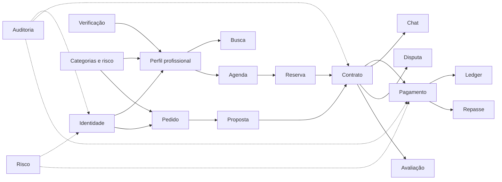
```mermaid
flowchart LR
    ID[Identidade] --> PROF[Perfil profissional]
    ID --> REQ[Pedido]
    VER[Verificação] --> PROF
    CAT[Categorias e risco] --> PROF
    CAT --> REQ
    PROF --> SEARCH[Busca]
    PROF --> CAL[Agenda]
    REQ --> PROP[Proposta]
    CAL --> BOOK[Reserva]
    PROP --> CONTRACT[Contrato]
    BOOK --> CONTRACT
    CONTRACT --> PAY[Pagamento]
    PAY --> LEDGER[Ledger]
    PAY --> PAYOUT[Repasse]
    CONTRACT --> CHAT[Chat]
    CONTRACT --> DISP[Disputa]
    CONTRACT --> REVIEW[Avaliação]
    AUDIT[Auditoria] -.-> ID
    AUDIT -.-> CONTRACT
    AUDIT -.-> PAY
    RISK[Risco] -.-> ID
    RISK -.-> PAY
```

---

# 10. Regras de negócio

## 10.1 Cadastro, duplicidade e ciclo da conta

| Cenário | Regra | Resposta pública | Ação interna |
|---|---|---|---|
| E-mail/telefone já usado | Não criar segunda credencial ativa | Mensagem neutra e fluxo de recuperação | Evento de tentativa |
| CPF/CNPJ já vinculado | Um documento canônico por identidade/empresa, salvo representação aprovada | “Não foi possível concluir” | Caso de suporte/risk match |
| Conta suspensa | Login pode ser limitado a recurso, suporte e dados próprios | Motivo, escopo, prazo e recurso | Bloquear ações conforme escopo |
| Conta banida | Não permitir recriação automática | Mensagem de indisponibilidade e recurso | Sinais vinculados com retenção aprovada |
| Conta encerrada | Reativação só na janela/política; nova conta não apaga obrigações | Explicar retenção | Link controlado de identidade |
| E-mail descartável | Bloquear domínios de alta confiança de abuso ou exigir telefone | Explicação corrigível | Lista versionada e recurso |
| Telefone virtual | Não presumir fraude; elevar verificação conforme risco | Step-up proporcional | Score explicável |
| Menor de 18 anos | Não permitir contratar ou atuar no MVP | Informação clara | Minimizar e excluir tentativa conforme retenção |
| Representante PJ | Verificar pessoa e poderes mínimos; empresa é perfil separado | Status específico | Histórico de representantes |
| Documento divergente | Pausar verificação, não acusar fraude automaticamente | Solicitar correção/evidência | Revisão humana |

**[OBR]** Proteção contra enumeração: login, recuperação e cadastro retornam respostas semanticamente neutras, tempos aproximados e rate limits por IP, dispositivo, identificador e risco.

**[FDE MVP]** Login social é opcional e fica para a Fase 2. Quando habilitado, usa OIDC/OAuth com `state`, PKCE, nonce e redirect URI estrita. Conta não é unida apenas por nome ou e-mail declarado pelo provedor: o usuário prova controle da sessão/contato já existente ou passa por recuperação assistida. Conflito de CPF, telefone, e-mail, representante PJ ou conta banida nunca gera merge automático. Vinculação e desvinculação exigem reautenticação, notificação e auditoria.

## 10.2 Níveis de verificação

| Selo exibido | O que comprova | O que não comprova | Validade/revisão |
|---|---|---|---|
| E-mail confirmado | Controle do endereço no momento | Identidade real | Revalidar em mudança/sinal |
| Telefone confirmado | Controle do número no momento | Titularidade permanente | Revalidar em troca/risco |
| Identidade documental | Documento e pessoa segundo processo contratado | Qualidade, antecedentes ou segurança | Expiração e atualização do fornecedor |
| Empresa validada | CNPJ e vínculo do representante | Solvência ou qualidade | Consulta periódica |
| Conta de recebimento apta | PSP habilitou o recebedor | Pagamento garantido | Estado sincronizado |
| Credencial profissional | Documento específico validado na fonte/processo | Resultado do serviço | Até vencimento/revogação |
| Serviço regulado aprovado | Requisitos da categoria aprovados | Ausência de risco | Revisão por validade e regra |

**[OBR]** A interface nunca agrega estes níveis em um único selo “verificado”.

## 10.3 Serviços regulados e categorias de risco

Cada categoria possui:

- `risk_tier`: baixo, moderado, alto ou proibido;
- documentos obrigatórios e fonte emissora;
- validade e antecedência de renovação;
- tipo de pessoa permitido;
- área geográfica/licença aplicável;
- seguro exigido, quando cabível;
- termos e avisos próprios;
- campos de escopo e evidências;
- regra de suspensão imediata por expiração.

**[OBR]** Serviço regulado só passa de `UNDER_REVIEW` para `PUBLISHED` quando todas as exigências estiverem aprovadas e não expiradas.

**VALIDAÇÃO JURÍDICA OBRIGATÓRIA** por categoria.
**VALIDAÇÃO OPERACIONAL** da fonte e capacidade de revisão.

## 10.4 Autenticação, senha e sessões

| Controle | Regra |
|---|---|
| Senha | Mínimo 12 caracteres; permitir gerenciadores e colagem; comparar com lista de senhas comprometidas sem enviar senha em claro; sem expiração periódica arbitrária |
| Credencial/hash | IdP é fonte única; deve usar Argon2id ou mecanismo adaptativo equivalente auditado, salt aleatório, parâmetros calibrados para 100-250 ms e rehash progressivo; plataforma não armazena hash |
| Access token | 5 a 15 minutos, audience/issuer explícitos, sem PII desnecessária |
| Refresh token rotativo | IdP mantém token/família opacos, rotação a cada uso e revogação; plataforma guarda apenas referência/fingerprint não reutilizável |
| Reutilização de refresh token | Detecção revoga família/dispositivo, alerta usuário e eleva risco |
| “Manter conectado” | Máximo 15 dias desde autenticação, com inatividade configurável |
| Sem persistência | Cookie de sessão; expira ao fechar ou após 30 min de inatividade |
| Simultaneidade | Até 5 dispositivos de usuário no MVP; administradores conforme política gerenciada |
| Revogação | Por dispositivo e global; senha/MFA alterados revogam sessões incompatíveis |
| Dispositivo confiável | No máximo 30 dias; não dispensa MFA financeiro quando risco exigir |
| Reautenticação | Recebedor, reembolso, saque/repasse manual suportado, alteração de documento, exclusão e exportação |
| OTP | 6 dígitos, uso único, expiração de 5 min, tentativas e reenvio limitados |
| CAPTCHA | Adaptativo após sinais; alternativa acessível |
| Alertas | Novo dispositivo, recuperação, MFA, senha, recebedor e atividade suspeita |

MFA obrigatório para toda conta administrativa e para profissionais antes de ação financeira sensível. Passkeys/WebAuthn são recomendadas; TOTP é fallback. SMS não é fator preferencial para administração.

**[DEP]** IAM/IdP precisa comprovar e expor por API/evento: e-mail e telefone, passkey/WebAuthn, MFA, refresh rotation/reuse, revogação por dispositivo/global, step-up com `acr/amr`, lockout/rate limit, logs, exportação, SLA, residência/transferência e plano de saída. Sem PoC, ADR-010 permanece proposto e o schema não ganha credencial local como fallback silencioso.

## 10.5 Primeira visita e localização

Antes do prompt do navegador:

- explicar que a localização melhora distância e oferta;
- informar que é opcional;
- oferecer CEP, bairro, cidade ou região;
- pedir coordenada somente após ação afirmativa;
- armazenar precisão e origem do dado;
- permitir revogar e limpar a preferência.

Localização pública:

- usa cidade/bairro ou célula geográfica degradada;
- distância é arredondada e não revela ponto exato;
- coordenadas exatas e endereço ficam em armazenamento protegido;
- anexos têm EXIF removido por padrão;
- cache, analytics e logs não recebem endereço completo.

### Janela ABAC do endereço exato

| Modalidade/estado | Cliente | Profissional | Operação |
|---|---|---|---|
| Remoto | Próprios dados | Nunca recebe endereço desnecessário | Somente caso/finalidade |
| Busca, pedido e proposta antes do contrato | Próprio | Cidade/bairro/célula aproximada | Moderação vê apenas redigido |
| Contrato e booking confirmados no endereço do cliente | Próprio | Endereço exato após pagamento + booking confirmados | Suporte apenas se caso atribuído |
| Cancelado antes da execução | Próprio | Acesso normal revogado imediatamente | Snapshot restrito somente por disputa/defesa |
| Em execução até 24h após conclusão | Próprio | Endereço exato para execução/comprovação proporcional | Caso atribuído |
| Mais de 24h após conclusão | Próprio/histórico | Acesso normal revogado; recontratação revalida | Disputa/Jurídico por caso e prazo |
| No endereço do profissional | Recebe local de atendimento confirmado | Próprio local | Por caso |

Compartilhamento é registrado e notificado. Revogar a tela não faz alguém esquecer dado já visualizado; a interface informa o marco de compartilhamento antes da contratação e proíbe reutilização fora da finalidade.

## 10.6 Perfil profissional

**[OBR]** Campos públicos elegíveis:

- ID público, nome profissional/empresarial, foto e capa;
- bio, experiência, categorias, especialidades e serviços;
- selos específicos e suas explicações;
- nota, quantidade, distribuição agregada e avaliações;
- SCSP, tempo/taxa de resposta e cancelamento em janelas divulgadas;
- área e distância aproximadas;
- atendimento presencial, remoto, no cliente, no profissional ou híbrido;
- portfólio moderado, faixa de preço e disponibilidade indicativa;
- políticas, FAQ e garantia voluntária do profissional com emissor/limites;
- resposta a avaliações;
- CTA coerente com o tipo de contratação.

**[OBR]** Telefone, WhatsApp, e-mail, CPF/CNPJ completo, endereço residencial e conta bancária nunca são públicos.

Métricas com amostra pequena exibem “dados insuficientes”, não porcentagens enganosas.

## 10.7 Serviço e versionamento

Cada serviço é uma oferta independente com:

| Grupo | Campos principais |
|---|---|
| Identidade | ID opaco, profissional, categoria, subcategoria, nome, descrição |
| Contratação | Imediata, avaliação ou orçamento; presencial/remoto/híbrido |
| Tempo | Duração, buffer, antecedência e prazo estimado |
| Preço | Unidade, preço, mínimo/máximo/faixa, moeda e versão |
| Composição | Mão de obra, materiais incluídos/excluídos e deslocamento |
| Local | Área, raio, local do cliente/profissional e restrições |
| Política | Cancelamento, reagendamento, ausência e garantia |
| Mídia | Fotos, vídeo, documentos e status de moderação |
| Governança | Status, motivo, aprovador, publicação/suspensão e versão |

Estados: `DRAFT`, `UNDER_REVIEW`, `PUBLISHED`, `PAUSED`, `REJECTED`, `SUSPENDED`, `ARCHIVED`.

Mudanças relevantes criam nova `ServiceVersion`: categoria, descrição de escopo, preço, unidade, duração, materiais, área e políticas. Contratos referenciam a versão aceita.

**[FDE MVP]** Vídeo em perfil, pedido e chat. O MVP aceita imagens reencodadas e PDFs permitidos. Fase 2 só habilita `MediaAsset.media_type=VIDEO` com allowlist de contêiner/codecs, limite de duração/tamanho, upload em quarentena, antimalware, transcodificação sem metadados, poster, legenda/transcrição, moderação, derivados acessíveis e lifecycle. `MediaAsset` e `MediaDerivative` são compartilhados por portfólio, pedido e chat para impedir três pipelines ou regras de retenção divergentes.

## 10.8 Pedidos e oportunidades

Campos mínimos: título, descrição, categoria/subcategoria, célula geográfica, data/janela, urgência, orçamento opcional, anexos, medidas/quantidades, preferências, visibilidade e expiração.

| Abuso | Controle |
|---|---|
| Spam/duplicidade | Similaridade de texto/mídia, limite por conta/dispositivo e janela |
| Proposta automática | Limite progressivo, challenge e análise de padrão |
| Assédio/discriminação | Classificador/sinais, denúncia, revisão e sanção proporcional |
| Pedido ilegal/perigoso | Taxonomia, termos proibidos, fila humana e bloqueio |
| Urgência manipulada | Frequência e consistência; urgência não compra ranking |
| Fraude | Risk score, verificação progressiva e bloqueio temporário |
| Conteúdo malicioso | MIME real, allowlist, antimalware, CDR quando aplicável |

Visibilidade:

- `PRIVATE_MATCHED`: recomendada; apenas profissionais elegíveis recebem detalhes permitidos.
- `INVITED`: profissionais escolhidos.
- `PUBLIC_SUMMARY`: enum reservado para a Fase 2, desabilitado por feature flag e rejeitado pela API no MVP; quando avaliado, exigirá opt-in, título sanitizado, região ampla, anexos privados, moderação e `noindex`.

## 10.9 Propostas

Proposta contém ID, versão, partes, pedido, escopo, incluídos/excluídos, mão de obra, materiais, deslocamento, taxas informativas, total, forma/cronograma, início, prazo, validade, cancelamento, garantia, anexos e observações.

Estados: `DRAFT`, `SENT`, `VIEWED`, `NEGOTIATING`, `REVISED`, `ACCEPTED`, `REJECTED`, `EXPIRED`, `CANCELLED`, `CONVERTED`.

Regras:

- apenas a última versão enviada e não expirada pode ser aceita;
- cada revisão preserva diff e versão anterior;
- aceite é idempotente e usa controle otimista;
- uma proposta aceita fecha alternativas somente após criação válida do contrato;
- aceite registra texto/política, versão, usuário, contexto, instante e evidência técnica proporcional;
- proposta não pode incluir cobrança fora do checkout.

## 10.10 Contratação interna, externa e evasão

Contratação interna oferece histórico, comprovantes do PSP, políticas, suporte, mediação privada, aditivos e avaliação verificada. A descrição deve apresentar limites e exceções.

Negociação externa:

- não recebe selo de pagamento interno;
- pode não ter mediação financeira, reembolso, comprovante ou avaliação verificada;
- não é proibida por detecção automática isolada;
- não permite à plataforma afirmar que houve contrato ou pagamento.

Medidas graduais contra evasão:

1. educação contextual;
2. aviso antes do envio;
3. mascaramento corrigível de contato/chave/URL em contexto de risco;
4. limite temporário;
5. revisão humana;
6. advertência;
7. suspensão proporcional;
8. sanção;
9. recurso.

Detectores podem sinalizar telefone, e-mail, URL, chave Pix e dados bancários, mas não acessam finalidade além do necessário. Sanção relevante exige evidências múltiplas e revisão.

## 10.11 Busca e ranking

### Recuperação

- normalização de acentos, caixa, singular/plural e abreviações;
- dicionário versionado de sinônimos por categoria/região;
- `pg_trgm` para erro de digitação;
- full-text search para nome, categoria, serviço e especialidade;
- PostGIS para distância e área;
- filtros por disponibilidade, preço, nota, modalidade, verificação e contratação imediata.

### Pipeline de ranking

```text
resultado =
  elegibilidade rígida
  -> recuperação textual/geográfica
  -> score orgânico
  -> penalidades proporcionais
  -> diversidade/exploração
  -> inserção patrocinada identificada, somente se a feature da Fase 2 estiver habilitada
```

Score orgânico usa, em alto nível:

- relevância da consulta;
- distância/área e modalidade;
- disponibilidade;
- qualidade bayesiana e volume;
- SCSP e recência;
- resposta, cancelamento, pontualidade e disputa;
- adequação do serviço;
- pequena cota de exploração para novos profissionais elegíveis.

Para serviço remoto, distância não compõe relevância: região limita idioma, fuso, disponibilidade, regra jurídica e atendimento quando aplicável. Para serviço híbrido, o score usa distância somente na etapa presencial.

**[OBR]**:

- patrocínio não altera score orgânico e ocupa slots rotulados;
- resultados orgânicos nunca são eliminados;
- no máximo 25% dos itens visíveis de uma página/bloco são patrocinados no MVP da Fase 2;
- no máximo 2 resultados consecutivos do mesmo grupo econômico;
- atributos sensíveis e proxies injustificados não entram no score;
- penalidade tem motivo, janela, proporcionalidade e recurso;
- métricas monitoram exposição, clique, contratação e disparidade por grupos permitidos de auditoria.

## 10.12 Chat

Tipos: texto, foto, PDF/documento permitido, proposta, aditivo, localização aproximada e mensagem de sistema.

| Controle | Regra inicial |
|---|---|
| Tamanho | Texto até 10 mil caracteres; imagem até 10 MB; documento até 20 MB |
| Formato | Allowlist por MIME detectado; nome original sanitizado |
| Segurança | Upload em quarentena, antimalware, CDR para PDF quando viável, URL assinada curta |
| Autorização | Participante ou operador com caso/finalidade; URL não concede acesso sozinha |
| Antispam | Limite por conversa, conta, dispositivo e padrão |
| Phishing/evasão | Aviso, marcação, bloqueio proporcional e recurso |
| Leitura | Timestamp por participante sem “presença” invasiva |
| Exclusão | Remoção visual conforme política; evidência preservada quando legalmente necessária |
| Criptografia | TLS e repouso; não alegar ponta a ponta |

Mensagens do sistema são imutáveis e não podem ser imitadas por usuário.

## 10.13 Notificações

| Classe | Exemplos | Opt-out | Quiet hours |
|---|---|---|---|
| Segurança obrigatória | senha, MFA, novo dispositivo, incidente | Não, salvo canal alternativo válido | Não |
| Transacional obrigatória | pagamento, refund, contrato, disputa, repasse | Não no in-app; canal configurável quando possível | Apenas urgência quebra |
| Operacional | mensagem, proposta, lembrete | Preferências por evento/canal | Sim, 22h-8h local |
| Marketing | campanha, conteúdo, reativação | Consentimento/opt-out imediato | Sim |

Regras:

- in-app é fonte canônica de notificação;
- cada envio possui `deduplication_key`, template/version, locale e correlation ID;
- retentativa exponencial com limite e DLQ;
- WhatsApp somente por API oficial e templates aprovados;
- SMS não contém dado sensível ou link sem domínio reconhecível;
- marketing não usa consentimento acoplado a termos;
- fallback de canal respeita preferências e criticidade.

## 10.14 Avaliações e reputação

Elegibilidade:

- contrato concluído, valor capturado e sem fraude confirmada;
- uma avaliação principal por parte por contrato;
- janela recomendada de 30 dias;
- autoavaliação, mesma identidade, vínculo detectado ou conflito de interesse são bloqueados/revisados;
- edição em até 7 dias, com histórico não público e nova moderação;
- comentário negativo não é removido só por ser negativo;
- direito de resposta e recurso.

Disputa ou reembolso posterior não apaga automaticamente a avaliação. A decisão final pode retirar o selo transacional, alterar o peso ou acrescentar rótulo factual conforme política versionada; conteúdo continua sujeito à moderação, e o histórico de elegibilidade permanece auditável.

`rating` usa 1 a 5; ausência é `null`. Critérios: qualidade, pontualidade, comunicação, custo-benefício, organização e cumprimento.

### Score público

Média bayesiana:

```text
bayesian_rating = (v / (v + m)) * R + (m / (v + m)) * C
```

`R` é média do profissional, `v` avaliações elegíveis, `C` média da categoria/região e `m` volume de estabilização versionado. O ranking combina essa medida com recência, SCSP, resposta, cancelamentos, disputas, pontualidade, verificação e violações. Pesos exatos não são públicos; fatores gerais e razão de penalidade individual são.

## 10.15 Confiança, segurança física e conduta

Política obrigatória cobre assédio, discriminação, ameaça, violência, conteúdo sexual, exploração, trabalho ilegal, armas, drogas, fraude, dano, entrada em residência, presença de menores e emergência.

Controles:

- denúncia em perfil, chat, pedido, contrato e review;
- botão de bloquear comunicação;
- canal urgente com triagem, sem se anunciar como emergência;
- preservação legal de evidência com cadeia de custódia;
- suspensão preventiva proporcional quando há risco concreto;
- escalonamento para Trust & Safety, Segurança, Jurídico e autoridades quando legalmente exigido;
- decisão motivada, prazo e recurso, salvo restrição legal;
- banimento em caso de violência/fraude grave confirmada, com revisão humana.

## 10.16 Planos e patrocínio

**[FDE MVP, Fase 2]**.

| Item | Regra |
|---|---|
| Plano | Benefícios, preço, limites, renovação e cancelamento antes do aceite |
| Upgrade | Pró-rata e efeito imediato explicitado |
| Downgrade | Efeito no próximo ciclo, sem apagar dados abruptamente |
| Inadimplência | Grace period, suspensão de premium, preservação do perfil orgânico |
| Trial | Data de término e renovação clara; lembrete prévio |
| Reembolso | Matriz jurídica e comercial, sem promessa universal |
| Patrocínio | Orçamento, região/categoria, impressão/click auditáveis e rótulo “Patrocinado” |
| Concentração | Caps por anunciante e leilão/seleção documentados |
| Reputação | Pagamento nunca altera nota, selo de risco ou moderação |

## 10.17 Taxas e transparência comercial

### Alternativas de monetização transacional

| Modelo | Pagador | Vantagens | Desvantagens/riscos | Custo operacional | Critério de escolha |
|---|---|---|---|---|---|
| Percentual do profissional | Profissional, deduzido pelo PSP | Alinha receita a GMV/SCSP; simples de explicar | Evasão e margem insuficiente em ticket baixo; sensibilidade por categoria | Baixo | **Recomendado no MVP: 15% como hipótese** |
| Taxa fixa | Cliente ou profissional | Receita previsível por ordem | Regressiva em ticket baixo ou irrelevante em ticket alto | Baixo | Só se custo fixo do PSP/suporte dominar |
| Fixa + percentual | Profissional ou ambos, sempre separado | Cobre custo mínimo e acompanha valor | Mais fricção e explicação; arredondamento/refund complexos | Médio | Após dados mostrarem perda em tickets baixos |
| Percentual/faixa por categoria | Profissional | Ajusta margem, risco e custo de operação | Complexidade, arbitragem de categoria e percepção de injustiça | Médio/alto | Somente com unit economics e taxonomia estáveis |
| Diferenciada por plano | Profissional assinante | Incentiva recorrência e previsibilidade | Pode criar pay-to-win e seleção adversa | Alto | Fase 2, benefício real sem alterar reputação |
| Conveniência do cliente | Cliente | Pode financiar proteção/processamento | Reduz conversão; risco de transparência/validade | Médio | Zero no MVP; exige teste e parecer |
| Lead/pacote de oportunidade | Profissional | Receita antes da contratação | Desalinha com SCSP, incentiva spam e mistura modelos | Alto | **[FDE MVP]**; novo business case |

O critério executivo compara margem de contribuição por categoria/ticket, conversão, evasão, custo PSP, suporte, fraude, chargeback, elasticidade e clareza. Nenhum modelo é aprovado apenas por receita bruta.

### Tabela operacional de cobranças

| Componente | Quem paga no MVP | Cálculo/cobrança | Checkout/extrato | Refund/cancelamento/chargeback |
|---|---|---|---|---|
| Serviço, material e deslocamento contratados | Cliente | No aceite; captura integral pelo PSP | Linhas separadas e total | Reconhecer/reembolsar conforme execução, evidência e política |
| Comissão de 15% | Profissional | Sobre a base contratada líquida de desconto financiado pelo profissional; deduzida no split/recebível | Visível ao cliente como informação e ao profissional como dedução/líquido | Reversão proporcional à base reembolsada; chargeback segue responsabilidade contratual |
| Custo PSP | Plataforma no MVP | Custo real do fornecedor, contabilizado separado | Não vira taxa oculta do cliente/profissional | Parcela não recuperável permanece despesa da plataforma no MVP; mudança futura exige política comercial, exibição e aceite prévios |
| Juros de parcelamento | Cliente que escolhe parcelar | Condição do PSP antes da confirmação | Parcela, número, juros/total e condições aplicáveis | Refund segue regra PSP/lei; nunca recalcular silenciosamente |
| Taxa de conveniência | Ninguém | R$ 0 | Exibir zero somente quando útil, sem criar falsa economia | Não aplicável |
| Cancelamento | Plataforma não monetiza | Apenas serviço/material/deslocamento reconhecido pela matriz | Preview antes de confirmar cancelamento | Refund e crédito explícitos; sem fee tardia |
| Antecipação | **[FDE MVP]**; profissional ao PSP na Fase 2 | Oferta direta do PSP, preço e condições próprios | Fora do saldo da plataforma | PSP responde conforme contrato |
| Assinatura/plano | **[FDE MVP]**; profissional na Fase 2 | Recorrente, ciclo/trial/cupom versionados | Fatura separada de contrato de serviço | Política própria, sem afetar review |
| Patrocínio | **[FDE MVP]**; profissional na Fase 2 | Orçamento/impressão/clique conforme produto | Extrato publicitário separado | Crédito por falha conforme termos; não garante contratação |

Regras para casos compostos:

- cupom financiado pela plataforma reduz o total do cliente, vira despesa promocional e não reduz o líquido do profissional;
- cupom financiado pelo profissional reduz sua base econômica e a comissão proporcionalmente;
- reembolso parcial reverte comissão na mesma proporção da base elegível reembolsada, salvo regra contábil aprovada;
- chargeback não apaga comissão/captura: cria exposição e compensações conforme decisão;
- pagamento por etapas futuro calcula e evidencia fee por etapa, mas o contrato permanece uma unidade;
- alteração de taxa comercial tem vigência futura e não altera snapshot aceito;
- arredondamento em centavos e financiador de cada desconto ficam no snapshot e ledger.

Antes da confirmação, checkout e proposta mostram:

- valor de mão de obra;
- materiais incluídos;
- taxa de deslocamento;
- descontos e respectivos financiadores;
- taxa da plataforma, inclusive quando deduzida do profissional;
- custo/juros de parcelamento;
- valor total do cliente;
- líquido estimado do profissional e condições;
- forma e cronograma de pagamento;
- políticas de cancelamento e reembolso;
- condições e cronograma estimado do repasse, sem promessa além do contrato do PSP.

No extrato, cada linha referencia contrato, pagamento, tarifa, refund, chargeback e lançamento de ledger. Nenhuma taxa nasce após o aceite; mudanças exigem novo consentimento ou aplicam-se apenas a contratos futuros.

---

# 11. Máquinas de estado

## 11.1 Separação obrigatória

| Agregado | Pergunta respondida | Exemplo de estado |
|---|---|---|
| Proposta | Qual versão foi negociada/aceita? | `ACCEPTED` |
| CalendarReservation/agenda | O recurso está em hold ou ocupado? | `HOLD_ACTIVE`, `BOOKING_ACTIVE` |
| Booking | O compromisso confirmado está em qual etapa? | `CONFIRMED`, `IN_SERVICE` |
| Contrato | Qual é o estágio da obrigação de serviço? | `IN_PROGRESS`, `COMPLETED` |
| Ordem de pagamento | Quanto deveria ser cobrado e sob quais regras? | `AWAITING_PAYMENT` |
| Tentativa de pagamento | Qual é o workflow normalizado da tentativa? | `UNKNOWN`, `PAID`, `FAILED` |
| Fato PSP | Qual observação imutável foi autenticada? | `CAPTURE_CONFIRMED` |
| Refund | Em qual estágio está a instrução de reembolso? | `REQUESTED`, `SUCCEEDED` |
| LatePaymentCase | Como um pagamento tardio será resolvido? | `OPEN`, `RESOLVED_REFUNDED` |
| Repasse | O recebível está elegível/processado? | `ELIGIBLE`, `PAID` |
| Ledger | Quais movimentos econômicos foram reconhecidos? | `POSTED`, `REVERSED` |
| Disputa | Há mediação em curso? | `UNDER_REVIEW` |

**[OBR]** Nenhum desses estados será derivado por igualdade simples com outro. Uma política explícita reage a eventos e valida pré-condições.

## 11.2 Máquina de estados do contrato

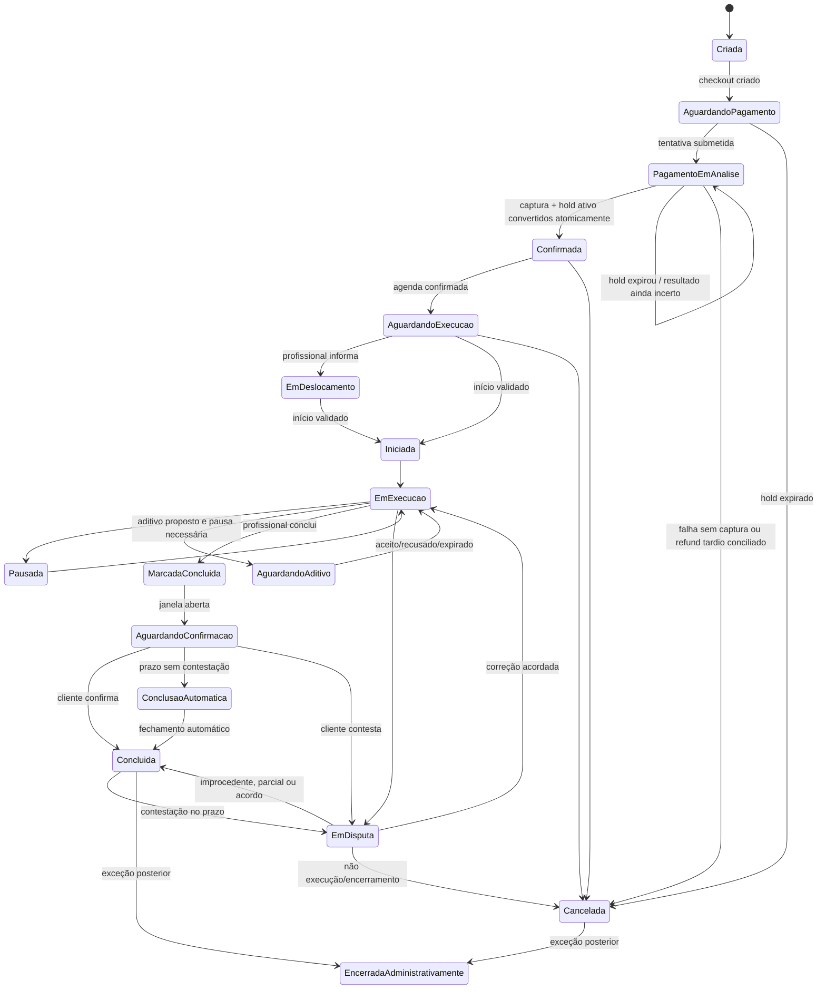
```mermaid
stateDiagram-v2
    [*] --> Criada
    Criada --> AguardandoPagamento: checkout criado
    AguardandoPagamento --> PagamentoEmAnalise: tentativa submetida
    PagamentoEmAnalise --> Confirmada: captura + hold ativo convertidos atomicamente
    PagamentoEmAnalise --> PagamentoEmAnalise: hold expirou / resultado ainda incerto
    PagamentoEmAnalise --> Cancelada: falha sem captura ou refund tardio conciliado
    AguardandoPagamento --> Cancelada: hold expirado
    Confirmada --> AguardandoExecucao: agenda confirmada
    AguardandoExecucao --> EmDeslocamento: profissional informa
    AguardandoExecucao --> Iniciada: início validado
    EmDeslocamento --> Iniciada: início validado
    Iniciada --> EmExecucao
    EmExecucao --> Pausada
    Pausada --> EmExecucao
    EmExecucao --> AguardandoAditivo: aditivo proposto e pausa necessária
    AguardandoAditivo --> EmExecucao: aceito/recusado/expirado
    EmExecucao --> MarcadaConcluida: profissional conclui
    MarcadaConcluida --> AguardandoConfirmacao: janela aberta
    AguardandoConfirmacao --> Concluida: cliente confirma
    AguardandoConfirmacao --> ConclusaoAutomatica: prazo sem contestação
    ConclusaoAutomatica --> Concluida: fechamento automático
    AguardandoConfirmacao --> EmDisputa: cliente contesta
    Confirmada --> Cancelada
    AguardandoExecucao --> Cancelada
    EmExecucao --> EmDisputa
    EmDisputa --> EmExecucao: correção acordada
    Concluida --> EmDisputa: contestação no prazo
    EmDisputa --> Cancelada: não execução/encerramento
    EmDisputa --> Concluida: improcedente, parcial ou acordo
    Concluida --> EncerradaAdministrativamente: exceção posterior
    Cancelada --> EncerradaAdministrativamente: exceção posterior
```

`ConclusãoAutomática` é um estado técnico transitório auditável; não significa que a plataforma atestou qualidade.

“Reembolsada parcialmente” e “reembolsada” são rótulos compostos da UI derivados de `Refund` e `PaymentOrder`; não são estados do contrato. O contrato registra se a obrigação foi concluída, cancelada ou está em disputa.

## 11.3 Tabela de transições do contrato

Cada transição registra `transition_id`, versão esperada, ator, papel, origem/destino, motivo, payload permitido, instante UTC, zona aplicável, correlation ID e evidências.

| De → Para | Ator | Pré-condição e validação | Evento/notificação | Efeito financeiro | Reversibilidade e auditoria |
|---|---|---|---|---|---|
| `CREATED` → `AWAITING_PAYMENT` | Cliente/sistema | Snapshot válido, proposta/serviço elegível, política aceita e hold ativo | `ContractCreated`; partes | Cria ordem, sem lançamento de caixa | Cancelável; log completo |
| `AWAITING_PAYMENT` → `PAYMENT_REVIEW` | Sistema | Tentativa aceita pelo adapter; idempotency key única | `PaymentSubmitted`; cliente | Nenhum até evento reconhecido | Timeout não reverte; consulta PSP |
| `PAYMENT_REVIEW` → `CONFIRMED` | Worker financeiro | Webhook/consulta autenticada confirma valor/moeda/recebedor **e**, sob lock, `CalendarReservation(HOLD)` continua ativa/não expirada e é convertida para `BOOKING` com criação/confirmação atômica do `Booking` | `PaymentApproved`, `BookingCreated`, `BookingConfirmed`; partes | Posta captura/split e cria `Payout(SCHEDULED)` | Sem reserva válida não transiciona; abre `LatePaymentCase` |
| `PAYMENT_REVIEW` → `CANCELLED` | Sistema | Falha definitiva ou expiração; nenhuma captura conciliada | `PaymentFailed`; cliente | Libera hold; sem receita | Nova ordem, nunca ressuscitar tentativa |
| `PAYMENT_REVIEW` → `CANCELLED` | Financeiro/Ops | `LatePaymentCase` em `REFUND_PENDING`, refund integral `SUCCEEDED` e conciliação confirmada | `LatePaymentResolved(REFUNDED)`; partes | Ledger compensatório; nenhum payout | Contrato permanece cancelado; fatos pagos/refund não são apagados |
| `AWAITING_PAYMENT` → `CANCELLED` | Sistema/cliente | Hold expirado ou abandono sem pagamento | `CheckoutExpired`; cliente | Libera hold | Irreversível nessa ordem |
| `CONFIRMED` → `AWAITING_EXECUTION` | Sistema | Booking confirmado e PSP consistente | `BookingConfirmed`; partes | Recebível ainda conforme agenda PSP | Cancelamento segue política |
| `AWAITING_EXECUTION` → `EN_ROUTE` | Profissional | Dentro de janela configurada; serviço presencial | `ProfessionalEnRoute`; cliente | Nenhum | Pode voltar só por correção administrativa motivada |
| `AWAITING_EXECUTION/EN_ROUTE` → `STARTED` | Profissional, confirmação cliente opcional | Data/janela válida; sem suspensão crítica | `ServiceStarted`; cliente | Pode mudar elegibilidade de cancelamento | Correção por evento administrativo |
| `STARTED` → `IN_PROGRESS` | Sistema/profissional | Início persistido | `ServiceInProgress`; partes | Nenhum | Sim, via pausa |
| `IN_PROGRESS` → `PAUSED` | Parte/suporte | Motivo permitido: segurança, dependência, acordo | `ServicePaused`; partes/suporte se risco | Pode pausar agenda de repasse futura | Retomável |
| `PAUSED` → `IN_PROGRESS` | Partes/suporte | Condição resolvida e agenda ajustada | `ServiceResumed`; partes | Nenhum | Pode pausar novamente com limite |
| `IN_PROGRESS` → `AWAITING_AMENDMENT` | Profissional/cliente | Aditivo proposto; cobrança adicional não executada | `AmendmentProposed`; contraparte | Sem captura adicional | Volta por decisão/expiração |
| `AWAITING_AMENDMENT` → `IN_PROGRESS` | Contraparte/sistema | Aceito e pago quando aplicável, ou recusado/expirado | `AmendmentAccepted/Rejected/Expired` | Aceite pode criar nova ordem/lancamentos | Aditivo aceito só corrige por compensação |
| `IN_PROGRESS` → `MARKED_COMPLETE` | Profissional | Checklist mínimo, resumo e nenhum aditivo pendente | `ServiceMarkedComplete`; cliente | Inicia janela, não libera por si só | Cliente pode contestar |
| `MARKED_COMPLETE` → `AWAITING_CONFIRMATION` | Sistema | Notificação criada e prazo calculado | `CompletionWindowOpened`; cliente | Marca data potencial de elegibilidade | Contestável |
| `AWAITING_CONFIRMATION` → `COMPLETED` | Cliente | Autenticado, contrato correto, sem disputa | `ServiceCompleted`; profissional | Inicia janela de 7 dias; não libera payout imediatamente | Disputa posterior no prazo abre caso |
| `AWAITING_CONFIRMATION` → `AUTO_COMPLETING` | Job | 72h, avisos enviados, sem disputa/risco/pausa | `AutoCompletionStarted`; partes | Ainda não | Job idempotente e cancelável antes do commit |
| `AUTO_COMPLETING` → `COMPLETED` | Sistema | Revalidação transacional de ausência de bloqueio | `ServiceAutoCompleted`; partes | Inicia janela de 7 dias; não libera payout imediatamente | Evidência do job e regra/version |
| `AWAITING_CONFIRMATION/IN_PROGRESS/COMPLETED` → `DISPUTED` | Cliente/suporte | Motivo, narrativa e evidência mínima; prazo aplicável; contrato/payout bloqueados em ordem canônica | `DisputeOpened`; partes/operação | Cria hold/restrição proporcional na mesma transação antes da resposta | Sai por decisão ou acordo; payout já processando segue tratamento explícito |
| `CONFIRMED/AWAITING_EXECUTION` → `CANCELLED` | Parte/suporte | Matriz de cancelamento calculada e confirmada | `BookingCancelled`; partes | Refund/retenção separados | Correção financeira compensatória |
| `DISPUTED` → `IN_PROGRESS` | Suporte/partes | Plano de correção aceito, sem risco | `RemediationAgreed`; partes | Mantém bloqueio conforme decisão | Nova disputa possível |
| `DISPUTED` → `CANCELLED` | Decisor por alçada | Não execução/encerramento decidido; contraditório concluído | `DisputeResolved`; partes | Refund é ordem/agregado separado | Recurso cria revisão, não apaga |
| `DISPUTED` → `COMPLETED` | Decisor | Improcedente, acordo ou remédio parcial; decisão/recurso tratados | `DisputeResolved`; partes | Pode criar refund separado e desbloquear saldo remanescente | Recurso cria revisão, não apaga |
| Estado terminal → `ADMIN_CLOSED` | Admin por alçada | Caso excepcional documentado | `ContractAdministrativelyClosed`; partes quando cabível | Nenhum automático | Imutável; ação sensível |

## 11.4 Máquinas da reserva e do booking

`HELD`, `EXPIRED` e `RELEASED` pertencem exclusivamente a `CalendarReservation`; `Booking` não existe durante o hold:

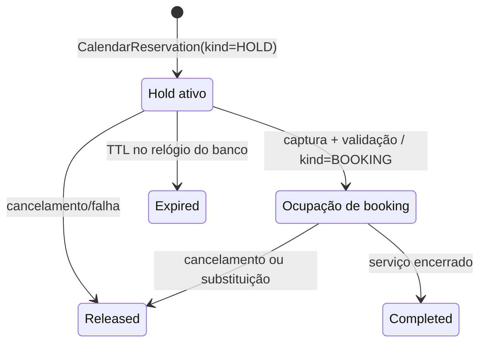
```mermaid
stateDiagram-v2
    state "Hold ativo" as HoldActive
    state "Ocupação de booking" as BookingActive
    [*] --> HoldActive: CalendarReservation(kind=HOLD)
    HoldActive --> BookingActive: captura + validação / kind=BOOKING
    HoldActive --> Expired: TTL no relógio do banco
    HoldActive --> Released: cancelamento/falha
    BookingActive --> Released: cancelamento ou substituição
    BookingActive --> Completed: serviço encerrado
```

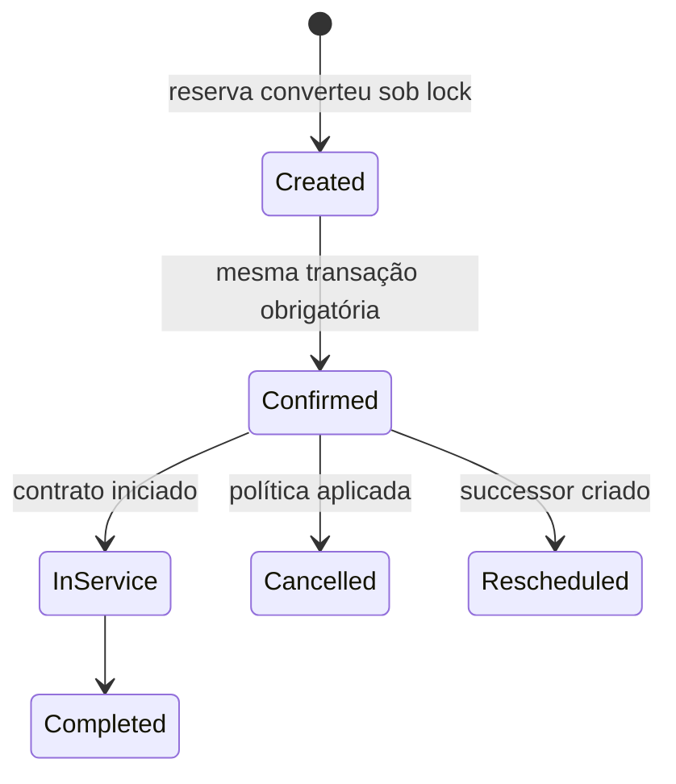
```mermaid
stateDiagram-v2
    [*] --> Created: reserva converteu sob lock
    Created --> Confirmed: mesma transação obrigatória
    Confirmed --> InService: contrato iniciado
    Confirmed --> Cancelled: política aplicada
    Confirmed --> Rescheduled: successor criado
    InService --> Completed
```

`CREATED` é estado técnico intra-transação: a API só observa `CONFIRMED`. Reagendamento encerra o booking antigo como `RESCHEDULED` e cria nova `CalendarReservation(BOOKING)` e novo `Booking(CONFIRMED)` com `supersedes_booking_id`; não reabre a linha antiga.

**[OBR]** A exclusão temporal pertence a `CalendarReservation`, não a `Booking`. Estado do contrato não é usado como trava de agenda.

## 11.5 Máquinas auxiliares

Proposta e serviço seguem estados da seção 10. Aditivo, pagamento, repasse, disputa e moderação têm máquinas próprias nas seções correspondentes.

---

# 12. Fluxos de contratação

## 12.1 Contratação imediata

Elegível somente quando preço, unidade, duração, escopo e agenda são determinísticos.

**[OBR]** O profissional precisa habilitar autoaceite explicitamente por serviço, modalidade e calendário. Sem essa opção ativa, o CTA vira solicitação sujeita ao aceite do profissional e não promete confirmação imediata. Suspensão, documento vencido, mudança material ou risco desabilita autoaceite até nova validação.

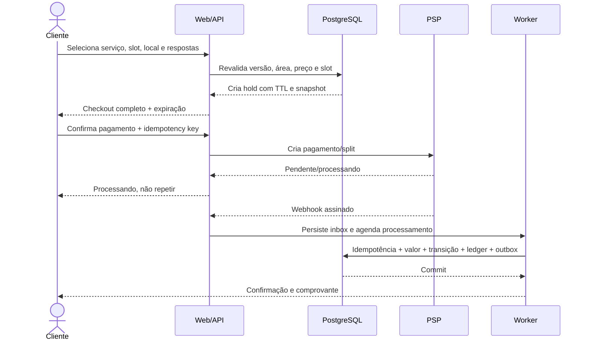
```mermaid
sequenceDiagram
    actor C as Cliente
    participant W as Web/API
    participant DB as PostgreSQL
    participant PSP as PSP
    participant Q as Worker

    C->>W: Seleciona serviço, slot, local e respostas
    W->>DB: Revalida versão, área, preço e slot
    DB-->>W: Cria hold com TTL e snapshot
    W-->>C: Checkout completo + expiração
    C->>W: Confirma pagamento + idempotency key
    W->>PSP: Cria pagamento/split
    PSP-->>W: Pendente/processando
    W-->>C: Processando, não repetir
    PSP-->>W: Webhook assinado
    W->>Q: Persiste inbox e agenda processamento
    Q->>DB: Idempotência + valor + transição + ledger + outbox
    DB-->>Q: Commit
    Q-->>C: Confirmação e comprovante
```

Critérios:

- o hold inicial recomendado é 10 minutos, renovável uma vez durante desafio 3DS/ação do PSP;
- Pix para slot imediato usa cobrança com expiração compatível com o hold ou reserva estendida explicitamente suportada pelo PSP; pagamento `PENDING/UNKNOWN` não prende o slot indefinidamente;
- boleto fica fora do MVP para contratação com horário, pois sua confirmação não cabe no TTL;
- preço é revalidado antes do hold e antes da tentativa;
- o hold guarda `service_version_id`, `price_version_id`, breakdown e política; qualquer divergência material exige novo aceite;
- pagamento tardio após expiração entra em exceção, não confirma agenda automaticamente;
- contrato só confirma após evento financeiro confiável;
- reenvio com mesma chave devolve o mesmo recurso.

Pagamento aprovado depois que o hold expirou:

1. `PaymentTransaction` registra o fato `PAID`; ele não é apagado.
2. `PaymentOrder.status` permanece `PAID`; a UI deriva o rótulo `PAID_REQUIRES_RESOLUTION` da existência de `LatePaymentCase` não terminal.
3. Contrato não confirma e `Booking` não é criado.
4. Na mesma transação local, ledger reconhece o fato, cria `LatePaymentCase(OPEN)` e outbox `LatePaymentDetected`; nenhum payout é criado.
5. Financeiro/Ops trata em até 1 dia útil: rebooking somente com disponibilidade e consentimento explícito das partes, ou refund idempotente.
6. Cliente vê “pagamento recebido, horário não confirmado, resolução em andamento”, nunca sucesso ou falha falsos.

`PaymentOrder.status=PAID` é a única fonte do resultado financeiro; `LatePaymentCase.status` é a única fonte da resolução operacional:

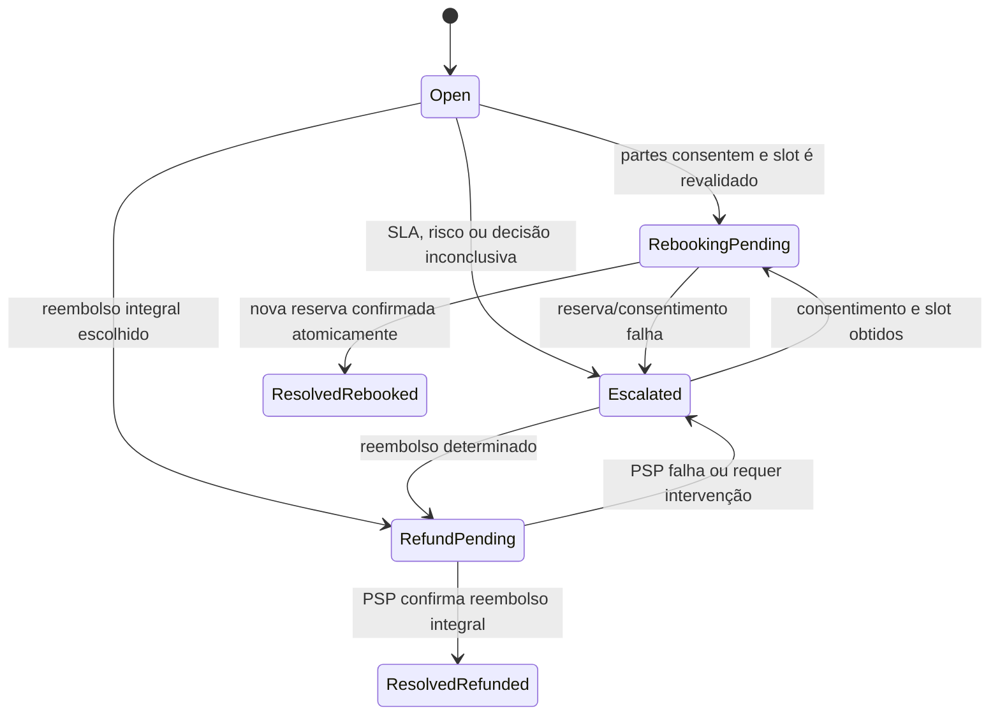
```mermaid
stateDiagram-v2
    [*] --> Open
    Open --> RebookingPending: partes consentem e slot é revalidado
    Open --> RefundPending: reembolso integral escolhido
    Open --> Escalated: SLA, risco ou decisão inconclusiva
    Escalated --> RebookingPending: consentimento e slot obtidos
    Escalated --> RefundPending: reembolso determinado
    RebookingPending --> ResolvedRebooked: nova reserva confirmada atomicamente
    RefundPending --> ResolvedRefunded: PSP confirma reembolso integral
    RebookingPending --> Escalated: reserva/consentimento falha
    RefundPending --> Escalated: PSP falha ou requer intervenção
```

Invariantes:

- um `PaymentOrder` tem no máximo um `LatePaymentCase` ativo e nenhum payout elegível enquanto o caso não for terminal;
- `REBOOKING_PENDING` e `REFUND_PENDING` emitem `LatePaymentResolutionPending`; o evento notifica/projeta, não executa a decisão;
- `RESOLVED_REBOOKED` exige consentimento versionado de ambas as partes e, na mesma transação, cria/converte `CalendarReservation(BOOKING)`, cria `Booking(CONFIRMED)`, move o contrato para `CONFIRMED/AWAITING_EXECUTION`, cria `Payout(SCHEDULED)` e emite `LatePaymentResolved(REBOOKED)`;
- `RESOLVED_REFUNDED` exige `Refund=SUCCEEDED` pelo total capturado ainda não reembolsado e conciliação; na mesma transação move o contrato `PAYMENT_REVIEW` para `CANCELLED`, não cria payout e emite `LatePaymentResolved(REFUNDED)`;
- rebooking e refund terminal são mutuamente exclusivos; diferença de preço exige breakdown, refund da diferença ou nova ordem e novo aceite;
- triagem e proposta de solução ocorrem em até 1 dia útil; sem decisão ou diante de falha permanente do PSP, o caso vira `ESCALATED`. Meta de resolução interna: 2 dias úteis, excluído tempo de ação obrigatória do PSP/cliente explicitamente pausado;
- contrato e booking não são apresentados como confirmados durante `OPEN`, `REBOOKING_PENDING`, `REFUND_PENDING` ou `ESCALATED`.

## 12.2 Pedido, proposta e aceite

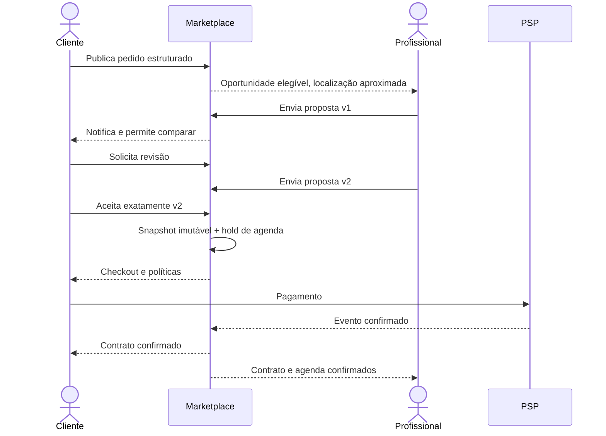
```mermaid
sequenceDiagram
    actor C as Cliente
    participant M as Marketplace
    actor P as Profissional
    participant PSP as PSP

    C->>M: Publica pedido estruturado
    M-->>P: Oportunidade elegível, localização aproximada
    P->>M: Envia proposta v1
    M-->>C: Notifica e permite comparar
    C->>M: Solicita revisão
    P->>M: Envia proposta v2
    C->>M: Aceita exatamente v2
    M->>M: Snapshot imutável + hold de agenda
    M-->>C: Checkout e políticas
    C->>PSP: Pagamento
    PSP-->>M: Evento confirmado
    M-->>C: Contrato confirmado
    M-->>P: Contrato e agenda confirmados
```

## 12.3 Agendamento de avaliação

**[REC]** A visita é um serviço/contrato separado, opcionalmente ligado por `origin_evaluation_contract_id` ao contrato futuro.

Tipos configuráveis:

- gratuita: sem ordem financeira, mas com booking e política de ausência;
- paga: preço/locomoção explícitos e pagamento integral;
- abatível: crédito condicionado e transparente, não alteração retroativa;
- não reembolsável: **não habilitar sem VALIDAÇÃO JURÍDICA OBRIGATÓRIA**.

Critério de aceite: a avaliação nunca autoriza automaticamente serviço, cobrança adicional ou exposição pública de endereço.

## 12.4 Serviço por hora/unidade/diária

- quantidade estimada entra na proposta;
- limite máximo autorizado e regra de medição são explícitos;
- valor final acima do autorizado exige aditivo;
- evidência de horas/unidades não pode depender apenas de rastreamento invasivo;
- arredondamento e intervalo mínimo aparecem antes do aceite.

## 12.5 Serviço remoto/híbrido

- contrato registra modalidade e canal de entrega;
- não revela endereço quando desnecessário;
- entrega digital usa anexo protegido e checksum;
- mudança de remoto para presencial exige aditivo e validação de área/preço.

---

# 13. Agenda

## 13.1 Modelo

| Entidade | Função |
|---|---|
| `AvailabilityRule` | Regra recorrente semanal por serviço/calendário |
| `AvailabilityException` | Abertura, bloqueio, férias ou horário especial |
| `CalendarResource` | Profissional ou recurso com capacidade |
| `CalendarReservation` | Única ocupação autoritativa, com `kind=HOLD`, `BOOKING` ou `BLOCK` |
| `Booking` | Compromisso de negócio confirmado que referencia a ocupação |

Campos críticos: zona IANA, início/fim UTC, duração, preparação, deslocamento antes/depois, capacidade, limite diário, serviço e versão.

## 13.2 Cálculo de slot

```text
slots = regras recorrentes
        + exceções de abertura
        - bloqueios/férias
        - bookings
        - holds ativos
        - buffers de preparação/deslocamento
        - limites de capacidade/dia
```

**[OBR]** Para atendimento no local, o motor calcula viabilidade entre o compromisso anterior, novo endereço aproximado e compromisso seguinte usando matriz de deslocamento ou buffer conservador. Se o fornecedor de mapas falhar, aplica buffer máximo configurado, não zero.

## 13.3 Concorrência

Opção recomendada no PostgreSQL:

- uma tabela `CalendarReservation` evita constraint impossível entre hold e booking;
- intervalo `tstzrange` sem sobreposição por `calendar_resource_id` e `capacity_unit` usando exclusion constraint GiST para estados ocupantes;
- transação com versão do calendário e lock da linha do recurso;
- hold converte a mesma linha em booking; não há janela entre excluir hold e inserir booking;
- job altera hold vencido para `EXPIRED`; predicate de índice não usa `now()`;
- idempotência por intenção de checkout;
- capacidade maior que 1 enumera `capacity_unit` sob lock do recurso.

**[OBR]** Cache nunca decide disponibilidade; apenas acelera leitura indicativa.

## 13.4 Fuso horário

- persistir instantes em UTC e `timezone_name` IANA do local/usuário;
- exibir data, hora, zona e offset no aceite;
- recalcular recorrência na zona original, não somando 24h em UTC;
- detectar horário inexistente/ambíguo em mudança de horário de verão;
- notificações usam zona do booking.

## 13.5 Reagendamento

1. Parte propõe novo slot e motivo.
2. Slot é validado sem liberar o atual.
3. Contraparte aceita dentro da validade.
4. Transação confirma novo booking e libera anterior.
5. Política calcula custo, se válido.
6. Snapshot e notificações são atualizados.

Reagendamento unilateral não altera o contrato. Exceção administrativa exige motivo, contato das partes e auditoria.

## 13.6 Critérios de aceite

- 100 requisições concorrentes para o mesmo recurso/capacidade 1 geram no máximo um booking confirmado.
- Hold expirado deixa de bloquear em até 60 segundos.
- Pagamento aprovado não confirma slot já perdido; fluxo de exceção é acionado.
- Alteração de zona não muda o instante aceito.
- Preço/serviço versionado é revalidado no checkout.
- Falha do mapa degrada para buffer seguro.

---

# 14. Pagamentos

## 14.1 Modelo operacional

**[OBR]** Um PSP contratado e habilitado para marketplace processa dados de pagamento, onboarding/KYC de recebedor, split e liquidação conforme produto/contrato. A plataforma:

- cria ordem interna e instruções;
- recebe token/identificador, nunca cartão completo/CVV;
- mantém estados próprios e ledger;
- valida webhooks;
- concilia eventos, API e relatório;
- exibe agenda de recebível sem prometer custódia/garantia.

**VALIDAÇÃO COM PROVEDOR DE PAGAMENTO.**
**VALIDAÇÃO JURÍDICA OBRIGATÓRIA.**
**VALIDAÇÃO CONTÁBIL/TRIBUTÁRIA OBRIGATÓRIA.**

## 14.2 Seleção do PSP

Gate mínimo da RFP:

| Dimensão | Critério eliminatório |
|---|---|
| Regulatória | Entidade/arranjo e contratos adequados no Brasil |
| Marketplace | Recebedores PF/PJ, KYC, split, comissão e responsabilidades |
| Meios | Pix e cartão; parcelamento e boleto avaliados |
| Ciclo | Refund total/parcial, chargeback, disputa e saldo negativo |
| Repasse | Agenda, bloqueio permitido, falha, conta inválida e webhooks |
| Segurança | Tokenização/hosted fields, PCI aplicável, assinatura de webhook e gestão de chave |
| Operação | Sandbox representativo, idempotência, relatórios, SLA e suporte |
| Financeiro | Taxas, reserva, antecipação, prazo e responsabilidade por perdas |
| Privacidade | DPA, suboperadores, localização e transferência internacional |
| Continuidade | Exportação/reconciliação e plano de saída |

Shortlist para diligência, sem decisão comercial: Pagar.me, Mercado Pago, Asaas e Adyen. Capacidades variam por produto, contrato e perfil; documentação pública não substitui confirmação escrita.

Pontos de partida oficiais para a PoC: [Pagar.me: recebedores](https://docs.pagar.me/docs/recebedores-2), [Mercado Pago: Split Payments](https://www.mercadopago.com.br/developers/pt/docs/split-payments/split-1-1/integration-configuration/integrate-marketplace), [Asaas: split de pagamentos](https://docs.asaas.com/docs/split-de-pagamentos) e [Adyen for Platforms: automatic split](https://docs.adyen.com/platforms/automatic-split-configuration). A equipe deverá testar o produto brasileiro efetivamente contratado, não inferir equivalência entre documentações.

## 14.3 Composição do preço e taxa

Definições:

```text
subtotal_servico = mao_de_obra + materiais + deslocamento
desconto_cliente = cupom_plataforma + cupom_profissional
total_antes_juros = subtotal_servico - desconto_cliente
juros_cliente = custo de parcelamento explicitamente atribuído
total_cliente = total_antes_juros + juros_cliente
base_comissao =
  mao_de_obra + materiais + deslocamento - cupom_profissional
comissao_plataforma = 15% * base_comissao
liquido_profissional_estimado =
  subtotal_servico
  - cupom_profissional
  - comissao_plataforma
  - custos atribuídos contratualmente ao profissional
```

No MVP:

- a base é congelada no aceite com os componentes em centavos, taxa em basis points e versão da tabela comercial;
- cupom da plataforma, quando futuro, é despesa promocional e não reduz líquido do profissional;
- cupom do profissional reduz sua base econômica e comissão proporcional;
- custo do PSP é despesa separada da plataforma, embora o PSP possa deduzi-lo tecnicamente de outra conta; ledger reclassifica;
- juros de parcelamento não entram na comissão, salvo decisão contratual explícita;
- split operacional da comissão ocorre na captura se o produto PSP permitir; reconhecimento contábil de receita é política separada e bloqueada até validação;
- fee em basis points é arredondada uma vez no total por regra `half-up` em centavos; alocação entre componentes usa largest remainder com desempate estável por `labor`, `material`, `travel`;
- reembolso reverte a alocação original congelada, nunca recalcula pela tabela vigente; o último componente recebe eventual centavo residual para fechar exatamente.

**[OBR]** `CommercialFeePolicy` versionada contém `payer`, `rate_bps`, componente incluído, desconto por financiador, regra de arredondamento, vigência, categoria/plano, aprovadores e hash. Nenhuma captura real ocorre sem versão assinada por Produto, Financeiro e validações jurídica/tributária.

## 14.4 Estados financeiros separados

`PaymentOrder` representa a intenção e o total devido. `PaymentAttempt` é o workflow mutável de uma tentativa; `PaymentTransaction` é cada fato imutável recebido/consultado do PSP. `Refund`, `ChargebackCase`, `RiskHold`, `Payout` e `LedgerTransaction` são agregados próprios.

Máquina de `PaymentOrder`:

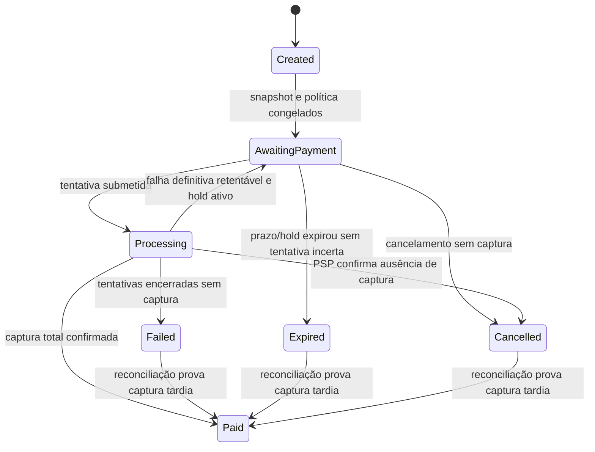
```mermaid
stateDiagram-v2
    [*] --> Created
    Created --> AwaitingPayment: snapshot e política congelados
    AwaitingPayment --> Processing: tentativa submetida
    Processing --> AwaitingPayment: falha definitiva retentável e hold ativo
    Processing --> Paid: captura total confirmada
    Processing --> Failed: tentativas encerradas sem captura
    AwaitingPayment --> Expired: prazo/hold expirou sem tentativa incerta
    AwaitingPayment --> Cancelled: cancelamento sem captura
    Processing --> Cancelled: PSP confirma ausência de captura
    Failed --> Paid: reconciliação prova captura tardia
    Expired --> Paid: reconciliação prova captura tardia
    Cancelled --> Paid: reconciliação prova captura tardia
```

Estados permitidos no MVP: `CREATED`, `AWAITING_PAYMENT`, `PROCESSING`, `PAID`, `FAILED`, `EXPIRED`, `CANCELLED`. `PAID` não retrocede: refund, chargeback, late payment e payout são agregados/projeções separados. Transição de terminal não pago para `PAID` exige captura provada por consulta/relatório autenticado de reconciliação e, sem reserva válida, cria `LatePaymentCase` no mesmo commit. Tentativa `UNKNOWN` mantém a ordem em `PROCESSING`; expiração do hold não autoriza marcar a ordem como `EXPIRED` enquanto o resultado financeiro estiver incerto. Pagamento parcial futuro usa `paid_minor`/projeção e não adiciona estado capaz de confirmar contrato sem o total.

Máquina de `PaymentAttempt`:

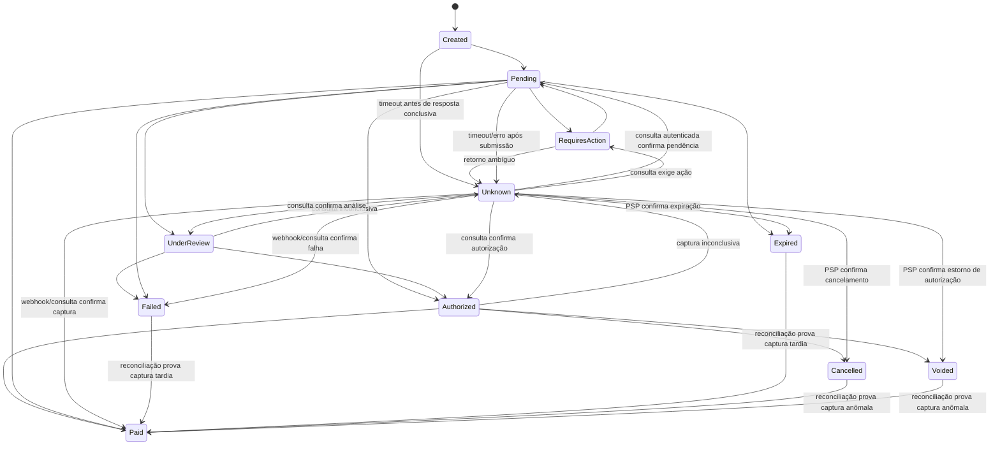
```mermaid
stateDiagram-v2
    [*] --> Created
    Created --> Pending
    Created --> Unknown: timeout antes de resposta conclusiva
    Pending --> RequiresAction
    RequiresAction --> Pending
    RequiresAction --> Unknown: retorno ambíguo
    Pending --> UnderReview
    Pending --> Authorized
    Pending --> Unknown: timeout/erro após submissão
    UnderReview --> Authorized
    UnderReview --> Failed
    UnderReview --> Unknown: consulta inconclusiva
    Authorized --> Paid
    Authorized --> Unknown: captura inconclusiva
    Pending --> Paid
    Pending --> Failed
    Pending --> Expired
    Authorized --> Cancelled
    Authorized --> Voided
    Unknown --> Pending: consulta autenticada confirma pendência
    Unknown --> RequiresAction: consulta exige ação
    Unknown --> UnderReview: consulta confirma análise
    Unknown --> Authorized: consulta confirma autorização
    Unknown --> Paid: webhook/consulta confirma captura
    Unknown --> Failed: webhook/consulta confirma falha
    Unknown --> Expired: PSP confirma expiração
    Unknown --> Cancelled: PSP confirma cancelamento
    Unknown --> Voided: PSP confirma estorno de autorização
    Failed --> Paid: reconciliação prova captura tardia
    Expired --> Paid: reconciliação prova captura tardia
    Cancelled --> Paid: reconciliação prova captura anômala
    Voided --> Paid: reconciliação prova captura anômala
```

`PAID` é fato histórico da tentativa e não vira `PAID_OUT`, `REFUNDED` ou `CHARGEBACK`. Refund, contestação, risco e payout referenciam a transação sem sobrescrevê-la.

| Rótulo de negócio solicitado | Fonte autoritativa | Regra |
|---|---|---|
| Criado, pendente, requer ação, em análise, autorizado, pago, falhou, expirou, cancelado, estornado | `PaymentOrder`/`PaymentAttempt`, derivados de fatos `PaymentTransaction` | Adapter mapeia `provider_status`; estado desconhecido vai para exceção |
| Parcialmente pago | Sumário de `PaymentOrder` sobre tentativas pagas | Fora do MVP integral; nunca confirma contrato sem total devido |
| Reembolsado parcialmente/reembolsado | `Refund` confirmado + projeção da ordem | Captura histórica permanece `PAID` |
| Em disputa/chargeback | `ChargebackCase` e fato do PSP | Não é `Dispute` de qualidade do serviço |
| Liberado para repasse, processando, repassado, falhou | `Payout` | Máquina exclusiva da seção 16 |
| Bloqueado por risco | `RiskHold` com escopo/valor/prazo | Não altera pagamento capturado nem conteúdo |
| Postado/compensado | `LedgerTransaction` | Fato contábil imutável |

Estados do provedor ficam em `provider_status` e são mapeados por adapter versionado. A UI pode mostrar uma linha do tempo composta, mas API e banco nunca compartilham um enum entre esses agregados.

`UNKNOWN` é incerteza interna após timeout ou resposta ambígua, não tradução livre de um status do PSP. Somente webhook autenticado ou consulta autenticada ao PSP pode resolvê-lo para estado conhecido; expiração por relógio local isolado é proibida. Enquanto uma tentativa estiver `UNKNOWN`, a ordem bloqueia nova tentativa mutável, confirmação contratual e payout para o mesmo contexto. O hold obedece ao TTL máximo e, se expirar antes da confirmação financeira, uma captura posterior segue `LatePaymentCase`. Cache de resposta idempotente pode expirar, mas operation key, provider IDs e hash do comando permanecem na entidade pelo ciclo financeiro.

Transição de estado não pago terminal para `PAID` é exclusiva da reconciliação diante de fato de captura autenticado, abre incidente de divergência e segue `LatePaymentCase` se contrato/reserva já não puderem confirmar. Nunca é executada por resposta síncrona do comando.

Máquina de `Refund`:

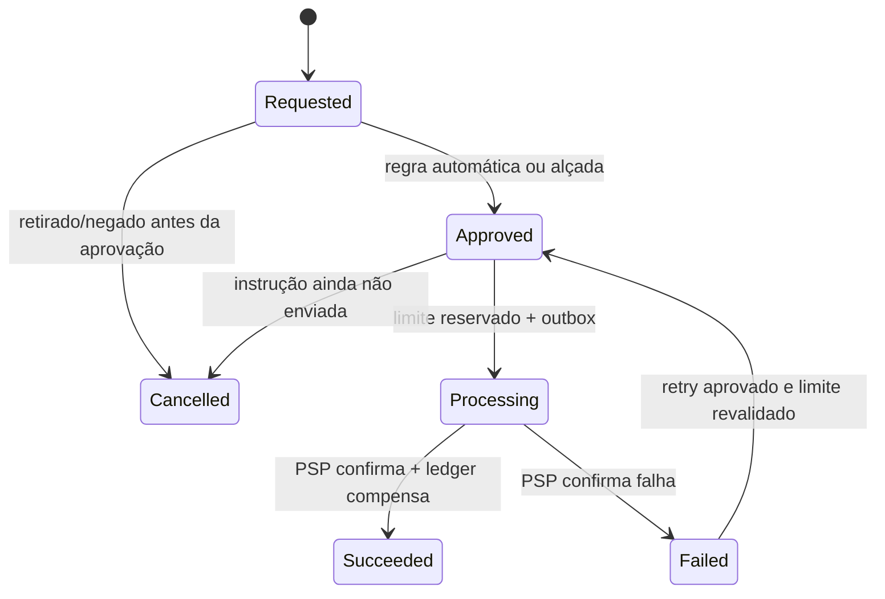
```mermaid
stateDiagram-v2
    [*] --> Requested
    Requested --> Approved: regra automática ou alçada
    Requested --> Cancelled: retirado/negado antes da aprovação
    Approved --> Processing: limite reservado + outbox
    Approved --> Cancelled: instrução ainda não enviada
    Processing --> Succeeded: PSP confirma + ledger compensa
    Processing --> Failed: PSP confirma falha
    Failed --> Approved: retry aprovado e limite revalidado
```

Estados autoritativos: `REQUESTED`, `APPROVED`, `PROCESSING`, `SUCCEEDED`, `FAILED`, `CANCELLED`. Aprovação automática pode registrar `REQUESTED -> APPROVED -> PROCESSING` na mesma transação. `RefundIssued` só é emitido após `SUCCEEDED` e lançamento compensatório; `REQUESTED`/`PROCESSING` nunca são apresentados como dinheiro devolvido.

## 14.5 Webhooks

Fluxo obrigatório:

1. receber bytes brutos e headers;
2. limitar tamanho e origem conforme capacidade do PSP;
3. validar assinatura com chave rotacionável;
4. validar timestamp/janela e nonce/event ID quando disponível;
5. persistir `WebhookEvent` com hash e chave única antes de responder;
6. responder rapidamente conforme SLA do PSP;
7. processar assincronamente;
8. deduplicar por `provider + event_id`;
9. buscar estado no PSP quando evento for ambíguo ou fora de ordem;
10. validar moeda, valor, recebedor e referência;
11. aplicar transição, ledger e outbox na mesma transação local;
12. retentar com backoff; após o limite, enviar à dead-letter queue (`DLQ`) e alertar;
13. conciliar independentemente.

**[OBR]** Duplicata retorna sucesso após persistência/detecção e não repete lançamento.

## 14.6 Fluxo financeiro de ponta a ponta

1. Cliente confirma contrato e política.
2. API cria `PaymentOrder` e hold.
3. PSP recebe idempotency key.
4. Cliente conclui ação/3DS/Pix.
5. API não confia apenas na resposta síncrona.
6. Webhook ou consulta autenticada confirma resultado.
7. Inbox idempotente cria `PaymentTransaction` imutável e projeta `PaymentAttempt/PaymentOrder`.
8. Contrato/booking confirmam e `Payout(SCHEDULED)` é criado somente se todas as pré-condições, inclusive hold ativo, persistirem; caso tardio segue a seção 12.1.
9. Ledger recebe lançamento balanceado.
10. Conclusão/disputa alteram elegibilidade, não captura histórica.
11. PSP liquida/repassa conforme contrato.
12. Relatório do PSP, API e ledger são conciliados.

## 14.7 Refund, cancelamento e chargeback

| Evento | Regra de taxa |
|---|---|
| Refund total antes de execução | Comissão revertida integralmente; custo PSP não recuperável permanece despesa da plataforma no MVP |
| Refund parcial | Comissão revertida proporcionalmente à base reembolsada |
| Retenção válida por serviço/material | Comissão incide apenas sobre valor reconhecido como serviço/material, se política aprovada |
| Cupom plataforma | Refund ao cliente respeita valor efetivamente pago; promo é revertida proporcionalmente |
| Cupom profissional | Reversão proporcional da base e comissão |
| Chargeback | Cria caso e lançamento de exposição; não apaga captura |
| Chargeback perdido | Reverte recebível/receita aplicável e registra fee/perda no responsável contratual |
| Chargeback ganho | Compensa exposição e desbloqueia conforme política |

Não debitar automaticamente o profissional se a causa for falha da plataforma/PSP ou se o contrato não atribuir responsabilidade. Saldo negativo usa compensação futura apenas com fundamento, limites, aviso e recurso.

Concorrência de refund e chargeback:

1. bloquear `PaymentOrder` por `SELECT FOR UPDATE` ou versão otimista equivalente;
2. calcular `available_return_minor = captured_minor - refund_reserved_minor - refunded_minor - chargeback_reserved_minor - charged_back_minor`;
3. validar `requested_minor <= available_return_minor`; tanto abertura de chargeback quanto pedido de refund usam a mesma trava e o mesmo limite;
4. aprovação automática/manual do refund reserva `refund_reserved_minor`, transiciona `Refund` para `PROCESSING` e grava outbox; chargeback aberto reserva `chargeback_reserved_minor` e cria/atualiza `ChargebackCase`, sempre na transação local correspondente;
5. confirmação de refund move `refund_reserved` para `refunded`; chargeback perdido move `chargeback_reserved` para `charged_back`; falha/refund cancelado ou chargeback ganho libera a reserva por comando idempotente;
6. fato do PSP com valor acima do disponível não é truncado nem descartado: `PaymentTransaction` e `ChargebackCase.gross_amount_minor` preservam o valor, `overlap_exception_minor` sinaliza sobreposição e bloqueia nova devolução até conciliação;
7. retry usa a mesma chave e a soma alocada nunca excede a captura, inclusive entre refund de suporte, disputa e chargeback.

## 14.8 Pagamento por etapas

**[FDE MVP, Fase 2]**. O modelo deve suportar:

- contrato com `Milestone` versionado;
- ordem/captura por etapa;
- comissão proporcional por etapa paga;
- aceite, contestação e refund por etapa;
- repasse elegível por etapa;
- total de etapas e aditivos igual ao total vigente;
- última etapa não ser cobrada automaticamente sem gatilho consentido.

## 14.9 Conciliação

Três vias:

- transações/eventos do PSP;
- relatório de liquidação/recebíveis/repasses;
- ordens, transações e ledger internos.

Periodicidade: incremental a cada hora e fechamento diário D+1. Divergências:

- evento ausente;
- valor/moeda divergente;
- pagamento órfão;
- duplicidade;
- refund/chargeback não lançado;
- split ou recebedor divergente;
- repasse ausente/falho;
- fee divergente.

Critério P0: soma de débitos igual a créditos por moeda e divergência não explicada de caixa/recebível igual a zero ao fechamento.

---

# 15. Ledger

## 15.1 Princípios

**[OBR]** Ledger imutável de dupla entrada:

- um `LedgerTransaction` agrupa duas ou mais linhas;
- soma de débitos igual à soma de créditos por moeda;
- linhas postadas não são alteradas/apagadas;
- correção cria transação compensatória ligada à original;
- idempotency key única por tipo/referência;
- timestamps de negócio, contabilização e ingestão são distintos;
- saldo é projeção do ledger, não campo editável;
- acesso financeiro é segregado e auditado.

## 15.2 Plano mínimo de contas

| Conta | Natureza | Finalidade |
|---|---|---|
| Caixa/PSP clearing | Ativo | Valor reconhecido no processador a conciliar |
| Contas a receber PSP | Ativo | Captura ainda não liquidada |
| Recebível do profissional | Passivo | Valor devido/elegível ao profissional |
| Receita de comissão | Receita | Comissão da plataforma |
| Taxas do PSP | Despesa | Processamento, refund e chargeback |
| Reembolso a pagar/clearing | Passivo/controle | Refund iniciado e não confirmado |
| Reserva de risco do profissional | Passivo restrito | Parcela contratualmente bloqueada pelo PSP/política |
| Chargeback em análise | Ativo/controle | Exposição ainda não decidida |
| Créditos promocionais | Passivo/contra-receita | Crédito concedido e consumível |
| Despesa promocional | Despesa | Cupom financiado pela plataforma |
| Ajustes e perdas | Receita/despesa | Diferença aprovada e compensação |

**VALIDAÇÃO CONTÁBIL/TRIBUTÁRIA OBRIGATÓRIA** para nomes, natureza e reconhecimento.

## 15.3 Estrutura

`LedgerTransaction`:

- `id`, `type`, `reference_type`, `reference_id`;
- `currency`, `business_at`, `posted_at`;
- `idempotency_key`, `correlation_id`;
- `reversal_of_id`, `status`;
- `created_by_type`, `created_by_id`, `approval_id`;
- metadados não sensíveis.

`LedgerEntry`:

- `id`, `ledger_transaction_id`, `account_id`;
- `side` (`DEBIT`/`CREDIT`);
- `amount_minor`, `currency`;
- `professional_profile_id` quando subledger;
- `available_at`, `restriction_reason`;
- hash/controle de integridade.

## 15.4 Exemplos de lançamentos

Exemplo **operacional e não contábil/fiscal** de captura de R$ 100, comissão contratual R$ 15 e custo PSP R$ 3 absorvido pela plataforma:

| Conta | Débito | Crédito |
|---|---:|---:|
| PSP clearing/controle da liquidação | R$ 100 | - |
| Obrigação/controle do profissional | - | R$ 85 |
| Comissão contratual a classificar | - | R$ 15 |
| Taxas PSP | R$ 3 | - |
| PSP clearing/controle da liquidação | - | R$ 3 |

Os dois fatos podem ser transações separadas, ambas balanceadas. Os nomes “clearing”, “obrigação” e “comissão” não afirmam que a plataforma controla o bruto ou já reconheceu receita. O template final depende do contrato/relatório do PSP e da conclusão principal versus agente.

**[OBR]** Antes da RFP e do parecer, templates de produção ficam bloqueados. Se o split direto não criar direito da plataforma sobre o bruto, o valor total será tratado em subledger/contas de controle apropriadas, não como ativo próprio. Se outro arranjo atribuir direito/obrigação diferente, um novo template e ADR contábil serão aprovados. **VALIDAÇÃO CONTÁBIL/TRIBUTÁRIA OBRIGATÓRIA.**

Refund parcial de R$ 20 sobre base original:

| Conta | Débito | Crédito |
|---|---:|---:|
| Recebível profissional/conta negativa | R$ 17 | - |
| Comissão contratual/classificação aprovada | R$ 3 | - |
| Reembolso a pagar/PSP clearing | - | R$ 20 |

Se o profissional já recebeu, o débito vai para conta negativa/recuperável conforme fundamento contratual, não altera o lançamento anterior.

## 15.5 Invariantes e aceite

- `amount_minor > 0`; lado define sinal.
- Moeda de todas as entradas da transação é igual.
- Débitos e créditos balanceiam antes do commit.
- Referência financeira e idempotency key possuem índices únicos.
- Nenhuma API administrativa faz `UPDATE`/`DELETE` em entrada postada.
- Reprocessar webhook 100 vezes cria uma transação de ledger.
- Saldo projetado é reproduzível desde o início e comparado diariamente.

---

# 16. Repasses

## 16.1 Modelo

Repasse é execução do PSP sobre recebível do profissional. A plataforma mantém espelho operacional:

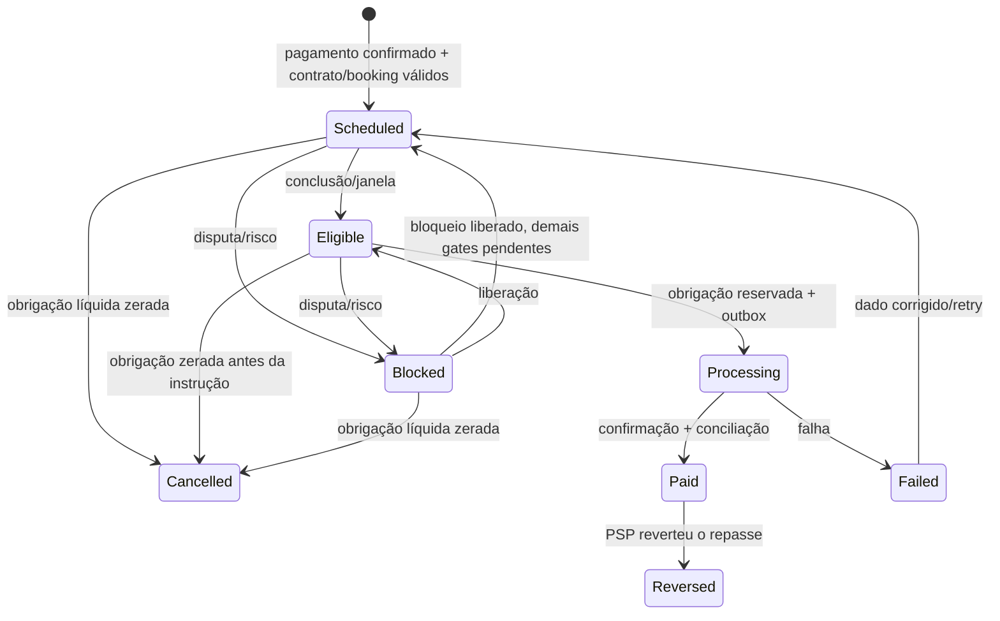
```mermaid
stateDiagram-v2
    [*] --> Scheduled: pagamento confirmado + contrato/booking válidos
    Scheduled --> Eligible: conclusão/janela
    Scheduled --> Blocked: disputa/risco
    Scheduled --> Cancelled: obrigação líquida zerada
    Eligible --> Blocked: disputa/risco
    Eligible --> Cancelled: obrigação zerada antes da instrução
    Blocked --> Scheduled: bloqueio liberado, demais gates pendentes
    Blocked --> Eligible: liberação
    Blocked --> Cancelled: obrigação líquida zerada
    Eligible --> Processing: obrigação reservada + outbox
    Processing --> Paid: confirmação + conciliação
    Processing --> Failed: falha
    Failed --> Scheduled: dado corrigido/retry
    Paid --> Reversed: PSP reverteu o repasse
```

Eventos da máquina têm significado único:

| Transição | Evento | Fato comunicado |
|---|---|---|
| `SCHEDULED/BLOCKED` → `ELIGIBLE` | `PayoutReleased` | Bloqueios terminaram e o recebível ficou elegível; nenhum dinheiro foi instruído ou liquidado |
| `ELIGIBLE` → `PROCESSING` | `PayoutProcessing` | Saldo foi reservado localmente e a instrução idempotente foi criada |
| `PROCESSING` → `PAID` | `PayoutPaid` | PSP confirmou e a conciliação aceitou o crédito |
| `PROCESSING` → `FAILED` | `PayoutFailed` | Instrução falhou; compensação ou bloqueio correspondente foi registrado |
| `SCHEDULED/ELIGIBLE/BLOCKED` → `CANCELLED` | `PayoutCancelled` | Refund/cancelamento zerou a obrigação sob lock, antes de criar/submeter tentativa PSP |
| `PAID` → `REVERSED` | `PayoutReversed` | PSP confirmou reversão real da transferência |

## 16.2 Política recomendada

**[HIP]**:

- pagamento integral fica sujeito à agenda de liquidação do PSP;
- elegibilidade operacional somente após conclusão, liquidação, KYC apto, ausência de bloqueio e fim da janela interna de disputa de 7 dias;
- após elegibilidade, a instrução é criada em até 2 dias úteis; crédito efetivo segue agenda do PSP e é comunicado como estimativa, não garantia;
- repasse automático; manual apenas para exceção e dupla aprovação;
- valor mínimo conforme custo PSP; abaixo, acumular no PSP se o produto permitir;
- repasse por etapa somente na Fase 2;
- antecipação somente oferecida diretamente pelo PSP e após validação.

**VALIDAÇÃO COM PROVEDOR DE PAGAMENTO.**

**[OBR]** `Payout(SCHEDULED)` é criado uma única vez, na mesma transação que confirma pagamento, contrato e booking. Pagamento tardio sem reserva válida não cria payout; o agregado só nasce se o caso terminar `RESOLVED_REBOOKED`.

Antes de chamar o PSP, uma transação local bloqueia `Contract` e `Payout` na ordem canônica, revalida ausência de disputa/hold, KYC, liquidação, janela e valor, transiciona o agregado existente de `ELIGIBLE` para `PROCESSING`, move `ProfessionalAvailable` para `PayoutPending`, cria o fato inicial de `PayoutAttempt`, vincula a `LedgerTransaction` como `RESERVATION` e grava outbox. O worker externo não cria outro agregado.

Tentativas e fatos contábeis:

- `PayoutAttempt` é append-only por `payout_id + attempt_no + fact_no`; fatos permitidos incluem `INSTRUCTION_CREATED`, `SUBMITTED`, `UNKNOWN`, `SUCCEEDED` e `FAILED`;
- enquanto o último fato for `SUBMITTED/UNKNOWN`, nova chamada ao PSP é bloqueada; consulta autenticada ou webhook resolve a mesma tentativa;
- retry após falha confirmada incrementa `attempt_no` e usa nova chave derivada do payout/sequence, sem reutilizar uma instrução de destino alterado;
- `PayoutLedgerLink` relaciona 1:N o payout às transações imutáveis com purpose `RESERVATION`, `SETTLEMENT`, `FAILURE_COMPENSATION` ou `REVERSAL`;
- antes de `PROCESSING`, refund/cancelamento pode recalcular o líquido sob lock, incrementando `calculation_version` e auditoria; se a obrigação chegar a zero, transiciona para `CANCELLED` e emite `PayoutCancelled`;
- confirmação/conciliação do PSP cria `SETTLEMENT` e `PayoutPaid`; falha cria `FAILURE_COMPENSATION` ou mantém restrição motivada; reversão real cria `REVERSAL`;
- nenhuma referência singular em `Payout` é tratada como histórico financeiro completo.

Chargeback posterior mantém `Payout=PAID` e cria exposição, reserva ou saldo negativo separado. `REVERSED` só é usado quando o PSP confirma reversão real da transferência, nunca como sinônimo de chargeback.

## 16.3 Bloqueio, reserva e saldo negativo

Qualquer bloqueio:

- possui motivo contratual e código;
- é proporcional ao valor exposto;
- informa valor, início, condição e prazo estimado;
- não mistura sanção de conteúdo com recebível sem nexo;
- permite contestação;
- é revisado automaticamente no prazo;
- gera acesso restrito e auditado.

Reserva de chargeback só existe se operada/permitida pelo PSP e contrato. A plataforma não chama provisão contábil interna de dinheiro retido.

Saldo negativo:

- nasce de chargeback, refund pós-repasse ou ajuste aprovado;
- é separado por moeda e profissional;
- não autoriza débito bancário sem mandato/base;
- compensação futura tem limite e demonstrativo;
- valor controvertido é destacado;
- cobrança externa segue processo jurídico aprovado.

## 16.4 Falhas

| Falha | Ação |
|---|---|
| Conta inválida | Marcar `FAILED`, ocultar dados, pedir correção com reautenticação |
| KYC incompleto | Bloquear elegibilidade e orientar onboarding |
| PSP indisponível | Retentar, monitorar SLA e não marcar pago |
| Webhook ausente | Consultar API/relatório e reconciliar |
| Valor divergente | Pausar caso, alertar financeiro e impedir ajuste automático |
| Repasse duplicado | Incidente P0, congelar automação relacionada e conciliar |
| Recebedor alterado | Cooling-off, notificação e revisão de risco antes de novos repasses |

## 16.5 Extrato do profissional

Cada linha mostra:

- contrato/referência;
- bruto;
- desconto por financiador;
- comissão;
- custo atribuível;
- refund/chargeback;
- líquido;
- estado e previsão/fato do repasse;
- motivo de bloqueio;
- comprovante/ID do PSP mascarado;
- canal de contestação.

---

# 17. Cancelamentos

## 17.1 Princípios

**[OBR]** A política é versionada por categoria/tipo, apresentada antes do aceite e aplicada ao snapshot. O cálculo considera ator, antecedência, início, materiais, deslocamento, presença, força maior, risco de segurança e evidência.

**VALIDAÇÃO JURÍDICA OBRIGATÓRIA**, inclusive direito de arrependimento e relação de consumo. Valores percentuais abaixo são hipótese operacional, não autorização comercial.

**[OBR]** Default seguro até aprovação: `automatic_retention_bps = 0`. Serviço não iniciado é reembolsado integralmente; retenção por visita executada, material pré-autorizado ou deslocamento comprovado exige regra exata aprovada ou revisão manual. Configuração usa basis points, limites monetários e intervalos sem sobreposição, nunca faixas vagas.

## 17.2 Matriz recomendada

| Cenário | Reembolso/retido | Crédito/penalidade | Score | Evidência | Recurso |
|---|---|---|---|---|---|
| Cliente cancela com antecedência >=24h | 100% ao cliente | Sem penalidade; custo PSP como despesa definida | Sem impacto isolado | Timestamp | Sim |
| Cliente cancela com antecedência >=2h e <24h | 100% no default MVP; eventual retenção futura exige percentual exato validado | Crédito pode substituir retenção apenas com aceite | Impacto só por padrão recorrente validado | Timestamp/agenda | Sim |
| Cliente cancela com antecedência >=0 e <2h | 100% no automático; material/deslocamento pré-autorizado vai a revisão, limitado ao menor entre valor aprovado e comprovado | Sem receita de cancelamento da plataforma | Impacto após decisão/evidência | Deslocamento/compra | Sim |
| Profissional cancela | 100% ao cliente | Crédito de cortesia pela plataforma conforme alçada; sanção progressiva | Impacta cancelamento | Motivo e contato | Sim |
| Cliente não comparece | Default: reembolsar parte não executada; visita efetivamente prestada/deslocamento só é reconhecido por política/evidência | Reagendamento opcional | Impacta após confirmação/evidência | Check-in e tentativas de contato | Sim |
| Profissional não comparece | 100% ao cliente | Possível crédito e suspensão por reincidência | Impacto forte | Tentativas/horário | Sim |
| Profissional atrasa | Tolerância hipótese de 15 min em compromisso de até 2h e 30 min acima; após isso cliente cancela sem custo | Crédito/redução acordada | Pontualidade | Mensagens/timestamps | Sim |
| Cliente atrasa | Mesma tolerância publicada; reduzir duração só se previsto e aplicável | Reagendamento | Padrão recorrente | Mensagens/timestamps | Sim |
| Serviço iniciado, cliente encerra sem falha | Valor proporcional executado + material aprovado; saldo reembolsado | Nenhuma taxa oculta | Neutro/avaliar padrão | Aceite/início/evidência | Sim |
| Serviço parcialmente executado com falha alegada | Suspender cálculo e abrir disputa | Decisão por evidência | Após decisão | Fotos, escopo, chat | Sim |
| Materiais comprados | Só valor previamente autorizado, não recuperável e comprovado | Materiais devem ser entregues ao cliente quando pagos, se aplicável | Neutro | Nota/comprovante | Sim |
| Reagendamento aceito | Sem refund; novo booking | Custo só se explicitamente aplicável | Sem impacto | Aceite bilateral | Sim |
| Reagendamento recusado | Tratar como cancelamento do proponente | Conforme ator/antecedência | Conforme regra | Proposta/recusa | Sim |
| Força maior | Análise caso a caso, preferência por reembolso/reagendamento | Sem punição automática | Sem impacto confirmado | Evidência proporcional | Sim |
| Risco à segurança | Interromper; preservar evidência; financeiro vai para disputa | Sem penalizar denunciante automaticamente | Após investigação | Relato/evidência | Sim |

## 17.3 Ausência e presença

- localização contínua não é exigida;
- presença pode ser evidenciada por código de início compartilhado, ação das partes, mensagem e timestamp;
- código nunca é enviado ao profissional antes da janela;
- ausência não é decidida só por GPS;
- tentativas de contato devem respeitar quiet hours e segurança;
- reincidência é avaliada por janela e amostra, não por evento isolado.

## 17.4 Cálculo

O motor retorna componentes, não um percentual opaco:

```json
{
  "policyVersion": "cancel-v1",
  "capturedAmount": 10000,
  "refundAmount": 8500,
  "recognizedServiceAmount": 0,
  "recognizedMaterialAmount": 1000,
  "recognizedTravelAmount": 500,
  "originalPlatformCommission": 1500,
  "platformFeeReversal": 1275,
  "platformFeeRetained": 225,
  "reasonCodes": ["CUSTOMER_LATE_CANCEL", "MATERIAL_PREAPPROVED"],
  "requiresManualReview": true
}
```

Critério: o total distribuído, reembolsado, reconhecido e contabilizado fecha com o total capturado e promoções, sem diferença.

---

# 18. Aditivos

## 18.1 Regra

Nenhum valor, prazo ou escopo adicional entra em vigor sem consentimento explícito da contraparte e pagamento adicional quando necessário.

Campos:

- ID/versão, contrato e proponente;
- motivo;
- diff do escopo anterior/novo;
- incluídos/excluídos;
- mão de obra, materiais, deslocamento e taxas;
- valor adicional ou redução;
- impacto em prazo/agenda;
- cronograma/pagamento;
- política e validade;
- anexos;
- evidência de aceite.

Estados:

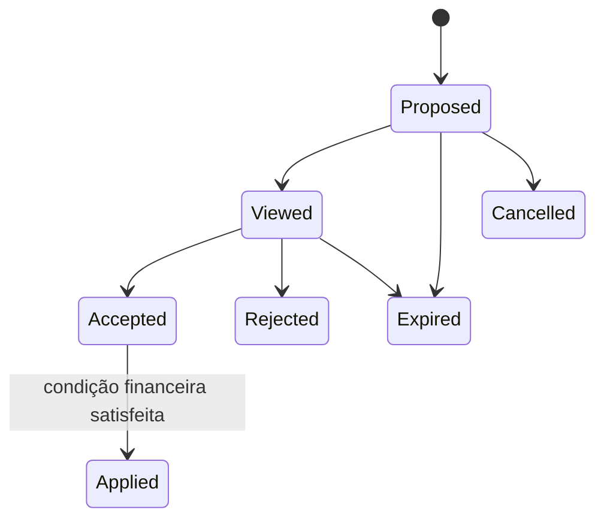
```mermaid
stateDiagram-v2
    [*] --> Proposed
    Proposed --> Viewed
    Viewed --> Accepted
    Viewed --> Rejected
    Proposed --> Expired
    Viewed --> Expired
    Proposed --> Cancelled
    Accepted --> Applied: condição financeira satisfeita
```

## 18.2 Regras por impacto

| Impacto | Tratamento |
|---|---|
| Aumento de preço | Nova ordem de pagamento; não iniciar parte adicional antes de aprovação/resultado |
| Redução de preço | Refund/ajuste conforme execução e PSP |
| Aumento de prazo | Novo aceite e ajuste de agenda |
| Mudança de modalidade/local | Revalidar área, risco, preço e endereço |
| Material adicional | Item, quantidade, propriedade e comprovante |
| Sem efeito financeiro | Ainda exige aceite se escopo/prazo relevante mudar |

## 18.3 Concorrência e aceite

- somente uma versão ativa do mesmo aditivo;
- aceitar usa `If-Match`/versão;
- aditivo expirado não pode ser ressuscitado;
- múltiplos aditivos aplicados compõem uma linha do tempo, não sobrescrevem contrato;
- total vigente é soma do snapshot e aditivos aplicados menos reduções/refunds;
- disputa impede novo aditivo salvo plano de correção aprovado.

## 18.4 Critérios

- cobrança extra sem `ACCEPTED/APPLIED` é rejeitada;
- mudança de preço nunca altera proposta/contrato original;
- recusa não penaliza automaticamente o cliente;
- aceite registra decomposição completa e política;
- refund de aditivo referencia sua ordem e lançamentos.

---

# 19. Disputas

## 19.1 Escopo e papel

A plataforma oferece suporte e mediação privada, não atua como autoridade judicial, árbitro estatal ou garantidora universal. Direitos legais e canais externos não são impedidos.

Motivos: não realizado, incompleto, qualidade divergente, valor indevido, duplicidade, atraso grave, ausência, dano, fraude, cancelamento, conduta inadequada, escopo divergente e material não entregue.

## 19.2 Estados

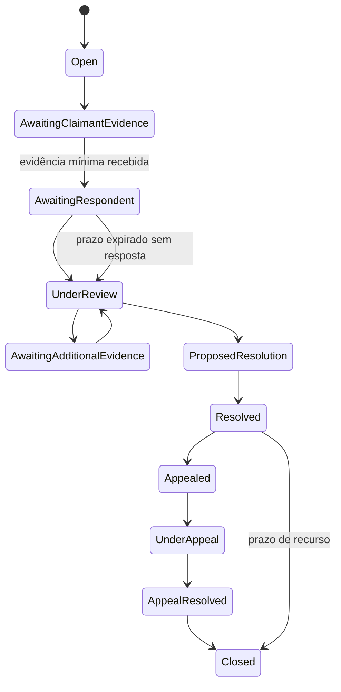
```mermaid
stateDiagram-v2
    [*] --> Open
    Open --> AwaitingClaimantEvidence
    AwaitingClaimantEvidence --> AwaitingRespondent: evidência mínima recebida
    AwaitingRespondent --> UnderReview
    AwaitingRespondent --> UnderReview: prazo expirado sem resposta
    UnderReview --> AwaitingAdditionalEvidence
    AwaitingAdditionalEvidence --> UnderReview
    UnderReview --> ProposedResolution
    ProposedResolution --> Resolved
    Resolved --> Appealed
    Appealed --> UnderAppeal
    UnderAppeal --> AppealResolved
    AppealResolved --> Closed
    Resolved --> Closed: prazo de recurso
```

## 19.3 Fluxo e prazos recomendados

A abertura é uma fronteira atômica P0: na mesma transação e sob ordem de lock `Contract -> Payout`, a API valida elegibilidade, cria `Dispute(OPEN)`, transiciona o contrato, cria `RiskHold`/restrição financeira proporcional quando aplicável e, se o payout estiver `SCHEDULED/ELIGIBLE`, move-o para `BLOCKED`; se estiver `FAILED`, o hold impede retry; se já estiver `PROCESSING/PAID`, aplica-se recuperação sem alegar bloqueio retroativo. A transação grava auditoria e outbox e só então responde `201 OPEN`. `DisputeOpened` não cria o hold assincronamente.

`Payout ELIGIBLE -> PROCESSING` adquire os mesmos locks e revalida ausência de disputa/hold imediatamente antes da reserva. Se a disputa vencer a corrida, o payout não processa. Se o payout já estiver `PROCESSING/PAID`, a disputa permanece válida, registra `hold_scope=RECOVERY`, tenta cancelar a instrução quando o PSP permitir e informa que reversão não é garantida; não falsifica bloqueio retroativo.

| Etapa | Prazo | Responsável | Saída |
|---|---:|---|---|
| Abertura | Até 7 dias após conclusão, sem limitar direitos legais | Parte/suporte | Motivo, pedido e bloqueio avaliado |
| Evidência inicial | 48h | Reclamante | Narrativa e anexos |
| Resposta | 3 dias úteis | Reclamado | Contestação e evidência |
| Triagem | 1 dia útil | Suporte | Categoria, risco, SLA e responsável |
| Análise padrão | 5 dias úteis | Especialista | Proposta de decisão |
| Complexa/risco | Até 15 dias úteis com atualização | Risco/Jurídico | Decisão por alçada |
| Recurso | 5 dias úteis | Parte | Fundamento novo/erro material |
| Decisão recursal | 5 dias úteis | Revisor diferente | Decisão final interna motivada |

Emergência física, fraude ativa, vazamento ou valor elevado segue SLA P0/P1, não a fila padrão.

Meta ponta a ponta para caso simples: até 10 dias úteis desde a evidência mínima, quando as partes respondem no prazo. Ausência de resposta não presume culpa; o decisor registra o timeout e decide com o conjunto disponível e a regra validada.

## 19.4 Evidências

Aceitas conforme pertinência:

- snapshot, proposta, aditivos e políticas;
- mensagens e eventos de sistema;
- fotos/vídeos com integridade e metadados minimizados;
- comprovante de material;
- timestamps de agenda e tentativas de contato;
- laudo/terceiro quando proporcional;
- comprovante do PSP/ledger;
- relato das partes.

GPS, imagem ou mensagem isolados não são verdade absoluta. O decisor registra fatos aceitos, fatos inconclusivos, regra aplicada e cálculo.

## 19.5 Matriz de decisão

| Resultado | Efeito de contrato | Efeito financeiro | Reputação/risco |
|---|---|---|---|
| Improcedente | Concluído | Desbloqueia conforme política | Sem punição por reclamar de boa-fé |
| Procedente total | Cancelado ou concluído com remédio, conforme execução | Refund total e reversões em agregados financeiros | Penalidade após revisão |
| Procedente parcial | Concluído com resolução registrada | Refund parcial discriminado | Impacto proporcional |
| Correção | Retorna à execução | Mantém bloqueio aplicável | Sem efeito até resultado |
| Acordo | Estado conforme termos | Refund/crédito/repasse acordado | Sem ocultar fraude/violação |
| Inconclusivo | Decisão conforme ônus/regra contratual validada | Alocação motivada | Não presumir fraude |

## 19.6 Alçadas e segregação

- agente que mediou não aprova exceção acima de sua alçada;
- recurso é revisto por pessoa diferente;
- caso de fraude vai para Risco;
- violência/dano grave vai para Trust & Safety/Jurídico;
- refund e ajuste seguem limites da seção 6;
- acesso a dado sensível expira ao encerrar o caso.

## 19.7 Critérios de aceite

- abertura idempotente por contrato/motivo dentro da regra;
- parte recebe protocolo, prazo e direito de resposta;
- possível repasse é sinalizado/bloqueado quando contratualmente suportado;
- decisão inclui regra, evidência, cálculo, operador e versão;
- recurso não é julgado pelo mesmo decisor;
- eventos e anexos têm cadeia de custódia;
- encerramento produz um efeito lógico financeiro e uma notificação deduplicada; transporte pode entregar evento mais de uma vez.

---

# 20. Segurança

## 20.1 Baseline e metas

**[OBR]** O programa adota:

- OWASP ASVS 5.0 nível 2 como baseline verificável;
- controles direcionados de nível 3 para administração, pagamentos, ledger, repasses e identidade;
- OWASP Top 10 e OWASP API Security Top 10 para ameaça e testes;
- threat modeling por fluxo crítico;
- menor privilégio, segregação de funções e Zero Trust proporcional;
- requisitos de segurança rastreados a histórias e testes.

Conformidade com uma lista não equivale a ausência de risco. Cada controle possui evidência, proprietário e periodicidade.

## 20.2 Classificação de dados

| Classe | Exemplos | Acesso | Proteção mínima |
|---|---|---|---|
| Pública | Categoria, perfil aprovado, avaliações publicadas | Internet | Integridade, moderação, cache control |
| Interna | Métricas agregadas, configuração não secreta | Equipe autorizada | SSO, RBAC, logs |
| Confidencial | E-mail, telefone, chat, contrato, suporte | Dono/finalidade/caso | Criptografia, ABAC, mascaramento |
| Restrita | CPF/CNPJ completo, documento, endereço, localização exata, financeiro | Poucos papéis e JIT | Criptografia por campo/chave, log de leitura, exportação bloqueada |
| Crítica | Segredos, chaves, refresh token, credencial PSP, backup | Workload ou pessoal JIT | KMS/HSM, cofre, rotação, nunca em log |

PAN completo e CVV não pertencem a nenhuma classe armazenável: são proibidos.

## 20.3 Trust boundaries e ameaças prioritárias

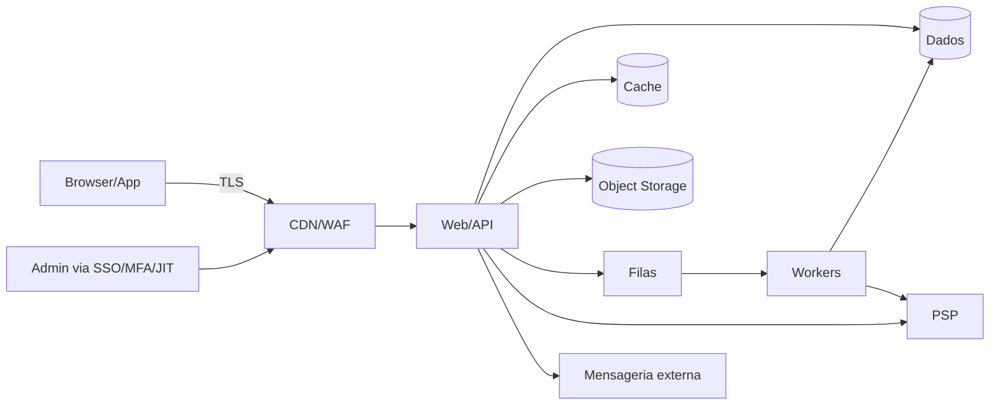
```mermaid
flowchart LR
    U[Browser/App] -->|TLS| EDGE[CDN/WAF]
    EDGE --> API[Web/API]
    API --> DB[(Dados)]
    API --> CACHE[(Cache)]
    API --> OBJ[(Object Storage)]
    API --> Q[Filas]
    API --> PSP[PSP]
    API --> MSG[Mensageria externa]
    ADM[Admin via SSO/MFA/JIT] --> EDGE
    Q --> WORK[Workers]
    WORK --> DB
    WORK --> PSP
```

| Ameaça | Ativo | Controle preventivo | Detecção/resposta |
|---|---|---|---|
| BOLA/IDOR | Contrato, chat, endereço | Autorização por objeto e participante em toda consulta | Teste negativo, alerta de enumeração |
| Tomada de conta | Identidade/recebível | MFA, rotação, rate limit, step-up | Novo dispositivo, reuso de token |
| Injeção | Banco/worker | Query parametrizada, schema validation, sem shell | SAST/DAST e erro anômalo |
| XSS | Sessão/chat/perfil | Escape contextual, sanitização, CSP | Relatório CSP e DAST |
| CSRF | Mutação autenticada por cookie | SameSite, token/origin e método seguro | Telemetria de falha |
| SSRF | Webhook, URL, mídia | Sem fetch arbitrário; allowlist, egress proxy, IP privado bloqueado | DNS/egress logs |
| Upload malicioso | Usuário/operação | Quarentena, MIME real, AV, CDR, sem execução | Alerta AV e bloqueio hash |
| Replay/webhook falso | Financeiro | Assinatura, timestamp, nonce/event ID e idempotência | Divergência/replay alertado |
| Abuso administrativo | PII/financeiro | SSO, MFA, JIT, alçada, dupla aprovação | Log imutável e revisão |
| Supply chain | Build/produção | Lockfile, SCA, SBOM, assinatura e proveniência | Alertas CVE e bloqueio CI |
| Exfiltração/log | PII/segredo | Redaction, DLP e minimização | Canários e detecção de volume |
| Ransomware/perda | Dados/operabilidade | Backup isolado, imutável e menor privilégio | Restore testado e IR |

## 20.4 Controles de aplicação e API

### Entrada e saída

- DTO/schema com allowlist, tipos, comprimento, enum e formato.
- Rejeitar propriedades desconhecidas em comandos sensíveis.
- Parametrizar SQL e limitar queries; ORM não substitui revisão.
- Escapar por contexto HTML/atributo/URL/JSON.
- Sanitizar rich text ou não permitir HTML no MVP.
- Descompactação tem limite de tamanho, profundidade e quantidade.
- Erro público usa envelope sem stack, SQL, token ou PII.

### Autorização

- middleware global autentica; política no domínio autoriza objeto e ação;
- IDs opacos não substituem autorização;
- filtros de listagem incluem ownership/escopo no banco;
- mass assignment é impedido por command models;
- resposta passa por serializer específico ao papel;
- exportação e busca administrativa têm limites e auditoria;
- testes cobrem matriz papel x estado x propriedade.

### Browser

- TLS moderno e HSTS após validação de todos os subdomínios;
- cookies `Secure`, `HttpOnly`, `SameSite` adequado e escopo mínimo;
- CSP com nonce/hash, sem `unsafe-inline` por padrão;
- `frame-ancestors`, `object-src 'none'`, Referrer-Policy e Permissions-Policy;
- CORS por allowlist exata, sem credencial com wildcard;
- CSRF para cookies autenticados;
- dependências externas com SRI quando aplicável e inventário.

### Rate limiting e bot

Limites combinam usuário, IP, dispositivo, recurso e risco. Rotas sensíveis têm orçamento:

- login/OTP/recuperação;
- cadastro e verificação;
- busca intensiva;
- publicação/pedido/proposta;
- mensagens/upload;
- checkout/refund;
- cupons/reviews;
- endpoints administrativos.

Resposta `429` não revela existência de conta e inclui retry seguro. CAPTCHA é adaptativo e acessível.

## 20.5 Criptografia, chaves e segredos

- TLS 1.2+ com preferência por configuração moderna suportada; política revista semestralmente.
- Banco, discos, filas, backups e object storage criptografados por serviço gerenciado.
- Campos restritos de documento/endereço podem usar envelope encryption com DEK por domínio e KEK em KMS.
- Hash determinístico separado, com pepper protegido, somente quando busca de duplicidade exigir.
- Segredos em secret manager, identidade de workload e rotação; `.env` de produção proibido no repositório.
- Chaves por ambiente e finalidade; produção não compartilha chave com homologação.
- Rotação possui versão e leitura compatível durante migração.
- Senhas usam algoritmo adaptativo recomendado no momento da implementação.

## 20.6 Logging e auditoria

Nunca registrar:

- senha, OTP, token completo, cookie ou secret;
- PAN, CVV, QR Pix completo quando sensível, chave bancária completa;
- documento/endereço completo;
- corpo integral de chat/anexo;
- biometria/selfie;
- payload bruto de terceiro sem redaction.

Log estruturado inclui instante, ambiente, serviço/módulo, nível, evento, outcome, actor pseudônimo, resource ID opaco, correlation/trace ID e código de erro. Audit log é separado, append-only, com retenção e acesso próprios.

Eventos auditáveis:

- autenticação/MFA/sessão;
- leitura/exportação de dado restrito;
- mudanças de papel, categoria, política e preço;
- verificação e moderação;
- transição contratual excepcional;
- pagamento, refund, ledger e repasse;
- regra/decisão de risco;
- acesso break-glass.

## 20.7 Segurança de upload

1. API emite URL assinada para bucket de quarentena.
2. Upload limita tamanho e tipo declarado.
3. Worker detecta MIME/magic bytes, hash e malware.
4. Imagem é recodificada e perde EXIF; PDF passa por CDR quando disponível.
5. Arquivo aprovado migra logicamente para área privada.
6. Download exige autorização e URL assinada curta com `Content-Disposition`.
7. Arquivo rejeitado é isolado e eliminado conforme política.

Object storage não é público; CDN usa origin access control. SVG/HTML executável não é aceito como upload de usuário no MVP.

## 20.8 SDLC e verificação

| Momento | Controle | Gate |
|---|---|---|
| Design | Threat model e privacy review | Fluxo P0 não entra em sprint sem revisão |
| Commit | Secret scan, lint e testes | Bloqueio |
| PR | Revisão, SAST, SCA e IaC scan | Bloqueio em severidade definida |
| Build | Artefato imutável, SBOM e assinatura | Somente artefato promovido |
| Homologação | DAST, E2E authz e contrato | Bloqueio P0/P1 |
| Pré-lançamento | Pentest independente com reteste | Crítico/alto corrigido ou risco formal excepcional |
| Produção | Monitoramento, WAF, CSP e anomalia | Alertas/runbooks |
| Contínuo | Patch, backup restore, tabletop | Evidência periódica |

## 20.9 Vulnerabilidades

| Severidade | Contenção | Correção alvo | Exceção |
|---|---:|---:|---|
| Crítica explorada/iminente | 4 h | 24 h | CISO + executivo, máximo 24 h |
| Crítica | 1 dia | 3 dias | CISO, controle compensatório |
| Alta | 3 dias | 15 dias | Segurança + dono |
| Média | 15 dias | 60 dias | Dono |
| Baixa | Próximo ciclo | 120 dias | Dono |

SLA conta da confirmação/triagem, com reavaliação por exploração e exposição. Programa de divulgação responsável fornece canal, safe harbor juridicamente revisado, triagem e retorno.

## 20.10 Resposta a incidentes

Fases: preparação, detecção, triagem, contenção, erradicação, recuperação, comunicação e lições aprendidas.

| Papel | Incidente técnico | Dados pessoais | Fraude/pagamento | Comunicação |
|---|---|---|---|---|
| Incident Commander | A/R | C | C | C |
| Segurança | R | R | C | C |
| Engenharia/SRE | R | C | R técnico | C |
| Encarregado/Privacidade | C | A/R avaliação LGPD | C | R titular/ANPD |
| Jurídico | C | C | C | A texto/obrigação |
| Risco/Financeiro | C | C | A/R | C |
| Suporte/Comms | I | I | I | R operacional |
| Executivo | A em P0 | A em relevante | A em perda material | A externa |

Runbooks mínimos: comprometimento de conta administrativa, vazamento de endereço/documento, webhook/credencial PSP, pagamento duplicado, ledger divergente, repasse duplicado, ransomware, object storage exposto, indisponibilidade regional e fornecedor comprometido.

**[OBR]** Incidentes com dados pessoais são avaliados conforme regulação da ANPD; registros são preservados pelo prazo aplicável. Comunicação é decisão do controlador com Privacidade/Jurídico, não uma automação cega.

---

# 21. Privacidade

## 21.1 Papéis e governança

**[HIP]** A empresa operadora da plataforma é controladora para conta, marketplace, segurança, risco, suporte e analytics próprios. Prestadores de nuvem, mensageria, verificação e suporte tendem a ser operadores conforme contrato e instrução. PSP pode ser controlador independente ou assumir papéis distintos para KYC/pagamento.

**VALIDAÇÃO JURÍDICA OBRIGATÓRIA** por fluxo e fornecedor. O contrato, não o rótulo comercial, deve refletir finalidades e decisões efetivas.

Governança:

- encarregado formalmente indicado e canal público;
- inventário/ROPA por finalidade;
- RIPD antes de geolocalização precisa, biometria/prova de vida, antifraude intensivo e decisões automatizadas de alto impacto;
- privacy review em novos dados/fornecedores;
- DPA e lista de suboperadores;
- processo de direitos do titular;
- registro de consentimento separado de outras bases;
- relatório de incidente e exercícios anuais.

## 21.2 Matriz de dados, finalidade e retenção proposta

Bases legais abaixo são **candidatas**. Prazos são baseline de produto e exigem **VALIDAÇÃO JURÍDICA OBRIGATÓRIA** e **VALIDAÇÃO CONTÁBIL/TRIBUTÁRIA OBRIGATÓRIA** onde indicado.

| Dado/categoria | Finalidade | Base candidata | Acesso | Retenção proposta | Compartilhamento | Exclusão/anonimização | Risco e controle |
|---|---|---|---|---|---|---|---|
| Identificação básica | Criar conta e contrato | Execução de contrato/procedimentos preliminares | Usuário, suporte necessário | Vida da conta + prazo de defesa | PSP/verificação quando necessário | Anonimizar após obrigações | Usurpação; criptografia/ABAC |
| E-mail/telefone | Login, contato e segurança | Contrato/legítimo interesse; consentimento para marketing | Dono, suporte mascarado | Vida da conta + bloqueio mínimo antifraude | Mensageria | Remover/hashear conforme obrigação | Phishing; mascaramento |
| CPF/CNPJ/documento | Unicidade, KYC e categoria | Obrigação legal/contrato/legítimo interesse conforme fluxo | Verificação/risco restrito | Até fim da finalidade + prazo legal/defesa | PSP/KYC | Eliminar imagem cedo; manter resultado mínimo | Roubo de identidade; campo cifrado |
| Selfie/prova de vida | Verificação de identidade | Base a validar; dado sensível/biométrico | Fornecedor e equipe mínima | Preferir não armazenar; resultado/ID | Fornecedor KYC | Exclusão após verificação salvo obrigação | Alto impacto; RIPD e liveness |
| Perfil público | Descoberta | Execução de contrato/legítimo interesse | Público | Enquanto publicado | Busca/CDN | Desindexar e anonimizar | Exposição; controles de publicação |
| Endereço/local exato | Execução presencial e fraude proporcional | Contrato/legítimo interesse | Partes após gate, suporte por caso | Contrato + prazo de disputa/defesa | Mapas/partes | Generalizar/remover quando possível | Segurança física; criptografia e log |
| Local aproximado | Busca/matching | Procedimento preliminar/legítimo interesse | Público/agregado | Enquanto pedido/perfil ativo | Busca/mapas | Generalizar | Reidentificação; célula mínima |
| Pedido/proposta/contrato | Negociação, execução e prova | Contrato/defesa de direitos | Partes/operação | 5 anos candidatos após encerramento | PSP/Jurídico quando necessário | Anonimizar campos não obrigatórios | Litígio; snapshot e acesso |
| Chat | Comunicação/evidência/moderação | Contrato/legítimo interesse | Participantes, caso atribuído | 180 dias sem contrato; 5 anos com contrato, candidatos | Moderação/Jurídico | Eliminar conteúdo fora de obrigação | Conteúdo sensível; acesso e redaction |
| Fotos/anexos | Escopo/evidência/portfólio | Contrato/consentimento quando aplicável | Partes/caso; público só com ação | Conforme recurso; evidência segue disputa | Storage/AV | Excluir binário e derivadas | EXIF/malware; recodificação |
| Pagamento tokenizado | Processar e conciliar | Contrato/obrigação legal | Financeiro restrito | Prazo fiscal/defesa aplicável | PSP | Manter IDs mínimos | Fraude; tokenização |
| Ledger/transação | Integridade financeira/auditoria | Obrigação legal/contrato/defesa | Financeiro/auditoria | 10 anos candidatos; validar | PSP/contabilidade/auditoria | Não excluir; restringir/pseudonimizar | Integridade; imutabilidade |
| Dados bancários mascarados | Repasse e suporte | Contrato/obrigação PSP | Profissional/financeiro mínimo | Enquanto recebedor + obrigação | PSP | Remover cópia local sempre que possível | Desvio; step-up |
| Avaliação | Reputação e confiança | Legítimo interesse/contrato | Público e moderação | Enquanto relevante + defesa | Busca | Anonimizar autor quando cabível | Retaliação; identificação limitada |
| Sessão/dispositivo | Segurança e revogação | Contrato/legítimo interesse | Usuário/segurança | Sessão + 12 meses de histórico candidato | Antifraude | Agregar/apagar | Rastreamento; minimização |
| IP/log de acesso | Segurança e Marco Civil | Obrigação legal/legítimo interesse | Segurança restrita | Ao menos 6 meses para registro aplicável; demais por finalidade | Infra/autoridade sob processo | Eliminar ao fim | Vigilância; truncamento e acesso |
| Registro de acesso legal | Evidenciar acesso à aplicação quando aplicável | Obrigação legal a confirmar | Security/Jurídico segregados | Baseline 6 meses, prazo exato validado | Autoridade sob processo válido | Expirar ao prazo, salvo legal hold | IP integral cifrado, separado do log operacional |
| Consentimento | Provar escolha | Obrigação legal/legítimo interesse | Privacidade/auditoria | Vigência + prazo de defesa | Autoridade quando devido | Não apagar prova; minimizar | Contestação; versionamento |
| Ticket/disputa | Suporte, mediação e defesa | Contrato/legítimo interesse/defesa | Caso atribuído | 5 anos candidatos após encerramento | Jurídico/PSP | Anonimizar excessos | Conteúdo sensível; purpose binding |
| Denúncia/moderação/recurso | Segurança, política, defesa e recurso | Legítimo interesse/defesa/obrigação conforme caso | Mod/Risk/Jurídico por caso | 2 anos baseline; 5 anos em violação grave/legal hold, a validar | Autoridade/fornecedor somente quando devido | Excluir conteúdo excessivo; preservar decisão mínima | Retaliação e viés; sigilo, QA e acesso |
| Fraude/risk score | Prevenir abuso/perda | Legítimo interesse/contrato/obrigação conforme PSP | Risco restrito | Janela por sinal, 6 meses a 5 anos conforme gravidade | PSP/KYC | Expirar sinais; manter decisão mínima | Discriminação; revisão e RIPD |
| Analytics | Medir produto/negócio | Legítimo interesse ou consentimento conforme tecnologia/finalidade | Dados/Produto agregados | Raw 90 dias, pseudônimo reversível 90 dias, agregado 25 meses, baselines a validar | Analytics | Apagar mapa/pseudônimo e agregar | Reidentificação; sem PII em evento |
| Marketing | Comunicação promocional | Consentimento ou base validada | Growth limitado | Até revogação/opt-out + prova | E-mail/WhatsApp | Suprimir e manter lista mínima de opt-out | Abuso; centro de preferências |

## 21.3 Retenção por estado

| Objeto | Conta ativa | Encerrada | Suspensa/banida |
|---|---|---|---|
| Perfil | Ativo/publicado conforme escolha | Despublicar imediatamente; reter mínimo | Despublicar conforme escopo |
| Credencial | Enquanto necessária | Revogar; hash/detector mínimo se necessário | Revogar ou limitar |
| Documento bruto | Preferir no fornecedor e eliminar após resultado | Eliminar salvo obrigação/caso | Reter apenas se fraude/caso justifica |
| Transação/ledger | Prazo fiscal/defesa | Mesmo prazo | Mesmo prazo |
| Chat/anexo | Pela tabela e contratos | Mesmo prazo, sem acesso normal | Preservar se caso/ordem |
| Logs | Janela de segurança/legal | Até expirar | Pode preservar por caso documentado |
| Fraude | Sinais expiram por política | Bloqueio mínimo proporcional | Evidência da decisão e recurso |

Legal hold suspende eliminação apenas para itens identificados, com motivo, escopo, dono e revisão periódica.

Classes versionadas de retenção:

| Classe | Baseline | Aplicação |
|---|---:|---|
| `CHAT_NO_CONTRACT` | 180 dias | Conversa sem contratação, salvo denúncia |
| `CONTRACT_EVIDENCE` | 5 anos candidato | Snapshot, chat/anexo selecionado e disputa, não toda cópia redundante |
| `MOD_STANDARD` | 2 anos | Denúncia, decisão, recurso e evidência mínima |
| `MOD_SEVERE` | 5 anos candidato | Violência, fraude grave ou obrigação/defesa |
| `ANALYTICS_RAW` | 90 dias | Evento pseudonimizado minimizado |
| `ANALYTICS_AGGREGATE` | 25 meses | Coortes sem reidentificação individual |
| `SECURITY_HOT` | 30 a 90 dias | Logs operacionais pesquisáveis |
| `ACCESS_LEGAL` | 6 meses baseline | Registro segregado aplicável |

Todos são parâmetros aprovados, não constantes. Job diário aplica lifecycle, emite contagens/erros e respeita `LegalHold` por objeto/campo. **VALIDAÇÃO JURÍDICA OBRIGATÓRIA** antes de congelar prazos.

## 21.4 Direitos do titular

Canal autenticado e alternativa assistida para:

- confirmação e acesso;
- correção;
- informação sobre compartilhamento;
- portabilidade quando regulamentada/aplicável;
- anonimização, bloqueio ou eliminação quando cabível;
- revogação de consentimento;
- oposição;
- revisão/explicação de decisão automatizada;
- encerramento da conta.

Fluxo:

1. registrar protocolo e identidade mínima;
2. classificar direito/jurisdição;
3. verificar identidade proporcional, sem coletar documento por padrão;
4. localizar dados por inventário;
5. aplicar exceções/obrigações com justificativa;
6. revisar por Privacidade/Jurídico quando necessário;
7. entregar por canal seguro e formato estruturado;
8. registrar resposta e prazo.

Meta interna: confirmação imediata do protocolo, triagem em 2 dias úteis e conclusão dentro do prazo legal aplicável. Acesso simplificado é imediato quando possível; resposta completa observa o prazo vigente.

## 21.5 Consentimento e cookies

- cookies estritamente necessários operam sem banner de aceite enganoso, mas são informados;
- analytics/marketing não essenciais ficam desabilitados até base/consentimento válido quando exigido;
- “aceitar” e “rejeitar não essenciais” têm destaque equivalente;
- granularidade por finalidade e fornecedor;
- retirada tão fácil quanto concessão;
- `ConsentRecord` guarda finalidade, versão, ação, canal, timestamp e prova mínima;
- recusa não bloqueia serviço essencial;
- dark patterns são proibidos.

## 21.6 Transferência internacional

Antes de contratar serviço fora do Brasil:

- mapear exportador/importador e países;
- definir hipótese legal e mecanismo de transferência;
- incorporar cláusulas-padrão da ANPD quando aplicável;
- avaliar suboperadores e acesso governamental;
- minimizar/criptografar dados;
- atualizar aviso e registro;
- definir plano de saída e exclusão.

**VALIDAÇÃO JURÍDICA OBRIGATÓRIA.**

## 21.7 Privacy by design

Critérios de aceite:

- endereço público nunca é mais preciso que a regra da categoria;
- acesso ao endereço restrito gera audit log;
- EXIF é removido;
- analytics não recebe telefone/e-mail/documento/endereço;
- encerramento dispara workflow de despublicação, revogação, retenção e eliminação;
- decisão automatizada relevante oferece explicação geral e revisão;
- RIPD aprovado antes de biometria/fingerprint intensivo.

---

# 22. Fraude

## 22.1 Modelo de risco

O `RiskAssessment` é versionado e explicável internamente:

```text
risk_score = sinais ponderados por versão
             + regras determinísticas
             - fatores de confiança válidos
```

Faixas iniciais:

| Faixa | Ação |
|---|---|
| Baixa | Permitir e monitorar |
| Média | Limite, verificação adicional ou atraso seguro |
| Alta | Bloqueio temporário e revisão humana |
| Crítica | Conter ação específica, preservar evidência e escalonar |

Score não é prova. Decisões de banimento, retenção relevante ou acusação de fraude não são exclusivamente automáticas.

## 22.2 Ameaças e controles

| Ameaça | Sinais mínimos e proporcionais | Controle | Métrica |
|---|---|---|---|
| Conta duplicada | Identificador, documento hash, dispositivo e padrão | Merge/revisão, step-up | Precisão/falso positivo |
| Perfil/documento falso | Inconsistência KYC, mídia repetida | Fornecedor + revisão | Aprovação fraudulenta |
| Conta laranja | Recebedor divergente, mudanças e rede | Cooling-off e KYC | Perda por recebedor |
| Cartão de terceiro | PSP score, divergência e comportamento | 3DS/step-up/bloqueio | Chargeback |
| Triangulação | Relações entre contas/pagamentos/serviços | Graph rules e revisão | Loss rate |
| Conluio | Pares recorrentes, refund/review/cupom anômalo | Limite e investigação | Custo promocional |
| Abuso de cupom | Dispositivo, identidade, método e endereço agregados | Limite por campanha | Promo loss |
| Review coordenada | Grafo, tempo, texto e ausência de uso real | Elegibilidade/moderação | Reviews removidas |
| Evasão | Contato/chave/URL e padrão | Medidas graduais | Internal payment rate |
| Phishing | URL/domínio, texto e denúncia | Warning/bloqueio/revisão | Cliques/denúncias |
| Spam/propostas em massa | Velocidade, similaridade e conversão | Quotas/challenge | Spam rate |
| Localização manipulada | Saltos, inconsistência e impossível deslocamento | Verificação contextual | Casos confirmados |
| Saque/repasse suspeito | Troca de conta, valor, dispositivo, velocidade | Reautenticação/cooling-off | Payout loss |
| Chargeback abusivo | Histórico, motivo, evidência e PSP | Limite/revisão, não negar direito | Win/loss rate |

## 22.3 Device intelligence

**[REC]** Usar sinais de dispositivo somente se:

- necessários a fraude/segurança;
- documentados no RIPD/LIA;
- não reutilizados para publicidade;
- retidos por janela curta;
- pseudonimizados e rotacionados;
- sem coleta de atributos invasivos desnecessários;
- acompanhados de rota alternativa e revisão.

Fingerprint não bloqueia sozinho e não presume que dispositivo compartilhado significa conluio.

## 22.4 Regras por momento

| Momento | Controles |
|---|---|
| Cadastro | velocidade, canal, domínio, dispositivo, duplicidade |
| Verificação | documento, liveness proporcional, titularidade e rede |
| Publicação | spam, conteúdo, categoria e localização |
| Proposta/chat | automação, evasão, phishing e assédio |
| Checkout | PSP score, valor, método, 3DS, cupom e idempotência |
| Execução | anomalia de horário/local, aditivo e cancelamento |
| Conclusão | pares, evidência, review e refund |
| Repasse | KYC, troca de recebedor, cooling-off, velocidade e disputa |

## 22.5 Operação e recurso

- cada regra possui ID, versão, dono, objetivo, dados, limiar, ação, expiração e teste;
- shadow mode antes de bloqueio quando risco permitir;
- fila prioriza valor, dano e prazo;
- analista vê reason codes, não atributos irrelevantes;
- decisão registra evidência e confiança;
- usuário recebe motivo compreensível sem ensinar a burlar;
- recurso é revisado por operador diferente;
- regras são avaliadas por precision, recall, falso positivo, perda evitada e disparidade;
- feature drift e mudança de categoria exigem recalibração.

## 22.6 Limites financeiros

Limites são dinâmicos e versionados:

- valor/tentativas de pagamento;
- cupons por identidade/dispositivo/campanha;
- contratos simultâneos;
- alteração de recebedor;
- refund sem revisão;
- repasse inicial e após mudança sensível;
- propostas/mensagens por janela.

Exceder limite não significa fraude; provoca step-up, atraso ou revisão.

---

# 23. Moderação

## 23.1 Escopo

Conteúdos moderáveis: perfil, descrição, serviço, portfólio, pedido, proposta, chat, avaliação, resposta, mídia, documento público e anúncio.

Estados:

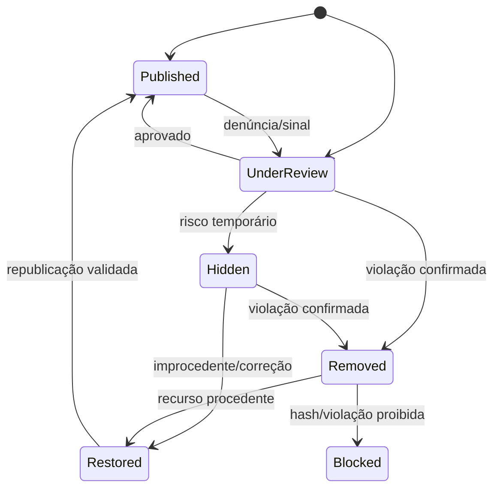
```mermaid
stateDiagram-v2
    [*] --> Published
    [*] --> UnderReview
    Published --> UnderReview: denúncia/sinal
    UnderReview --> Hidden: risco temporário
    UnderReview --> Removed: violação confirmada
    Hidden --> Removed: violação confirmada
    Hidden --> Restored: improcedente/correção
    Removed --> Restored: recurso procedente
    Restored --> Published: republicação validada
    UnderReview --> Published: aprovado
    Removed --> Blocked: hash/violação proibida
```

## 23.2 Taxonomia

| Classe | Exemplo | Ação inicial | Escalonamento |
|---|---|---|---|
| Ilegal/proibido | drogas, armas, exploração | Ocultar/bloquear imediatamente | Jurídico/autoridade se exigido |
| Risco físico grave | ameaça, violência, serviço perigoso | Suspensão preventiva | Trust & Safety |
| Assédio/discriminação | ataque/recusa ilícita | Ocultar e revisar | Sanção proporcional |
| Fraude/phishing | link/identidade falsa | Bloquear ação e investigar | Risco/Segurança |
| Privacidade | telefone, documento, endereço exposto | Redigir/ocultar | Privacidade |
| Evasão | contato em contexto proibido | Aviso/mascaramento corrigível | Gradual |
| Spam/irrelevante | duplicação/promo indevida | Limitar/remover | Moderação |
| Qualidade | descrição insuficiente | Solicitar correção | Sem sanção |

## 23.3 Processo

1. Denúncia recebe protocolo e categoria.
2. Sistema preserva versão original e contexto.
3. Triagem calcula urgência, não culpabilidade.
4. Conteúdo pode ser ocultado preventivamente por prazo.
5. Operador revisa política/version e evidência.
6. Decisão registra motivo, escopo, duração e ação.
7. Partes são notificadas quando permitido.
8. Recurso recebe revisor diferente.
9. Conteúdo é restaurado, corrigido ou removido.
10. Métricas e QA amostral avaliam consistência.

## 23.4 Sanções

Escada: orientação, correção, advertência, limitação de recurso, ocultação, suspensão temporária, suspensão de contexto e banimento. Gravidade pode pular etapas quando há risco concreto.

Estados são separados por efeito:

| Dimensão | Exemplo | Regra de precedência |
|---|---|---|
| `account_access` | Login normal, limitado, suspenso | Mantém suporte, recurso e direitos quando seguro |
| `content_visibility` | Publicado, oculto, removido | Não altera contrato ou recebível por si |
| `contracting_access` | Pode publicar/propor/contratar | Contratos existentes seguem resolução própria |
| `communication_access` | Chat normal, limitado, bloqueado | Mensagem de sistema/suporte permanece disponível |
| `payout_risk` | Elegível, bloqueado, liberado | Só muda por nexo financeiro/risco e política contratual |

Ocultar conteúdo ou suspender publicação não bloqueia repasse automaticamente. Bloqueio financeiro exige evento, fundamento, valor exposto, prazo e recurso próprios. A tela compõe os estados sem reduzir tudo a “conta suspensa”.

**[OBR]**:

- patrocínio/plano não reduz sanção;
- crítica negativa não é violação por si;
- sanção relevante informa regra e recurso, salvo impedimento legal;
- ações têm prazo e revisão;
- conta inteira não é suspensa quando limitação de recurso resolve;
- evidência não é apagada junto com conteúdo;
- moderação automática de alto impacto requer revisão.

## 23.5 SLA e qualidade

| Prioridade | Exemplo | Triagem | Ação de contenção |
|---|---|---:|---:|
| P0 | ameaça ativa, exploração, dado crítico público | 15 min em cobertura | Imediata |
| P1 | fraude/phishing, assédio grave | 2 h | Até 2 h |
| P2 | conteúdo proibido não urgente | 1 dia útil | Conforme revisão |
| P3 | spam/qualidade/recurso | 3 dias úteis | Conforme fila |

QA revisa amostra estratificada, mede concordância, reversão em recurso, tempo e vieses por idioma/região/categoria.

Estes SLAs só são publicados após escala/plantão comprovados. Fora da cobertura, detector pode ocultar temporariamente PII pública, phishing ou ameaça de alta confiança com prazo curto e revisão posterior, mas não aplica banimento irreversível. Categoria com entrada em residência não abre no piloto sem cobertura urgente aprovada.

---

# 24. Arquitetura

## 24.1 Opção A: MVP escalável, recomendada

### Visão

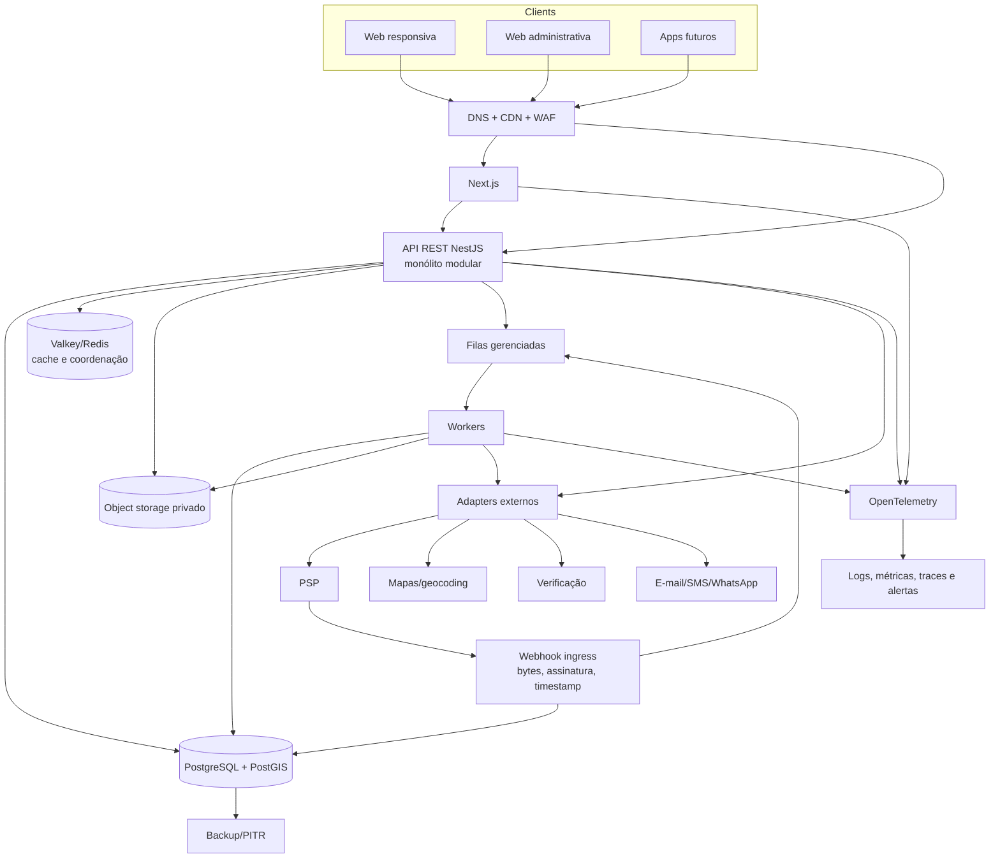
```mermaid
flowchart TB
    subgraph Clients
      WEB[Web responsiva]
      ADM[Web administrativa]
      MOBILE[Apps futuros]
    end
    WEB --> EDGE[DNS + CDN + WAF]
    ADM --> EDGE
    MOBILE --> EDGE
    EDGE --> NWEB[Next.js]
    EDGE --> API[API REST NestJS<br/>monólito modular]
    NWEB --> API
    API --> PG[(PostgreSQL + PostGIS)]
    API --> VALKEY[(Valkey/Redis<br/>cache e coordenação)]
    API --> OBJ[(Object storage privado)]
    API --> Q[Filas gerenciadas]
    Q --> WORK[Workers]
    WORK --> PG
    WORK --> OBJ
    API --> EXT[Adapters externos]
    WORK --> EXT
    EXT --> PSP[PSP]
    PSP --> WH[Webhook ingress<br/>bytes, assinatura, timestamp]
    WH --> PG
    WH --> Q
    EXT --> MAP[Mapas/geocoding]
    EXT --> KYC[Verificação]
    EXT --> MSG[E-mail/SMS/WhatsApp]
    API --> OTEL[OpenTelemetry]
    NWEB --> OTEL
    WORK --> OTEL
    OTEL --> OBS[Logs, métricas, traces e alertas]
    PG --> BAK[Backup/PITR]
```

### Componentes e responsabilidades

| Componente | Responsabilidade | Não deve fazer |
|---|---|---|
| CDN/WAF | TLS edge, cache público, proteção volumétrica e bot básica | Autorizar recurso de negócio |
| Next.js | SSR/SEO, BFF fino quando necessário e interface | Escrever banco diretamente |
| API modular | Casos de uso, autorização, invariantes e REST | Depender de SDK externo dentro do domínio |
| PostgreSQL/PostGIS | Fonte transacional, geografia, busca inicial e locks | Ser fila de trabalho sem controle |
| Valkey/Redis | Cache, rate limit e coordenação efêmera | Ser autoridade de agenda/pagamento |
| Fila/worker | Webhooks, notificações, mídia, outbox e jobs | Executar efeito sem idempotência |
| Object storage | Anexos privados, derivados e lifecycle | Servir upload bruto publicamente |
| Adapters | Traduzir PSP, mapas, KYC e mensageria | Vazar status/modelo do fornecedor ao domínio |
| Webhook ingress | Limitar, validar, persistir `WebhookEvent`/Inbox e enfileirar financeiro crítico | Aplicar efeito antes de persistir/deduplicar |
| Observabilidade | Telemetria correlacionada e SLO | Coletar PII/conteúdo por conveniência |

### Estrutura do monólito

```text
apps/
  web/
  admin/
  api/
  workers/
packages/
  contracts/
  design-system/
  observability/
modules/
  identity/
  professionals/
  catalog/
  marketplace/
  scheduling/
  contracting/
  payments/
  ledger/
  communications/
  trust/
  operations/
```

Cada módulo possui API interna explícita, entidades/repos próprios, migrations com ownership, eventos de domínio e testes de arquitetura que proíbem imports indevidos. Tabelas podem compartilhar a instância, mas não são alteradas diretamente por outro módulo.

### Fluxo de consistência

1. Comando entra com autenticação, correlation ID e idempotency key quando aplicável.
2. Policy autoriza papel, objeto, estado e finalidade.
3. Caso de uso valida versão e invariantes.
4. Transação PostgreSQL persiste agregado, ledger quando aplicável e outbox.
5. Commit ocorre uma vez.
6. Publisher envia outbox à fila.
7. Consumidores usam inbox/deduplicação.
8. Projeções, notificações e integrações toleram retentativa.

### Avaliação

| Critério | Avaliação |
|---|---|
| Vantagens | Transações locais, menor latência/custo cognitivo, deploy simples, debugging e equipe compartilhada |
| Desvantagens | Falha/deploy com blast radius maior; disciplina de módulo necessária |
| Riscos | “Big ball of mud”, jobs afetarem API, migration longa |
| Mitigação | Testes de boundaries, workers separados, pool/timeout, feature flags, ownership |
| Complexidade | Média |
| Custo | Baixo a médio relativo; serviços gerenciados mínimos |
| Equipe | 1 a 2 squads de produto, 1 responsável de plataforma/SRE compartilhado, segurança/fintech próximos |
| Capacidade inicial | Escala horizontal de web/API/workers; PostgreSQL vertical/read replica conforme medição |
| Momento de uso | MVP, piloto e crescimento inicial |

## 24.2 Opção B: escala avançada

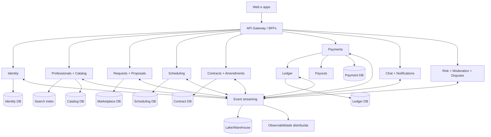
```mermaid
flowchart TB
    C[Web e apps] --> G[API Gateway / BFFs]
    G --> IAM[Identity]
    G --> CAT[Professionals + Catalog]
    G --> MKT[Requests + Proposals]
    G --> SCH[Scheduling]
    G --> CON[Contracts + Amendments]
    G --> PAY[Payments]
    G --> COM[Chat + Notifications]
    G --> TRUST[Risk + Moderation + Disputes]
    PAY --> LED[Ledger]
    PAY --> OUT[Payouts]
    CAT --> SIDX[(Search index)]
    SCH --> SDB[(Scheduling DB)]
    CON --> CDB[(Contract DB)]
    PAY --> PDB[(Payment DB)]
    LED --> LDB[(Ledger DB)]
    IAM --> IDB[(Identity DB)]
    CAT --> CATDB[(Catalog DB)]
    MKT --> MDB[(Marketplace DB)]
    IAM <--> BUS[Event streaming]
    CAT <--> BUS
    MKT <--> BUS
    SCH <--> BUS
    CON <--> BUS
    PAY <--> BUS
    LED <--> BUS
    COM <--> BUS
    TRUST <--> BUS
    BUS --> LAKE[(Lake/Warehouse)]
    BUS --> OBS[Observabilidade distribuída]
```

Bounded contexts candidatos:

- Identity & Access;
- Supply/Professionals/Catalog;
- Discovery/Search;
- Marketplace Requests/Proposals;
- Scheduling;
- Contracting;
- Payments/Payouts;
- Ledger;
- Communications;
- Trust & Safety;
- Operations/Support;
- Data Platform.

### Avaliação

| Critério | Avaliação |
|---|---|
| Vantagens | Escala e deploy independentes, isolamento financeiro, ownership por equipe |
| Desvantagens | Consistência eventual, sagas, contratos/eventos, observabilidade e on-call complexos |
| Riscos | Duplicidade de verdade, evento fora de ordem, custo de plataforma, baixa velocidade |
| Complexidade | Alta |
| Custo | Alto relativo: mensageria, bancos, gateway, tracing, ambientes e equipe plataforma |
| Equipe mínima | 4+ squads autônomas, plataforma/SRE, segurança e data dedicados |
| Momento | Apenas após gatilhos objetivos |

## 24.3 Gatilhos de migração

Extrair um contexto, e não “migrar para microsserviços” em bloco, quando pelo menos dois sinais persistirem:

- SLO/escala do módulo é incompatível com o restante;
- deploys de equipes diferentes se bloqueiam com frequência;
- isolamento regulatório/segurança exige boundary próprio;
- banco/pool/locks não podem ser resolvidos por particionamento/otimização;
- ciclo de mudança tem ownership estável e contrato de dados conhecido;
- custo de extração e operação é menor que custo do acoplamento medido.

Primeiros candidatos prováveis: processamento assíncrono de mídia/notificações, busca e, por exigência de isolamento, pagamentos/ledger. Ledger pode permanecer no mesmo deploy por mais tempo se separação lógica e acesso forem fortes.

## 24.4 Estratégia de evolução

1. Preservar portas/adapters e eventos no monólito.
2. Medir dependências, latência e volume.
3. Definir contrato REST/evento e ownership.
4. Criar serviço com banco próprio e replay/backfill.
5. Usar strangler e dual-read controlado, nunca dual-write ingênuo.
6. Validar reconciliação e rollback.
7. Remover caminho antigo somente após janela estável.

## 24.5 Resiliência de terceiros

| Terceiro | Timeout/retry | Circuit breaker | Degradação |
|---|---|---|---|
| PSP | Timeout curto por operação; retry só com idempotência | Sim | Checkout “temporariamente indisponível”; estado pendente consultável |
| Mapas | Retry limitado | Sim | Busca manual e buffer conservador |
| KYC | Assíncrono | Sim | Estado “em análise”, sem publicação dependente |
| E-mail/SMS | Assíncrono e DLQ | Sim | In-app permanece canônico; segurança escala canal |
| Antimalware | Assíncrono | Sim | Arquivo fica em quarentena |
| Analytics | Fire-and-forget controlado | Sim | Produto funciona sem tracking |

## 24.6 Critérios arquiteturais

- nenhum módulo externo recebe senha, token ou dado não necessário;
- toda dependência tem timeout, budget, retry classificado e owner;
- operações financeiras usam outbox/inbox e idempotência;
- falha de cache não corrompe estado;
- deploy de worker não interrompe API;
- restauração de banco e object storage é ensaiada;
- módulo e tabela possuem dono documentado.

---

# 25. Stack

## 25.1 Stack principal e alternativas

| Capacidade | Principal | Alternativa | Motivo/escala | Limitação, custo e lock-in |
|---|---|---|---|---|
| Web | Next.js + React + TypeScript, App Router | Remix/React Router ou Nuxt/Vue | SSR/SEO, streaming, ecossistema e contratação | Mudança rápida e complexidade server/client; lock-in moderado de framework |
| Design system | CSS Modules/Tailwind tokens + Storybook | Panda CSS/vanilla-extract | Acessibilidade e velocidade com tokens próprios | Governança visual; não depender de kit genérico |
| Mobile F2 | React Native + Expo após spike | Flutter | Compartilha linguagem/tipos e equipe | Nem todo código web é reutilizável; dependência Expo moderada |
| Backend | Node.js LTS + NestJS + TypeScript | Kotlin + Spring Boot | Módulos, DI, OpenAPI, contratação e stack unificada | CPU-bound exige worker; disciplina async; Kotlin oferece robustez com curva/custo maior |
| Identidade/IAM | IdP OIDC gerenciado escolhido por RFP/PoC, integrado por adapter | Keycloak gerenciado pela equipe | Evita credencial/MFA caseiros e atende web/mobile | Lock-in/custo; precisa refresh reuse, step-up, passkeys, exportação e SLA comprovados |
| ORM/query | Prisma ou TypeORM somente após spike; SQL explícito para financeiro/locks | Kysely/Drizzle | Produtividade em CRUD | Abstração pode esconder lock/query; migrations revisadas obrigatoriamente |
| Banco | PostgreSQL gerenciado + PostGIS | Cloud SQL/Aurora PostgreSQL conforme nuvem | ACID, geografia, extensões, equipe ampla | Escala de escrita vertical antes de sharding; lock-in baixo do engine, médio do serviço |
| Cache | Valkey/Redis gerenciado | Redis Cloud | Rate limit, cache e coordenação efêmera | Não é fonte de verdade; custo por memória e lock-in de comandos especiais |
| Filas MVP | SQS + SNS/EventBridge na AWS | RabbitMQ gerenciado | Operação baixa, DLQ e escala | Ordenação/semântica exigem desenho; lock-in médio |
| Streaming futuro | Kafka gerenciado somente por necessidade | Pulsar/Kinesis | Replay e alto volume | Alto custo operacional; fora do MVP |
| Busca MVP | PostgreSQL FTS + `pg_trgm` + PostGIS | OpenSearch ou Algolia | Consistência e baixo custo no piloto | Relevância/facetas limitadas; OpenSearch quando gatilho |
| Arquivos | S3 privado | Google Cloud Storage | Durabilidade, lifecycle e URLs assinadas | API portável em alto nível; egress e políticas geram lock-in médio |
| CDN/WAF | CloudFront + AWS WAF | Cloudflare | Integração e edge | Regras/custo e lock-in médio; autorização continua na API |
| Mapas/geocoding | Google Maps Platform após PoC Brasil | Mapbox/HERE | Cobertura e UX a validar | Custo por chamada, termos/cache e lock-in alto; encapsular provider IDs |
| Pagamentos | Um PSP escolhido por RFP e adapter | Segundo da shortlist após gatilho | Contrato local, split, KYC e suporte | Maior lock-in/risco; exportação e reconciliação próprias |
| E-mail | Amazon SES + templates próprios | SendGrid/Mailgun | Custo/escala e reputação controlável | Operação de deliverability necessária |
| SMS/WhatsApp | Zenvia, Twilio ou Infobip por RFP | Outro BSP oficial | Cobertura Brasil e WhatsApp oficial | Custo, template e lock-in; consentimento/canais |
| Push F2 | FCM/APNs por adapter | OneSignal | Padrões das plataformas | Tokens e regras por ecossistema |
| Observabilidade | OpenTelemetry + Grafana stack gerenciada/CloudWatch | Datadog/New Relic | Padrão aberto e correlação | Operação/custo de cardinalidade; SaaS acelera com lock-in |
| Analytics produto | Pipeline first-party pseudonimizado + PostHog após DPA | Amplitude | Funil rápido sem enviar PII | Transferência/lock-in e governança; eventos canônicos continuam internos |
| BI | dbt + warehouse quando volume justificar + Metabase | Looker/Power BI | Métricas versionadas e acesso | Stack de dados é P2; não consultar primário pesado |
| Infra | AWS `sa-east-1`, serviços gerenciados | GCP São Paulo | Latência/residência operacional e oferta | Custo regional e lock-in; não há alegação de exigência legal de residência |
| IaC | OpenTofu/Terraform | Pulumi | Ecossistema, revisão e portabilidade | State e providers; módulos próprios limitados |
| CI/CD | GitHub Actions com OIDC | GitLab CI | Integração e mercado | Minutos/lock-in; credencial estática proibida |
| Containers | OCI + ECS/Fargate ou equivalente | Kubernetes/EKS apenas por gatilho | Operação menor que Kubernetes | Lock-in do scheduler; imagens portáveis |
| Segredos | Secrets Manager + KMS | Vault | Integração IAM e rotação | Custo/lock-in médio; Vault exige operação |
| Feature flags | OpenFeature + Unleash | LaunchDarkly | API neutra e kill switch | Unleash demanda operação; SaaS custa e cria lock-in |
| Testes | Vitest/Jest, Supertest, Playwright, Testcontainers, k6, axe, ZAP | Ferramentas equivalentes por stack | Cobertura unitária a segurança/carga | Tempo de pipeline; suites por risco |

## 25.2 Critérios de escolha

Pesos para RFP/spike:

| Critério | Peso sugerido |
|---|---:|
| Atendimento funcional e regulatório | 25% |
| Segurança, privacidade e auditoria | 20% |
| Confiabilidade/SLA/operação | 15% |
| Custo total em três cenários de volume | 15% |
| Qualidade de API, sandbox e relatórios | 10% |
| Suporte e capacidade no Brasil | 10% |
| Portabilidade/saída | 5% |

Versões não são congeladas neste documento. No início da implementação, registrar versões LTS/suportadas, política de atualização e EOL em ADR/lockfiles.

## 25.3 Custos e equipe

- Preferir serviços gerenciados enquanto custo de operação humana superar economia de infraestrutura.
- Orçar base, pico, egress, logs/traces, mapas, mensagens, KYC, PSP e ambientes.
- Definir budgets e alertas por serviço/ambiente.
- Treinamento em TypeScript não substitui experiência em transações financeiras, PostgreSQL, segurança e SRE.
- Contratar ou alocar responsável fintech antes da integração real do PSP.

---

# 26. Domínios

## 26.1 Mapa de ownership

| Domínio | Responsabilidade e limite | Entidades principais | Eventos principais | Dependências | Dono do dado |
|---|---|---|---|---|---|
| Identidade | Credenciais, autenticação, MFA e sessões; não contém perfil profissional | User, DeviceSession, LoginAttempt | `UserRegistered`, `SessionRevoked` | Mensageria, risco | Identity |
| Autorização | Catálogo de entitlement/papel, atribuição temporal e decisão; não autentica credencial | Entitlement, RoleDefinition, RoleEntitlement, RoleAssignment, AdminApprovalDecision | `AuthorizationCatalogPublished`, `RoleAssigned/Revoked` | Identidade, auditoria | Security/IAM |
| Usuários | Perfil civil/preferências e contexto; não autentica nem escreve endereço | UserProfile, ConsentRecord | `UserProfileUpdated`, `AccountClosed` | Identidade, privacidade, localização | Users |
| Profissionais | Pessoa/organização, representação e estado profissional | Organization, RepresentativeAssignment, ProfessionalProfile | `ProfessionalSubmitted/Activated`, `RepresentativeChanged` | Verificação, catálogo | Supply |
| Verificação | Requisitos, evidência, resultado e validade; não emite credencial | ProfessionalVerification | `VerificationRequested/Approved/Expired` | KYC, categoria | Trust |
| Catálogo | Definição/versionamento da oferta | Service, ServiceVersion, ServicePrice, PortfolioItem | `ServicePublished/Paused` | Categoria, profissional | Catalog |
| Categorias | Taxonomia, risco, campos e documentos | Category, Subcategory | `CategoryPolicyChanged` | Jurídico/operação | Catalog Governance |
| Localização | Endereços protegidos, geocoding e áreas | Address, ServiceArea | `AddressValidated`, `AreaChanged` | Mapas, privacidade | Location |
| Busca | Indexação, recuperação e ranking; não é fonte de perfil | SearchDocument/projeções | `SearchIndexUpdated` | Catálogo, reputação, agenda | Discovery |
| Agenda | Regras, recursos e ocupação autoritativa; não confirma pagamento | AvailabilityRule/Exception, CalendarResource/Reservation, Booking | `BookingCreated/Confirmed/Cancelled` | Contrato, mapas | Scheduling |
| Pedidos | Necessidade do cliente e visibilidade | ServiceRequest, RequestAttachment | `RequestCreated/Published` | Categoria, localização | Marketplace |
| Propostas | Oferta versionada sobre pedido | Proposal, ProposalRevision | `ProposalSent/Accepted` | Pedido, profissional | Marketplace |
| Contratações | Snapshot, partes e execução | Contract | `ContractCreated`, `ServiceStarted/Completed` | Proposta/serviço, agenda | Contracting |
| Aditivos | Mudança versionada e consentida | ContractAmendment | `AmendmentProposed/Accepted` | Contrato, pagamento | Contracting |
| Pagamentos | Ordem, tentativa, fatos PSP, refund e exceção tardia | PaymentOrder, PaymentAttempt, PaymentTransaction, Refund, ChargebackCase, LatePaymentCase | `PaymentApproved/Failed`, `RefundIssued`, `LatePaymentDetected/ResolutionPending/Resolved` | PSP, ledger | Payments |
| Ledger | Reconhecimento imutável de fatos econômicos | LedgerAccount, LedgerTransaction/Entry | `LedgerTransactionPosted` | Pagamento, repasse | Finance |
| Repasses | Elegibilidade e execução espelhada do PSP | Payout, PayoutAttempt, PayoutLedgerLink | `PayoutReleased/PayoutProcessing/PayoutPaid/PayoutFailed/PayoutCancelled/PayoutReversed` | PSP, ledger, disputa | Finance |
| Chat | Conversas, participantes e mensagens | Conversation, Participant, Message | `MessageSent/Flagged` | Storage, moderação | Communications |
| Notificações | Preferência, template, entrega e deduplicação | Notification | `NotificationQueued/Sent` | E-mail/SMS/push | Communications |
| Avaliações | Conteúdo e elegibilidade da avaliação | Review, ReviewResponse | `ReviewCreated/Moderated` | Contrato, moderação | Reputation |
| Reputação | Projeções bayesianas e sinais agregados; não muda review | ReputationSnapshot | `ReputationUpdated` | Review, contratos, risco | Reputation |
| Assinaturas | Planos, ciclo e entitlement, Fase 2 | Subscription | `SubscriptionStarted/Cancelled` | Pagamento | Monetization |
| Publicidade | Campanha/placement rotulado, Fase 2 | SponsoredPlacement | `SponsoredImpression/Click` | Busca, assinatura | Monetization |
| Suporte | Ticket, fila, SLA e interação assistida | SupportTicket | `TicketCreated/Escalated/Closed` | Todos por referência | Operations |
| Disputas | Contraditório, evidência, decisão e recurso | Dispute, DisputeEvidence | `DisputeOpened/Resolved` | Contrato, pagamento | Trust & Safety |
| Moderação | Política, análise e ação sobre conteúdo | Report, ModerationAction | `ContentHidden/Restored` | Conteúdo, suporte | Trust & Safety |
| Risco | Sinais, score, regra, decisão e revisão | RiskAssessment | `RiskAssessed/Actioned` | Identidade, PSP | Risk |
| Administração | Comandos privilegiados e configuração | AdminAction/Configuration | `AdminActionExecuted` | IAM, auditoria | Operations Platform |
| Auditoria | Trilha imutável e registro de acesso legal restrito | AuditLog, ApplicationAccessLog | `AuditRecordWritten` | Todos | Security/GRC |
| Analytics | Eventos pseudonimizados, métricas e experimentos | AnalyticsEvent/MetricDefinition | `AnalyticsEventIngested` | Outbox/eventos | Data |

## 26.2 Regras entre domínios

- Domínio consumidor referencia ID público/estável, não lê tabela alheia por conveniência.
- Mudança síncrona que exige invariantes no mesmo agregado usa chamada interna explícita.
- Efeito posterior usa evento e consumidor idempotente.
- Projeção pode ser reconstruída; fonte transacional não depende da projeção.
- Ledger só aceita comandos tipados de fatos financeiros aprovados.
- Analytics nunca é dependência para concluir fluxo.
- Busca nunca autoriza nem confirma disponibilidade.
- Admin chama os mesmos casos de uso do domínio com política adicional; não edita banco.

Fronteiras atômicas do MVP:

- aceite de proposta bloqueia a revisão e, em uma transação PostgreSQL, marca aceite, cria `Contract` com snapshot, vincula/cria `CalendarReservation(HOLD)`, cria `PaymentOrder`, grava auditoria e outbox; por isso a API pode devolver contrato/ordem;
- confirmação de captura, em uma transação local, persiste o fato/Inbox, atualiza `PaymentAttempt/Order` e cria `LedgerTransaction`; com hold válido sob lock, converte `CalendarReservation`, cria/confirma `Booking`, confirma contrato, cria `Payout(SCHEDULED)` e outbox; sem hold válido, cria `LatePaymentCase`/outbox e não confirma agenda/contrato nem cria payout;
- cancelamento aprovado atualiza `Contract`, `Booking` e `CalendarReservation`, persiste o cálculo/política e cria `Refund` ou ordem de efeito financeiro quando aplicável, com auditoria/outbox na mesma transação; o worker externo apenas executa a instrução já registrada;
- abertura de disputa bloqueia `Contract -> Payout` nessa ordem, cria caso, transição contratual, hold/restrição proporcional, auditoria e outbox na mesma transação; evento não cria o bloqueio depois;
- antes de chamar PSP para payout/refund, a transação local reserva saldo/limite e grava outbox; payout revalida disputa/hold sob os mesmos locks e worker externo não segura transação de banco;
- eventos resultantes atualizam busca, analytics, notificações e projeções. Não recriam contrato, ledger ou reserva que o comando síncrono já prometeu;
- se uma futura extração impedir atomicidade local, a API muda para `202 Operation` e uma saga explícita; não mantém resposta síncrona enganosa.

## 26.3 Matriz de criticidade

| Classe | Domínios | RPO/RTO e mudança |
|---|---|---|
| Financeiro P0 | Pagamentos, ledger, repasses | Metas e cenários exclusivamente na seção 34; dupla revisão |
| Transacional P0/P1 | Identidade, agenda, contratos, disputas | Metas e cenários exclusivamente na seção 34 |
| Comunicação P1 | Chat, notificações, suporte | Metas e cenários exclusivamente na seção 34 |
| Descoberta P1/P2 | Catálogo, busca, reputação | Projeções reconstruíveis; seção 34 |
| Analítico P2 | Analytics/BI | Seção 34; não compete com recuperação do core |

A seção 34 é a única fonte de verdade para RPO/RTO; a seção 35 mede e testa.

---

# 27. Modelo de dados

## 27.1 Convenções lógicas

- PostgreSQL gerenciado; horários são `timestamptz` UTC e recorrências guardam zona IANA.
- Chaves expostas são UUIDv7 opacos; inteiro sequencial nunca sai na API.
- Dinheiro é `bigint` em unidade mínima e `currency char(3)`; `float` é proibido.
- Mutáveis têm `created_at`, `updated_at` e `row_version`; financeiro/auditoria é append-only.
- E-mail, telefone, CPF e conta são cifrados; unicidade usa HMAC normalizado e versionado.
- Status usa enum/check e comando de domínio; não existe `PATCH status` genérico.
- JSONB serve a snapshot/regra/payload sanitizado, não substitui coluna pesquisável ou FK.
- FKs usam `RESTRICT`; exclusão de titular é workflow, não cascade indiscriminado.
- Grande volume pode ser particionado por mês após gatilho: audit, mensagem, notificação, login e webhook.

Gramática do dicionário: campo `id`, `*_id` ou nome de relação sem tipo explícito significa `uuid NOT NULL` com FK, salvo sufixo `?`; `status/type/kind` significa `varchar` com `CHECK`/tabela versionada; `*_at` é `timestamptz`; `*_date` é `date`; `*_minor` é `bigint`; `*_bps` é `integer`; `hash/digest` é `bytea`; texto livre tem limite declarado no schema físico. Produção exige dicionário DDL com nullability, default, FK, check e classificação para cada coluna; este artefato lógico não autoriza migration sem esse derivado.

Abreviações de acesso: `Tit` titular; `Cli` cliente; `Pro` profissional; `Pub` público; `Sup` suporte por caso; `Mod` moderação; `Fin` financeiro; `Risk` risco; `DPO` privacidade; `Adm` administrador por função. Acesso humano excepcional exige `case_id` e `AuditLog`.

## 27.2 Modelo conceitual


```mermaid
erDiagram
    User ||--|| UserProfile : possui
    User ||--o{ Address : usa
    User ||--o{ RepresentativeAssignment : representa
    Organization ||--o{ RepresentativeAssignment : autoriza
    User ||--o| ProfessionalProfile : atua_como_PF
    Organization ||--o| ProfessionalProfile : atua_como_PJ
    User ||--o{ DeviceSession : autentica
    User ||--o{ ConsentRecord : manifesta
    ProfessionalProfile ||--o{ ProfessionalVerification : comprova
    ProfessionalProfile ||--o{ Service : oferece
    Service ||--o{ ServiceVersion : versiona_escopo
    Category ||--o{ Subcategory : contem
    Subcategory ||--o{ Service : classifica
    ServiceVersion ||--o{ ServicePrice : precifica
    Service ||--o{ ServiceArea : atende
    ProfessionalProfile ||--o{ AvailabilityRule : define
    ProfessionalProfile ||--o{ AvailabilityException : excepciona
    ProfessionalProfile ||--o{ CalendarResource : possui_recurso
    CalendarResource ||--o{ CalendarReservation : ocupa
    CalendarReservation ||--o| Booking : confirma
    ProfessionalProfile ||--o{ PortfolioItem : publica
    User ||--o{ ServiceRequest : solicita
    ServiceRequest ||--o{ RequestAttachment : anexa
    ServiceRequest ||--o{ Proposal : recebe
    Proposal ||--o{ ProposalRevision : versiona
    Proposal ||--o| Contract : converte
    Service ||--o{ Booking : reserva
    Contract ||--o{ Booking : agenda
    Contract ||--o{ ContractAmendment : altera
    Contract ||--o{ PaymentOrder : cobra
    PaymentOrder ||--o{ PaymentAttempt : submete
    PaymentAttempt ||--o{ PaymentTransaction : registra_fato
    PaymentOrder ||--o{ Refund : reembolsa
    PaymentOrder ||--o{ ChargebackCase : sofre
    PaymentOrder ||--o| LatePaymentCase : excepciona
    LedgerTransaction ||--|{ LedgerEntry : contem
    LedgerAccount ||--o{ LedgerEntry : movimenta
    Contract ||--o{ Payout : origina
    Payout ||--o{ PayoutAttempt : tenta
    Payout ||--o{ PayoutLedgerLink : contabiliza
    LedgerTransaction ||--o{ PayoutLedgerLink : referencia
    Contract ||--o{ Dispute : contesta
    Dispute ||--o{ DisputeEvidence : inclui
    Conversation ||--o{ ConversationParticipant : inclui
    Conversation ||--o{ Message : contem
    Contract ||--o{ Review : valida
    Review ||--o| ReviewResponse : recebe
    ProfessionalProfile ||--o{ Subscription : assina
    ProfessionalProfile ||--o{ SponsoredPlacement : anuncia
    User ||--o{ SupportTicket : abre
    User ||--o{ RiskAssessment : avaliado
    WebhookEvent o|--o{ PaymentTransaction : origina_fato
```

Entidades operacionais e de governança:

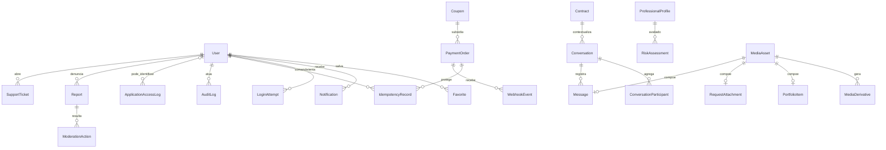
```mermaid
erDiagram
    User ||--o{ Favorite : salva
    User ||--o{ Notification : recebe
    User ||--o{ LoginAttempt : tenta
    User ||--o{ IdempotencyRecord : comanda
    User ||--o{ AuditLog : atua
    User o|--o{ ApplicationAccessLog : pode_identificar
    User ||--o{ Report : denuncia
    Report ||--o{ ModerationAction : resulta
    User ||--o{ SupportTicket : abre
    Coupon ||--o{ PaymentOrder : subsidia
    Contract ||--o{ Conversation : contextualiza
    Conversation ||--o{ ConversationParticipant : agrega
    Conversation ||--o{ Message : registra
    PaymentOrder ||--o{ IdempotencyRecord : protege
    PaymentOrder ||--o{ WebhookEvent : recebe
    ProfessionalProfile ||--o{ RiskAssessment : avaliado
    MediaAsset ||--o{ MediaDerivative : gera
    MediaAsset ||--o| PortfolioItem : compoe
    MediaAsset ||--o| RequestAttachment : compoe
    MediaAsset ||--o| Message : compoe
```

## 27.3 Identidade, perfil, catálogo e agenda

| Entidade/finalidade | Campos e tipos principais | Relações, índices e restrições | Auditoria, exclusão, sensibilidade e acesso |
|---|---|---|---|
| `User` identidade única | `public_id uuid`; `identity_provider varchar`; `provider_subject varchar`; `email/phone_cipher bytea?`; `*_lookup_hash bytea?`; `status`; verificações/timestamps | UNIQUE provider/subject e hashes parciais; ao menos um login; índice status/data; `RoleAssignment` auxiliar | IdP possui senha/MFA/token; plataforma nunca guarda hash de senha; Tit/Identity, Sup mascarado, Risk hash |
| `UserProfile` apresentação/preferência | `user_id`; `display_name varchar(100)`; `legal_name/birth_date_cipher`; avatar; `locale`; `timezone`; privacy/notification JSON | PK/FK 1:1; timezone válida; avatar limpo; trigram apenas em nome publicado | Opcionais elimináveis; nome legal confidencial; Tit, partes/Pub conforme regra, Sup por caso |
| `Organization` empresa | `public_id uuid`; `legal_name varchar(180)`; `trade_name varchar(120)?`; `cnpj_cipher bytea`; `cnpj_hash bytea`; `status`; datas | UNIQUE CNPJ ativo; status formal; não autentica | Fiscal restrito; representantes veem por poder; Supply/Verification/Risk |
| `RepresentativeAssignment` vínculo temporal | `organization_id`; `user_id`; `role`; `powers jsonb`; `verification_status`; `valid_from/valid_to`; `approved_by`; datas | UNIQUE organização/usuário/papel/vigência; intervalos válidos; sem autoaprovação | Append-only por versão; pessoa/empresa/Supply/Audit; encerramento revoga poderes |
| `Address` execução/cobrança | `owner_type/owner_id`; `kind`; campos cifrados; `city_code/state/country`; `location geography(Point,4326)`; `public_geocell`; provider/verified | Location é único writer; GiST location; índice dono/tipo; BR no MVP | Snapshot no contrato; exato restrito; Tit/Location, Pro na janela contratual, Pub só célula/cidade |
| `ProfessionalProfile` contexto profissional | `owner_type PERSON/ORGANIZATION`; `owner_user_id?`; `organization_id?`; `public_id`; nomes; bio; fiscal ref; status; `search_engine_indexing boolean default false`; métricas; datas | CHECK exatamente um owner; UNIQUE owner ativo; trigram nome; índices status/data | Publicação/indexação/status versionados; Pro/Pub reduzido/Verification/Risk/Sup |
| `ProfessionalVerification` prova granular | professional; `type`; provider/reference cifrada; status/nível; datas/expiração; reason; object key; reviewer | índice fila/tipo/expiração; máquina formal; documento em bucket restrito | Histórico append-only; binário eliminado cedo; Pro status, time verificação/Risk integral, Pub selo específico |
| `Category` política | public ID/slug/nome; risco/status; aprovação; tipos permitidos; policy version/order | UNIQUE slug; CHECK allowlist; arquiva se referenciada | Política versionada; Pub leitura; Taxonomy/Jurídico/Adm por alçada |
| `Subcategory` exigência | category; public ID/slug/nome; regulada; verificações; termos proibidos; policy; risco | UNIQUE categoria/slug; regulada exige requisitos | Versiona/arquiva; mesmo acesso de Category |
| `Service` identidade da oferta | professional/subcategory; `public_id uuid`; `current_version_id`; status; publicação/suspensão/datas | índices professional/status, subcategory/status; FK current version; máquina formal | Mudança relevante aponta nova versão; contratos preservam a antiga |
| `ServiceVersion` snapshot integral | service; `version integer`; category/subcategory; name/description; contracting/modality; duration/buffers; unit; materiais incluídos/excluídos; área ref; deslocamento; antecedência/prazos; cancelamento/reagendamento/garantia; media refs; hash/datas | UNIQUE service/version; imutável após submissão; instantâneo exige preço/duração; hash do snapshot | Append-only; Pro/Pub se vigente/Catalog/Mod; Contract referencia exatamente esta versão |
| `ServicePrice` componente da versão | `service_version_id`; model; amount/min/max; unit; currency; travel/material breakdown; valid range | UNIQUE versão/model; valores >=0/min<=max | Imutável com a versão; Pro/Pub vigente/Catalog/Fin snapshot |
| `ServiceArea` cobertura | professional/service; tipo; origin address; radius/polygon/cities; label; travel rule | GiST polygon; CHECK por tipo; raio máximo; origem não pública | Mudança auditada; Pro/Location/Search, Pub label/distância |
| `AvailabilityRule` recorrência | professional/service; timezone; dias; horários locais; vigência; capacidade; rrule | índice dono/vigência; dias/intervalo/capacidade válidos; DST validado | Histórico arquivado; Pro/Scheduling, público só períodos indicativos |
| `AvailabilityException` bloqueio/abertura | professional/service; type; starts/ends; capacity delta; reason; source/id | GiST range; start<end; UNIQUE source/id | Motivo confidencial; Pro/Scheduling, Sup período |
| `CalendarResource` capacidade | professional; service?; `public_id uuid`; timezone; capacity; status; row_version | UNIQUE owner/name; capacity 1..N; linha bloqueada em toda reserva | Scheduling é owner; Pro gerencia, público não lê rotina |
| `CalendarReservation` ocupação autoritativa | resource; kind `HOLD/BOOKING/BLOCK`; intent/booking ref; `period tstzrange`; capacity_unit; status; expires_at?; service/price versions; idempotency key | Exclusion GiST `(resource_id, capacity_unit, period &&)` para estados ocupantes; UNIQUE intent/key; expiração por job, nunca predicate `now()` | HOLD converte na mesma linha para BOOKING; Scheduling/partes resumo/Sup por caso |
| `PortfolioItem` mídia moderada | professional/service version; `media_asset_id`; caption/alt_text/order; status/mod action | media asset exclusivo da superfície; publicar apenas `READY/APPROVED`; vídeo desabilitado no MVP | Lifecycle deriva de `MediaAsset`; Pro, Pub publicado, Mod/Storage |

## 27.4 Demanda, proposta, contratação e financeiro

| Entidade/finalidade | Campos e tipos principais | Relações, índices e restrições | Auditoria, exclusão, sensibilidade e acesso |
|---|---|---|---|
| `ServiceRequest` pedido | customer/subcategory; public ID; título/descrição; geocell/address; janela/urgência; budget; visibility/deadline/status | índices dono/status, categoria/prazo/geocell; min<=max; MVP CHECK visibility em `PRIVATE_MATCHED/INVITED` | Cli e Pro elegível veem versão sanitizada; nenhum acesso público no MVP; Mod/Sup por caso |
| `RequestAttachment` evidência | request/uploader; `media_asset_id`; type/name; visibility | asset exclusivo; limites por finalidade; somente `READY`; dedupe não revela outro usuário | Lifecycle por caso/asset; Cli/Pro conforme visibilidade, Mod/Sup |
| `Proposal` cabeçalho | request/professional; public ID; current revision; status/datas/version | uma ativa por par; lock no aceite; índices pedido/pro/status | Transições auditadas; partes e operação por caso |
| `ProposalRevision` snapshot | version; scope/included/excluded; labor/material/travel; `customer_platform_fee_minor` default 0; `professional_commission_minor`; `customer_total_minor`; `professional_net_estimate_minor`; schedule/policies/dates | UNIQUE proposal/version; valores >=0; total cliente exclui comissão do profissional; immutable | Append-only; partes, Contracts, Fin valores, Disputa |
| `Booking` compromisso confirmado | `calendar_reservation_id`; partes/service version/contract/address; `supersedes_booking_id?`; status `CREATED/CONFIRMED/IN_SERVICE/CANCELLED/RESCHEDULED/COMPLETED`; price/timezone/cancel | Criado somente na conversão atômica de `CalendarReservation(HOLD)` para `BOOKING`; `CREATED -> CONFIRMED` no mesmo commit; UNIQUE reservation; end>start; rebooking cria sucessor | Estado auditado; nunca representa hold; endereço restrito; partes/Scheduling/Contracts/Sup |
| `Contract` acordo | partes; proposal revision/service/booking; public ID/number/status; snapshot/hash; valores/policy; timestamps/state version | UNIQUE number; checks de totais/datas; snapshot/hash imutáveis; bloqueio auto conclusão | Retenção/anonimização controlada; partes, Contracting, Fin/Risk/Disputa/Sup mínimo |
| `ContractAmendment` mudança | contract/version/proposer; reason; old hash/new scope; deltas; schedule/payment/policy; status/datas/evidence hash | um proposto ativo; soma delta; aceite contraparte; immutable após envio | Append-only; partes/Amendments/Fin/Disputa |
| `PaymentOrder` intenção/agregado | contract/amendment/coupon; purpose/sequence; breakdown; customer total/pro net; currency; status `CREATED/AWAITING_PAYMENT/PROCESSING/PAID/FAILED/EXPIRED/CANCELLED`; provider; `captured_minor`; quatro parcelas de refund/chargeback; `late_payment_case_id?`; datas | UNIQUE contract/purpose/sequence e provider ID; máquina formal; soma das quatro parcelas de devolução/exposição alocada `<= captured`; `PAID` não retrocede; late case não muda o status | Sem delete; partes veem breakdown/rótulo composto; Payments/Fin/Risk |
| `PaymentAttempt` workflow PSP | order; provider; idempotency key; status `CREATED/PENDING/REQUIRES_ACTION/UNDER_REVIEW/AUTHORIZED/PAID/FAILED/EXPIRED/CANCELLED/VOIDED/UNKNOWN`; version; expected amount/currency; created/submitted/resolved; `unknown_since?`; `next_reconciliation_at?` | UNIQUE provider/key; índice parcial permite no máximo uma tentativa em estado ativo, incluindo `UNKNOWN`; `UNKNOWN` sem `resolved_at`; nova tentativa só após terminal confirmado | Não contém payload/PAN; Payments/Fin/Risk; histórico em fatos |
| `PaymentTransaction` fato PSP | attempt/order; provider IDs; `source_type WEBHOOK/QUERY/RECONCILIATION`; `source_id`; fact type; raw/normalized status; amount/currency/method/installments/last4/end-to-end; occurred/received; payload ref/key | UNIQUE provider/object/fact; append-only; fato terminal exige fonte autenticada; resposta de comando fica em tentativa/audit e não cria fato terminal; sem PAN/CVV | Cada mudança externa insere novo fato; nenhuma atualiza fato anterior; projeção deriva attempt/order; Payments/Fin/Risk |
| `LedgerAccount` plano de contas | code; account type; owner type/id; purpose; currency/status | UNIQUE owner/purpose/currency e code; conta usada não apaga | Sem PII/delete; Ledger/Fin; parte só projeção |
| `LedgerEntry` posting | `ledger_transaction_id`; sequence; `account_id`; side `DEBIT/CREDIT`; `amount_minor`; currency; available/restriction; metadata segura | UNIQUE transaction/sequence; amount>0; mesma moeda; balanceamento diferido antes do commit; UPDATE/DELETE revogados | Append-only; Ledger/Fin/auditor; partes via projeção |
| `Payout` repasse | professional/contract/order; destination token/version; gross/fee/reserve/net; `calculation_version`; status `SCHEDULED/ELIGIBLE/BLOCKED/PROCESSING/PAID/FAILED/CANCELLED/REVERSED`; eligibility policy/dates/failure/risk hold/current attempt projection | UNIQUE contract/order/purpose; gross-fee-reserve=net; criado `SCHEDULED`; valor só recalcula antes de PROCESSING; PROCESSING exige saldo em PayoutPending e tentativa inicial | Sem delete; referências 1:N guardam histórico; PAID não vira reversed por mero chargeback; Pro resumo, Fin/Risk/Sup |
| `PayoutAttempt` fato de tentativa PSP | payout; `attempt_no`; `fact_no`; type `INSTRUCTION_CREATED/SUBMITTED/UNKNOWN/SUCCEEDED/FAILED`; provider refs/idempotency key; destination version; amount/currency; source; occurred/received; safe error | UNIQUE payout/attempt/fact e provider/event; append-only; nova tentativa bloqueada se última estiver SUBMITTED/UNKNOWN; valor/destino devem corresponder ao payout | Sem update/delete; destino mascarado; Fin/Payments/Risk, Pro só projeção |
| `PayoutLedgerLink` relação contábil tipada | payout; `ledger_transaction_id`; purpose `RESERVATION/SETTLEMENT/FAILURE_COMPENSATION/REVERSAL`; amount/currency; created | UNIQUE payout/ledger transaction/purpose; FK imutáveis; moeda/valor conferem com postings | Append-only; Finance/Auditoria; parte vê linhas derivadas |
| `Refund` reembolso | order/contract/dispute; requester/reason; amount; fee allocation reversals; status `REQUESTED/APPROVED/PROCESSING/SUCCEEDED/FAILED/CANCELLED`; provider/approval/datas/key | UNIQUE keys/provider ID; máquina formal; APPROVED→PROCESSING reserva atomicamente; SUCCEEDED move reserved para refunded; FAILED/CANCELLED libera conforme fase | Sem delete; `RefundIssued` apenas em SUCCEEDED; partes status, Fin/Disputa/Sup/Risk |
| `ChargebackCase` contestação financeira PSP | order/transaction/provider case; gross/allocated/overlap exception; reason/status `OPEN/WON/LOST/PARTIAL`; evidence deadlines; reserve/fee/loss ledger refs; datas/key | UNIQUE provider/case; alocação usa trava do PaymentOrder; fato bruto nunca é truncado; índices status/deadline/order | Sem delete; cliente vê status seguro; Fin/Risk/PSP integral, Sup mínimo; separado de `Dispute` do serviço |
| `Dispute` caso | contract/partes; public ID/reason/descrição cifrada; status/severity/amount; deadlines/assignment/decision/effect/appeal | fila por status/severity/SLA; unicidade ativa por regra; máquina | Legal hold e audit; partes com visão limitada, Disputa/Fin/Jurídico/Risk |
| `DisputeEvidence` cadeia de custódia | dispute/submitter/type; object/hash/mime/size; captured/submitted; scan/visibility/description/source/hold | object/hash, índice dispute/date, clean, nunca substituir | Append-only/cofre; partes por visibilidade, Disputa/Jurídico |

## 27.5 Comunicação, reputação, growth, operação e controles

| Entidade/finalidade | Campos e tipos principais | Relações, índices e restrições | Auditoria, exclusão, sensibilidade e acesso |
|---|---|---|---|
| `MediaAsset` mídia compartilhada | owner/context/purpose; type `IMAGE/VIDEO/DOCUMENT`; original object; MIME/hash/size/duração/dimensões/codecs; status `QUARANTINED/SCANNING/PROCESSING/READY/REJECTED`; scan/moderação/retention | UNIQUE original object/hash no escopo; um asset pertence a uma superfície; somente `READY` pode ser referenciado; vídeo bloqueado por feature flag no MVP | Lifecycle por finalidade/legal hold; binário privado; titular/participantes por contexto, Storage/Mod por caso |
| `MediaDerivative` derivado acessível | asset; kind `THUMBNAIL/POSTER/TRANSCODE/CAPTION/TRANSCRIPT/ACCESSIBLE`; object key/hash/MIME/codec/dimensões/duração/idioma/status | UNIQUE asset/kind/variant; publicação de vídeo futuro exige poster e legenda/transcrição apta; derivado nunca sobrevive ao asset sem legal hold próprio | Herda classificação/retention do asset; Storage/Mod e público somente quando a superfície for pública |
| `Conversation` contexto | public ID; context type/id; status; last message; retention class | UNIQUE contexto/kind; índice last message; auth deriva do contexto | Conteúdo expira por classe; participantes/Comms/Mod/Sup caso |
| `ConversationParticipant` membro | conversation/user/role; joined/left/read/block/notification | UNIQUE membro ativo; índice user/conversation | Saída não apaga mensagem; próprio/Comms |
| `Message` conteúdo/evento | conversation/sender; public ID; type; body cifrado/`media_asset_id?`/ref; sent/edit/delete; mod; client ID/reply | UNIQUE conversation/client ID; cursor `(conversation,sent,id)`; check por tipo; asset exclusivo quando mídia | Edição versionada; lifecycle do asset separado; participantes/Comms/Mod/Sup caso |
| `Notification` entrega | user/event/channel/template/locale/payload; dedupe/status/schedule/provider/attempt/error/mandatory | UNIQUE user/channel/dedupe; índices queue/user; payload minimizado | Expira por canal; Tit/Notifications/Sup status |
| `Review` avaliação | contract/author/subject; public ID; rating/criteria/comment/status/verified/datas/mod action/label | UNIQUE contract/author; rating 1..5; author != subject; índices alvo | Edição versionada; partes, Pub publicada, Reviews/Mod |
| `ReviewResponse` resposta | review/author/body/status/datas/mod action | UNIQUE review; autor é alvo; limite texto | Mesma retenção; autor/Pub/Mod |
| `Favorite` preferência privada | user/professional/created | PK par; índice user/date | Hard delete; somente Tit/Favorites |
| `Subscription` plano F2 | professional/plan/version/provider/status/period/cancel/price/benefit/payment | UNIQUE provider e uma ativa; índice renewal/status | Financeira; Pro/Subscriptions/Fin; entitlement mínimo para Busca |
| `SponsoredPlacement` campanha F2 | professional/service/category/region/status/dates/budget/spend/bid/cap/label/target/payment | spend<=budget; índices elegibilidade; cap e diversidade | Targeting minimizado/audit; Pro/Ads/Fin/Pub rótulo |
| `Coupon` promoção F2 | code hash/mask; campaign/status/type/value/cap/currency/dates/limits/rule/funding/version | UNIQUE hash/version; checks tipo; redemption auxiliar com UNIQUE | Regra/resgate auditado; usuário elegibilidade, Growth/Fin/Risk |
| `AuditLog` trilha | time; actor/context/action/resource; before/after digests/fields; reasons/case/correlation/trace/IP prefix/result | Partição; índices resource/actor/correlation/case; UPDATE/DELETE revogados | Append-only/WORM crítico; Audit/Security/DPO por finalidade |
| `ApplicationAccessLog` registro legal restrito | application; `user_id?`; `session_id?`; `connection_id uuid`; source IP integral cifrado; occurred_at; request ID; finalidade/classe | Partição mensal; connection ID obrigatório e efêmero para visitante; usuário/sessão opcionais; sem fingerprint estável; integridade, retenção após validação | Representa acesso autenticado ou público; separado do log operacional truncado; Security/Jurídico mediante processo; nunca analytics; **VALIDAÇÃO JURÍDICA OBRIGATÓRIA** |
| `Report` denúncia | reporter/target/reason/description cifrada/severity/status/assignment/datas/case | Fila por status/severity/date; dedupe não bloqueia evidência nova | Confidencial/audit; denunciante status resumido, Mod/Risk/Sup |
| `ModerationAction` decisão | report/target/policy/action/scope/reasons/evidence/actor/automated/dates/appeal/reversal/correlation | índices target/report/expiry; irreversível automática proibida | Append-only; alvo razão pública, Mod/Risk/Jurídico integral |
| `SupportTicket` SLA | requester/public ID/category/priority/status/text cifrado/assignment/context IDs/SLA/datas/CSAT | índice fila/SLA e requester; referências válidas | Confidencial/audit; solicitante/Sup/domínio escalado mínimo |
| `ConsentRecord` prova | user/purpose/channel/notice/legal basis/action/time/source/proof/IP prefix/expiry/supersedes | Append-only; índice user/purpose/time; estado é última ação | Prova mínima preservada; Tit/DPO/Privacy/Notification |
| `DeviceSession` sessão | user/public ID; provider session/family fingerprint; device/fingerprint/IP prefix/UA/trust/remember/expiry/seen/revoke/reuse | UNIQUE provider session; índices user/family fingerprint; máximo sessões; sem refresh token | Referência eliminada após janela; IdP é fonte; Tit/Identity/Risk, Sup contagem |
| `RiskAssessment` decisão | subject/context; rule/model version; score/level/signals/reasons/decision/status/reviewer/expiry/appeal/correlation | score 0..100; fila; sem atributo proibido; nova avaliação não overwrite | Confidencial/audit; Risk, sujeito recebe fatores gerais, domínios recebem decisão mínima |
| `LoginAttempt` sinal | lookup hash/user/time/result/reason/IP prefix/ASN/country/UA/device/challenge/correlation/latency | Partição; índices hash/IP/user + time; sem segredo/contato claro | Hot 30d, busca 90d, arquivo até 12m proposto; Identity/Risk/Security |
| `WebhookEvent` inbox | provider/event/type/signature/time/payload ref+digest/processing/attempt/error/correlation/related object | UNIQUE provider/event; índice retry/object; schema/tamanho | Payload cifrado/minimizado; Integration/Payments/Security, Fin metadados |
| `IdempotencyRecord` resposta estável | scope/actor/key/request hash/resource/status/response cache/lock/expiry/times/correlation | UNIQUE scope/actor/key; mesmo key e hash diferente = 409; lock atômico | Cache de body 24-72h; chave de operação/IDs financeiros permanecem na entidade pelo ciclo financeiro; Sup/Fin metadata |

## 27.6 Entidades auxiliares necessárias

| Entidade | Regra central |
|---|---|
| `Entitlement` | `code`, recurso, ação, sensibilidade, `delegable`, status e versão; código UNIQUE, sem wildcard e sem grant direto a usuário |
| `RoleDefinition` | Chave/versão/nome/status/publicação; versão publicada é imutável e papéis privilegiados expiram por política |
| `RoleEntitlement` | FK da versão do papel para entitlement; UNIQUE par e sem herança implícita |
| `RoleAssignment` | `user_id`, `role_definition_id/version`, escopo ABAC, status, `valid_from/to`, JIT/ticket, `requested_by`, `beneficiary`, approval IDs e revogador; impede autoelevação, exige dois aprovadores distintos para privilégio e invalida cache na revogação |
| `AdminApprovalDecision` | Decisão append-only por operador, digest do comando, fator de autenticação e instante; UNIQUE aprovação/decisor e decisor distinto de proponente/beneficiário |
| `BookingHold` | Nome de API/read model de `CalendarReservation(kind=HOLD)`, não tabela concorrente |
| `LedgerTransaction` | Cabeçalho append-only com type/reference/currency/business/posted, idempotency/correlation/reversal/actor/approval; agrupa postings e valida débito=crédito por moeda antes do commit |
| `CommercialFeePolicy` | Base, pagador, `rate_bps`, desconto, arredondamento/alocação, vigência, categoria/plano, aprovadores e hash |
| `LatePaymentCase` | UNIQUE payment order; status `OPEN/REBOOKING_PENDING/REFUND_PENDING/ESCALATED/RESOLVED_REBOOKED/RESOLVED_REFUNDED`; owner/SLA, reserva antiga/nova, consent hashes, refund, booking/payout/contract transition refs, decisão, pause reason e correlação; `PaymentOrder` permanece PAID; REBOOKED exige booking+payout e contrato confirmado, REFUNDED exige refund SUCCEEDED+contrato cancelado+nenhum payout |
| `OutboxEvent` | Gravado com agregado; event/version/payload mínimo/publicação/attempt |
| `InboxMessage` | UNIQUE consumer/event para deduplicação |
| `StateTransition` | Histórico append-only de origem/destino/comando/ator/motivo |
| `FileObject` | Dono/classificação/MIME/size/hash/scan/retention; só clean publica |
| `CouponRedemption` | UNIQUE por ordem/usuário e limite transacional |
| `PrivacyRequest` e `LegalHold` | Direito do titular e suspensão granular de eliminação |
| `AdminApproval` | Digest do comando, alçada, proponente distinto de aprovador, expiração |

## 27.7 Integridade e migração

- Constraints no banco protegem dinheiro, unicidade, sobreposição e imutabilidade.
- Trigger é reservado a invariantes locais; regra de negócio complexa fica no domínio.
- Migration é forward-compatible e revisada por dono de dados.
- Backfill é idempotente, observável e limitado.
- Índice é definido por query real e validado com `EXPLAIN`.
- Dados de produção não são copiados a dev/test; usar sintéticos.

---

# 28. APIs

## 28.1 Padrões REST

- Base `/api/v1`, TLS, JSON UTF-8 e OpenAPI 3.1 como contrato.
- Cookie web `Secure`, `HttpOnly`, `SameSite` + CSRF; mobile futuro usa bearer curto em keychain/keystore.
- `X-Correlation-ID` é validado/gerado na borda e propagado a logs/eventos.
- Comandos criadores/financeiros exigem `Idempotency-Key`; concorrentes usam `If-Match`.
- Mesma chave/body retorna resposta original; mesma chave/body diferente retorna `409 IDEMPOTENCY_KEY_REUSED`.
- Cursor opaco assinado, `limit` padrão 20/máximo 100; offset só em admin pequeno/estável.
- Filtros/ordenações são allowlist; campo desconhecido retorna `400`.
- Rate limit combina IP, conta, dispositivo, recurso e risco; `429` inclui `Retry-After`.
- Datas são RFC 3339; entrada local inclui data/hora + zona IANA.
- Dinheiro usa `{ "amount_minor": 26000, "currency": "BRL" }`.
- API deriva ator, papel, estado, preço e taxa no servidor; não aceita esses valores como autoridade do cliente.

## 28.2 Envelopes

```json
{
  "data": {
    "id": "019ad6e4-5a75-7b73-a9f1-b1a0f1fd2af0",
    "status": "PUBLISHED",
    "version": 3
  },
  "meta": {
    "correlation_id": "019ad6e5-98bb-75f4-bb33-d75bc3aedc71"
  }
}
```

```json
{
  "error": {
    "code": "SLOT_UNAVAILABLE",
    "message": "O horário não está mais disponível.",
    "fields": [{"field": "starts_at", "code": "CONFLICT"}],
    "retryable": false,
    "details": {"availability_version": 84}
  },
  "meta": {
    "correlation_id": "019ad6e5-98bb-75f4-bb33-d75bc3aedc71"
  }
}
```

HTTP: `400` sintaxe; `401` não autenticado; `403` sem permissão; `404` inexistente ou invisível; `409` versão/estado/idempotência/slot; `422` regra de domínio; `423` bloqueio temporário com revisão; `429` limite; `502/503` dependência; `500` sem stack/PII.

## 28.3 Autenticação, usuário e profissional

| Método/rota | Permissão e entrada | Saída/erros | Idempotência, paginação e limite | Auditoria |
|---|---|---|---|---|
| `POST /auth/registrations` | Público; contato, senha opcional, termos/locale | `201` + verificação; resposta antienumeração | Key; 5/h IP+device | Criação/termos |
| `POST /auth/login` | Público; identificador/senha/remember | `200`, `202 challenge`, `401` genérico, `423` | 10/15min IP+hash | `LoginAttempt` |
| `POST /auth/otp-requests` | Público/Tit; purpose/channel | `202` uniforme, `429` | Dedup 60s; 5/h destino | Sem código |
| `POST /auth/otp-verifications` | Challenge; ID/código | Sessão/verificado; genérico em erro | 5/challenge, uso único | Resultado |
| `POST /auth/token/refresh` | Refresh válido | Access + rotação; reuso revoga família | Serial por family; 30/h | Reuso/revogação |
| `POST /auth/logout` | Tit; dispositivo/todos | `204` | Idempotente | Sim |
| `GET /sessions` | Tit | Lista mascarada | Cursor; 100/min | Próprio não |
| `DELETE /sessions/{id}` | Tit dono, step-up quando necessário | `204`/404 | Idempotente; 20/h | Revogação |
| `POST /auth/mfa/enrollments` | Tit/Adm reautenticado | Segredo/recovery codes uma vez | 5/h | Obrigatória |
| `POST /auth/mfa/challenges/{id}/verify` | Challenge | Step-up token de 5 min/escopo | 5/challenge | Obrigatória |
| `GET /me` | Tit | Perfil/contextos/permissões | 120/min | Não |
| `PATCH /me` | Tit; allowlist + `If-Match` | Perfil/`409` versão | Key recomendada; 30/h | PII/privacidade |
| `DELETE /me` | Tit + step-up | `202 closure`; pendência explicada | Key; 3/dia | Integral |
| `POST /organizations` | **FDE MVP**; Tit verificado; dados empresariais/policy | MVP `422 FEATURE_DISABLED`; após Q-09, `201 DRAFT` | Key; 3/dia | Integral |
| `GET /organizations/{id}` | **FDE MVP**; representante com `organizations.read` | MVP `422`; após Q-09, organização/estado/poderes efetivos | 60/min | Toda consulta |
| `PATCH /organizations/{id}` | **FDE MVP**; `organizations.manage` + `If-Match`; allowlist empresarial | MVP `422`; após Q-09, nova versão ou `409/422` | Key; 20/dia | Before/after integral |
| `POST /organizations/{id}/verifications` | **FDE MVP**; owner verificado + step-up; provider session/policy | MVP `422`; após Q-09, `202 KYB_IN_REVIEW` | Key; 5/dia | Restrita |
| `GET /organizations/{id}/verifications` | **FDE MVP**; representante com `organizations.read`/time KYB | MVP `422`; após Q-09, status, requisitos e expiração sem documento bruto | 30/min | Operador |
| `POST /organizations/{id}/verification-appeals` | **FDE MVP**; owner elegível; reason/evidence refs | MVP `422`; após Q-09, `201 APPEAL_OPEN` ou prazo `422` | Key; uma/decisão | Integral |
| `POST /organizations/{id}/representative-invitations` | **FDE MVP**; representante com `representatives.manage`; convidado/poderes/validade | MVP `422`; após Q-09, `201 PENDING_ACCEPTANCE` | Key; 20/dia | Integral |
| `POST /representative-invitations/{id}/accept` | **FDE MVP**; convidado autenticado + step-up | MVP `422`; após Q-09, `202 PENDING_VERIFICATION` | Key; uma vez | Integral |
| `PATCH /organizations/{id}/representatives/{assignment_id}` | **FDE MVP**; `representatives.manage`; nova versão de poderes/vigência | MVP `422`; após Q-09, versão temporal; último owner `409` | Key; 20/dia | Before/after integral |
| `DELETE /organizations/{id}/representatives/{assignment_id}` | **FDE MVP**; poder de revogar + step-up | MVP `422`; após Q-09, `204`; último owner `409` | Idempotente; 20/dia | Integral/cache/sessões |
| `POST /organizations/{id}/professional-profile` | **FDE MVP**; owner; KYB, representação, fiscal e recebedor aptos | MVP `422`; após Q-09, `201 DRAFT`; gate ausente `422` | Key; uma ativa | Integral |
| `POST /professional-profiles` | Tit no contexto Pro | `201 DRAFT`; 409 existente | Key; 5/dia | Sim |
| `GET /professionals/{id}` | Público; include allowlist | Perfil público/404 | 120/min, cache | Não |
| `PATCH /professional-profiles/{id}` | Pro dono + `If-Match` | `200`, `409`, `422 revisão` | Key; 30/h | Sim |
| `POST /professional-profiles/{id}/submit` | Pro dono; policy version | `202 IN_REVIEW`; missing verification | Key; 5/dia | Sim |
| `POST /professional-profiles/{id}/verifications` | Pro dono; type/provider session | `202`; type inválido `422` | Key; 10/dia | Restrita |
| `GET /professional-profiles/{id}/verifications` | Pro dono/time verificação | Status/expiração, sem imagem default | 30/min | Operador |

Rotas `/auth/*` são facade/BFF do IdP aprovado. Segredo, senha, OTP seed, recovery code e refresh token não são persistidos nem logados pela plataforma; callbacks validam issuer, audience, nonce, PKCE e sessão do provedor. Se a PoC exigir modelo diferente, ADR-010 e o schema serão revisados antes do build.

## 28.4 Serviço, busca, agenda, pedido e proposta

| Método/rota | Permissão e entrada | Saída/erros | Idempotência/paginação/limite | Auditoria |
|---|---|---|---|---|
| `POST /services` | Pro elegível; categoria, oferta, preço, área/policy | `201 DRAFT`; `422` gate | Key; 20/dia | Criação |
| `PATCH /services/{id}` | Pro dono + `If-Match`; allowlist | Versão nova; `409/422` | Key; 60/h | Relevantes |
| `POST /services/{id}/submit` | Pro dono; version | `202 IN_REVIEW` | Key; 10/dia | Sim |
| `POST /services/{id}/pause` | Pro/Mod com razão | `200 PAUSED`; contratos intactos | Key; 10/h | Sim |
| `GET /search/professionals` | Público; q/categoria/cidade/célula/raio/data/preço/nota/modalidade/selos/instant/sort/cursor | Apenas orgânico no MVP; patrocinado rotulado se a Fase 2 estiver habilitada; filtro inválido `400` | Cursor; 60/min IP | Query minimizada |
| `GET /services/{id}/availability-summary` | Público; timezone/período agregado até 31d | Períodos indicativos, nunca slots exatos | 30/min IP; cache | Não |
| `GET /services/{id}/availability` | Autenticado com intenção válida; from/to até 14d | Slots exatos + availability version | 30/min/user+device; antisscraping | Consulta sensível agregada |
| `POST /booking-holds` | Cli; service/slot/timezone/versions/address | `201 HOLD`; `409 SLOT/PRICE` | Key obrigatória; 10/10min | Sim |
| `DELETE /booking-holds/{id}` | Cli dono | `204` mesmo expirado | Idempotente | Não |
| `PUT /professional-profiles/{id}/availability-rules` | Pro dono; lista + `If-Match` | Version/`409/422 DST` | Key; 20/h | Sim |
| `POST /professional-profiles/{id}/availability-exceptions` | Pro dono; type/range | `201`; conflito `409` | Key; 50/dia | Sim |
| `POST /service-requests` | Cli; categoria/texto/local aproximado/janela/budget; visibility apenas `PRIVATE_MATCHED/INVITED`; anexos | `201 DRAFT` ou `202 REVIEW`; `PUBLIC_SUMMARY` retorna `422 FEATURE_DISABLED` | Key; 10/dia | Visibilidade |
| `POST /service-requests/{id}/publish` | Cli dono; version/policy; moderação concluída | `200 PUBLISHED` + `RequestPublished`; `422` | Key; 10/dia | Sim |
| `GET /service-requests` | Cli dono/Pro elegível; filtros | Cursor e campos por papel | 60/min | Operador se houver |
| `POST /service-requests/{id}/proposals` | Pro elegível; snapshot completo | Draft/sent; `409/422` | Key; 20/dia/categoria | Envio |
| `POST /proposals/{id}/revisions` | Pro dono; base version/snapshot | Revision; `409` | Key; 30/dia | Sim |
| `POST /proposals/{id}/send` | Pro dono; revision | `200 SENT` | Key; 20/dia | Sim |
| `POST /proposals/{id}/accept` | Cli dono; revision/text/hold | Contract/order; `409/422` | Key obrigatória; 5/h | Aceite/hash |
| `POST /proposals/{id}/decline` | Cli dono; reason code | `200 DECLINED` | Key; 30/h | Transição |

## 28.5 Contrato, financeiro e webhook

| Método/rota | Permissão e entrada | Saída/erros | Idempotência/paginação/limite | Auditoria |
|---|---|---|---|---|
| `GET /contracts` | Parte; role/status/datas/cursor | Lista | Cursor; 60/min | Não |
| `GET /contracts/{id}` | Parte/Sup com caso | Snapshot, timeline, resumo e comandos permitidos | 120/min; invisível=404 | Operador |
| `POST /contracts/{id}/start` | Pro parte/janela; evidence opcional | `STARTED`; `409/422` | Key; 5/h | Sim |
| `POST /contracts/{id}/mark-completed` | Pro parte; note/anexos | `AWAITING_CONFIRMATION` | Key; 5/h | Sim |
| `POST /contracts/{id}/confirm-completion` | Cli parte | `COMPLETED`, sem payout síncrono | Key; 5/h | Sim |
| `POST /contracts/{id}/cancellation-requests` | Parte; reason/evidence | Request + preview; `409` | Key; 5/dia | Integral |
| `POST /contracts/{id}/amendments` | Parte; snapshot/delta | `PROPOSED`; `409/422` | Key; 10/dia | Integral |
| `POST /amendments/{id}/accept` | Contraparte + step-up | `ACCEPTED` + order/agenda | Key obrigatória; 5/h | Aceite |
| `POST /amendments/{id}/decline` | Contraparte | `DECLINED` | Key; 10/h | Sim |
| `POST /contracts/{id}/payment-orders` | Cli/sistema; purpose/sequence/method/coupon, nunca valores | Breakdown/order; `409/422` | Key obrigatória; 10/h | Financeira |
| `POST /payment-orders/{id}/checkout-sessions` | Cli + risk step-up; method/installments/return URL allowlist | Token/redirect e expiração | Key obrigatória; 10/h | Financeira |
| `GET /payment-orders/{id}` | Parte | Estado interno, breakdown, comprovante | 120/min | Operador |
| `GET /payment-orders/{id}/late-payment-case` | Parte/Sup/Fin por caso | Estado de resolução, SLA e ações seguras; sem dado PSP bruto | 60/min | Operador |
| `POST /admin/late-payment-cases/{id}/decisions` | Fin/Ops por alçada; `REBOOK/REFUND`, consent hashes/slot ou razão | `202 REBOOKING_PENDING/REFUND_PENDING`; terminal inválido `409` | Key obrigatória; 10/h | Integral |
| `POST /payment-orders/{id}/refund-requests` | Parte/Sup conforme regra; amount/reason/evidence | `REQUESTED`; acima do elegível `422` | Key; 5/dia | Sim |
| `POST /admin/refunds/{id}/approve` | Fin por alçada/2A | `202 PROCESSING`; conflito/alçada | Key; 20/h | Dupla |
| `POST /refunds/{id}/cancel` | Solicitante; somente `REQUESTED` e sem aprovação | `CANCELLED`; estado incompatível `409` | Key; 5/dia | Sim |
| `POST /admin/refunds/{id}/decline` | Fin por alçada; reason code/evidência | `CANCELLED`; estado incompatível `409` | Key; 20/h | Integral |
| `POST /admin/refunds/{id}/retry` | Fin por alçada; somente `FAILED`, limite e destino revalidados | `202 PROCESSING`; conflito/limite `409/422` | Key; 10/h | Integral |
| `GET /professional/payouts` | Pro | Extrato/destino mascarado | Cursor; 60/min | Não |
| `POST /professional/payouts` | **Fase 2 ou PSP manual**, Pro + step-up | `202`; `423 risk`; `422` | Key; 3/dia | Financeira |
| `POST /admin/payouts/{id}/retry` | Fin; razão/approval; última tentativa deve ser `FAILED` e destino versionado apto | `202` + novo `attempt_no`; `SUBMITTED/UNKNOWN` ou não retentável retorna `409` | Key; 10/h | Integral |
| `POST /webhooks/payments/{provider}` | PSP assinado; bytes/headers | `202` após inbox; inválido conforme contrato | Dedupe event; WAF/size | Digest/resultado |
| `GET /admin/ledger/entries` | Fin/Auditor; filtros/cursor | Entries imutáveis | Máx 100; 30/min | Toda consulta |
| `POST /admin/ledger/adjustments` | Fin proponente + aprovador distinto | Compensação; nunca altera original | Key; 5/h | Integral |

## 28.6 Comunicação, confiança, suporte e administração

| Método/rota | Permissão e entrada | Saída/erros | Idempotência/paginação/limite | Auditoria |
|---|---|---|---|---|
| `GET /conversations` | Participante | Lista por contexto/status | Cursor; 60/min | Não |
| `GET /conversations/{id}/messages` | Participante/operador com caso | Cursor; mídia via URL assinada | Máx 100; 120/min | Operador |
| `POST /conversations/{id}/messages` | Participante; client ID/type/body/upload/ref | `201` ou `202 QUARANTINED`; `422` explicável | Client ID; 60/min | Flags, não texto |
| `POST /uploads` | Autenticado; purpose, `media_type`, MIME, size/hash e context; `VIDEO` no MVP é vedado | `201 QUARANTINED` + `media_asset_id` e URL curta; vídeo retorna `422 FEATURE_DISABLED` | Key; 30/h | Criação/classificação |
| `POST /uploads/{media_asset_id}/complete` | Dono; etag/hash final | `202 SCANNING`; objeto fora do contrato `422` | Key; 30/h | Scan |
| `GET /media-assets/{id}` | Dono/participante autorizado pelo contexto | Status seguro; derivados disponíveis somente em `READY`; sem object key interno | 60/min | Operador quando houver |
| `GET /notifications` | Tit | Lista | Cursor; 120/min | Não |
| `POST /notifications/{id}/read` | Tit | `204` | Idempotente | Não |
| `PATCH /notification-preferences` | Tit; canais/quiet hours | Preferências; obrigatório não desliga | Key; 20/h | Sim |
| `POST /contracts/{id}/reviews` | Parte elegível; rating/critérios/texto/anexos | Pending/published; duplicada `409` | Key; 5/dia | Sim |
| `POST /reviews/{id}/response` | Avaliado | `201`; uma resposta | Key; 10/dia | Sim |
| `POST /reports` | Autenticado/canal público; target/reason/evidence | Protocolo/status seguro | Key; 20/dia | Integral |
| `POST /contracts/{id}/disputes` | Parte; reason/text/amount/evidence | `201 OPEN` somente após disputa, transição e hold/restrição aplicável no mesmo commit; conflito `409` | Key; 3/contrato | Integral |
| `POST /disputes/{id}/responses` | Parte notificada | `201`; prazo/estado `409` | Key; 10/dia | Integral |
| `POST /disputes/{id}/appeals` | Parte elegível | `201 APPEALED`; fora prazo `422` | Uma/decisão | Integral |
| `POST /support-tickets` | Tit; category/subject/context/uploads | Ticket + SLA real | Key; 10/dia | Sim |
| `GET /support-tickets/{id}` | Solicitante/agente | Visão sem nota interna ao solicitante | 60/min | Agente |
| `POST /admin/moderation/actions` | Mod por alçada | Ação; ban requer revisão | Key; 30/h | Integral |
| `POST /admin/accounts/{id}/suspensions` | Mod/Risk/Admin; escopo/reason/duration/evidence | Permanente exige aprovação | Key; 20/h | Integral |
| `POST /admin/approvals` | Operador; command type/digest/justification | `PENDING`, expira | Key; 20/h | Integral |
| `POST /admin/approvals/{id}/decide` | Aprovador distinto; decision/justification | Mesmo ator/expirado `409` | Key; 20/h | Integral |
| `GET /admin/iam/role-definitions` | `roles.read`; filtros/versão/cursor | Papéis e entitlements explícitos | Cursor; 30/min | Toda consulta |
| `POST /internal/iam/catalog-releases` | Workload CI autenticado; artefato assinado, digest e duas aprovações humanas válidas | `202 VALIDATING/ACTIVE`; digest repetido retorna a mesma versão; política inválida `422` | Digest idempotente; 5/h | Artefato/diff/aprovadores integral |
| `POST /admin/iam/role-assignments` | `roles.assign` + MFA/JIT; beneficiary/role version/scope/expiry/ticket/justification | `202 PENDING_APPROVAL`; autoelevação/escopo `403` | Key; 10/h | Comando/digest integral |
| `POST /admin/iam/role-assignments/{id}/approvals` | `roles.approve` + MFA; decisão/digest | Após duas aprovações distintas, `ACTIVE`; conflito de ator/digest `409` | Key; uma por decisor | Integral |
| `DELETE /admin/iam/role-assignments/{id}` | `roles.revoke` + MFA; reason/ticket | `204`, revoga sessões/cache afetados; já revogado `204` | Idempotente; 20/h | Integral |
| `POST /privacy/requests` | Tit, autenticação proporcional | Protocolo/prazo/canal | Key; 5/dia | DPO |

## 28.7 Exemplos JSON

### Pedido

```json
{
  "subcategory_id": "019ad6ea-957a-7318-bc1e-508063b50baa",
  "title": "Montagem de guarda-roupa de seis portas",
  "description": "Móvel novo, desmontado e com manual.",
  "location_approx": {
    "city_code": "2927408",
    "district": "Pituba"
  },
  "desired_window": {
    "start": "2026-07-22T12:00:00Z",
    "end": "2026-07-24T21:00:00Z"
  },
  "budget": {"min_minor": 18000, "max_minor": 35000, "currency": "BRL"},
  "visibility": "PRIVATE_MATCHED",
  "proposal_deadline": "2026-07-21T21:00:00Z",
  "attachment_ids": ["019ad6eb-10d4-76cd-9763-34308516a9aa"]
}
```

### Proposta e breakdown

```json
{
  "scope": "Montagem e ajuste do guarda-roupa descrito no pedido.",
  "included": ["mão de obra", "fixadores fornecidos pelo fabricante"],
  "excluded": ["transporte do móvel", "fixação em parede"],
  "amounts": {
    "labor_minor": 24000,
    "materials_minor": 2000,
    "travel_minor": 0,
    "currency": "BRL"
  },
  "valid_until": "2026-07-21T21:00:00Z",
  "cancellation_policy_version": "MONTAGEM-2026-01"
}
```

```json
{
  "data": {
    "price": {
      "service_subtotal_minor": 26000,
      "customer_platform_fee_minor": 0,
      "installment_interest_minor": 0,
      "customer_total_minor": 26000,
      "professional_commission_minor": 3900,
      "professional_net_estimate_minor": 22100,
      "currency": "BRL"
    },
    "fee_payer": "PROFESSIONAL",
    "fee_rate_basis_points": 1500
  }
}
```

### Aceite e checkout

```http
POST /api/v1/proposals/019ad6ed-8e6d-79ef-a220-64fc9b941378/accept
Idempotency-Key: 01JZT5CZSB96N7MCF1M6NMDZ4C
If-Match: "proposal-7"
```

```json
{
  "revision_id": "019ad6ed-b37c-7e7e-9d60-8f154056929c",
  "acceptance_text_version": "CONTRACT-PTBR-2026-03",
  "booking_hold_id": "019ad6ef-8737-7386-b8e7-54c852b508d9"
}
```

```json
{
  "data": {
    "contract": {
      "id": "019ad6f0-02dc-7780-9966-04c66ee413a0",
      "status": "AWAITING_PAYMENT",
      "snapshot_hash": "sha256:ba86bda5..."
    },
    "payment_order": {
      "id": "019ad6f0-2c3e-7874-9569-39ebd955e770",
      "internal_status": "CREATED",
      "customer_total_minor": 26000,
      "professional_commission_minor": 3900,
      "currency": "BRL"
    },
    "booking_hold_expires_at": "2026-07-18T22:25:00-03:00"
  }
}
```

### Webhook normalizado

```json
{
  "provider": "psp_a",
  "provider_event_id": "evt_987654",
  "event_type": "payment.approved",
  "provider_created_at": "2026-07-18T21:20:11Z",
  "provider_object_id": "pay_123456",
  "amount_minor": 26000,
  "currency": "BRL"
}
```

Duplicar `evt_987654` não duplica transição ou ledger. Evento fora de ordem é persistido e conciliado; `PAID` não regride para `PENDING`.

## 28.8 Versionamento e depreciação

- Adicionar campo opcional é compatível; enum novo só quando consumidores toleram desconhecido.
- Remover/renomear, tornar opcional obrigatório ou mudar unidade/semântica exige `/v2`.
- Depreciação pública mínima de 6 meses, salvo vulnerabilidade, com headers `Deprecation`/`Sunset`.
- OpenAPI diff bloqueia breaking change em CI.
- Testes consumer-driven cobrem web, admin, mobile futuro e integrações.

---

# 29. Eventos

## 29.1 Semântica e envelope

Eventos descrevem fatos passados. Entrega é **pelo menos uma vez**:

- produtor grava agregado + `OutboxEvent` na mesma transação;
- relay publica;
- consumidor grava `InboxMessage` + efeito na mesma transação;
- “exactly once” não é prometido;
- schema/event version é validado em CI;
- ordenação existe somente por agregado;
- máximo 64 KB; conteúdo maior permanece no domínio;
- replay é autorizado, auditado, com dry-run e limite.

```json
{
  "event_id": "019ad6f3-c6de-75e1-914b-8b66f7e3e98d",
  "event_type": "PaymentApproved",
  "event_version": 1,
  "occurred_at": "2026-07-18T21:20:12.483Z",
  "producer": "payments",
  "aggregate": {
    "type": "PaymentOrder",
    "id": "019ad6f0-2c3e-7874-9569-39ebd955e770",
    "version": 6
  },
  "correlation_id": "019ad6f0-51d6-7990-aadb-168cb4a420fd",
  "causation_id": "evt_987654",
  "data": {
    "contract_id": "019ad6f0-02dc-7780-9966-04c66ee413a0",
    "amount_minor": 26000,
    "currency": "BRL",
    "payment_method": "CARD"
  }
}
```

Proibido em evento: senha, token, cookie, OTP, PAN/CVV, chave/conta completa, CPF/documento, endereço/coordenada exata, chat, evidência, selfie/biometria, secret e payload bruto do PSP.

## 29.2 Perfis de entrega

| Perfil | Retry/DLQ | Observabilidade | Uso |
|---|---|---|---|
| `BIZ` | 8 tentativas, backoff+jitter 10s a 6h, depois DLQ | Lag, erro e idade; ticket se DLQ | Busca, reputação e projeções |
| `CRIT` | 12 tentativas, 5s a 24h, DLQ + reconciliação | Page por efeito incompleto, lag >2 min ou DLQ financeira | Pagamento, ledger, refund, payout e booking pago |
| `NOTIFY` | 6 tentativas/canal até 24h | Taxa de falha e dedupe | Comunicação |

## 29.3 Catálogo

Todos usam versão `v1`, inbox única por consumidor/evento e payload mínimo.

Os eventos abaixo anunciam fatos já confirmados. Consumidores assíncronos não criam nem transicionam `Contract`, `Booking`, `CalendarReservation`, `PaymentOrder`, `LedgerTransaction`, `Refund` ou `Payout` quando a fronteira atômica da seção 26.2 já prometeu esse efeito. Nesses casos, consumidores apenas notificam, projetam, indexam, medem ou reconciliam; uma futura saga deverá ser explicitamente modelada e exposta como `202 Operation`.

| Evento | Produtor | Consumidores/efeito | Payload mínimo | Perfil, ordem e observação | Proibido adicional |
|---|---|---|---|---|---|
| `UserRegistered` | Identity | Users cria perfil; Notification verifica; Analytics | user, channel, locale, time | BIZ/NOTIFY; User; cadastro→ativação | contato claro/IP |
| `ProfessionalSubmitted` | Professionals | Verification checklist; Mod fila; Notify | professional, user, categories, profile version | BIZ; Professional; SLA fila | fiscal/bio/docs |
| `ProfessionalApproved` | Verification | Search elegível; Catalog habilita; Notify | professional, verification types, time, policy | BIZ; Professional; upsert versionado | documento/nota/referência |
| `ServicePublished` | Catalog | Search indexa; Analytics; Notify | service, professional, subcategory, modality, public price/area, version | BIZ; Service; freshness | endereço/rascunho |
| `RequestCreated` | Requests | Audit; Mod triagem interna | request, customer, subcategory, status, version | BIZ; Request; nunca notifica oferta | endereço/texto/anexo |
| `RequestPublished` | Requests | Matching cria oportunidades; Notify; Analytics | request, customer, subcategory, geocell, window, visibility, version | BIZ; Request; somente após validação/moderação | endereço/texto/anexo |
| `ProposalSent` | Proposals | Notify cliente; Analytics; Chat system ref | proposal, request, professional, revision, total, currency, expiry | BIZ/NOTIFY; Proposal | escopo/anexo/contato |
| `ProposalAccepted` | Transação Marketplace | Notify; Analytics; projeções | proposal, revision, request, contract, payment order, reservation, parties, time, snapshot hash | CRIT; Proposal; fatos já criados atomicamente | snapshot/IP |
| `BookingCreated` | Transação financeira/Scheduling | Analytics; projeções de entidade | booking, contract, service, parties, start/end, final status, event group | CRIT; Booking; emitido quando a linha é criada na conversão do hold, sem notificação duplicada | endereço/motivo |
| `BookingConfirmed` | Mesma transação de `BookingCreated` | Reminders; Notify; Analytics; reconciliação | booking, contract, start/end/confirmed, event group | CRIT; Booking; evento composto de confirmação; contrato/reserva já atômicos | endereço/token |
| `BookingCancelled` | Transação de cancelamento | Notify; Analytics; projeções; worker executa refund já ordenado quando aplicável | booking, contract, actor type, reason, policy, refund order?, time | CRIT; Booking; booking/contrato/decisão financeira já persistidos | texto/evidência |
| `PaymentApproved` | Transação financeira | Notify; Risk; Analytics; projeções | order, contract, transaction, ledger transaction, booking, amount, currency, method, time | CRIT; PaymentOrder; fatos críticos já atômicos | payload/identidade |
| `PaymentFailed` | Transação financeira | Notify; Risk; Analytics; projeções | order, contract, reservation, safe code, retryable, time | CRIT/NOTIFY; PaymentOrder; contrato/hold já transicionados quando a falha é definitiva | erro bruto/score |
| `LatePaymentDetected` | Transação financeira | Ops; Notify; Reconciliation; Analytics | case, order, contract, transaction, amount/currency, detected, SLA | CRIT; PaymentOrder; ledger/caso já criados, sem booking/payout | payload/endereço |
| `LatePaymentResolutionPending` | Payments/Ops | Notify; Reconciliation; projeções | case, order, contract, resolution type, status, due, time | CRIT; PaymentOrder; não executa rebooking/refund | consentimento/evidência |
| `LatePaymentResolved` | Transação financeira/Contracting | Notify; Reconciliation; Analytics; Payout projeta fato já aplicado | case, order, contract, result `REBOOKED/REFUNDED`, booking?, payout?, refund?, time | CRIT; PaymentOrder; efeitos terminais já atômicos | consentimento/payload/endereço |
| `ServiceStarted` | Contracts | Notify; Analytics; Risk context | contract, booking, parties, time, version | BIZ; Contract | evidência/endereço |
| `ContractAmendmentAccepted` | Transação Contracting | Notify; Analytics; projeções | amendment, contract, payment order?, reservation?, version, delta, currency, schedule changed, time, hash | CRIT; Contract; fatos necessários já atômicos | escopo/evidência/IP |
| `ServiceCompleted` | Contracts | Payout agenda reavalia no fim da janela; Reviews; Notify; Analytics | contract, parties, time, type, dispute window end | CRIT; Contract; não libera imediatamente | nota/evidência |
| `ReviewCreated` | Reviews | Reputation; Mod; Search | review, contract, subject, rating, status, time | BIZ; Subject; recompute | comentário/foto |
| `DisputeOpened` | Transação Disputes | Notify; Support/Risk; Analytics; projeções | dispute, contract, payout?, hold/restriction id?, opener, reason, amount/currency, due | CRIT; Contract; disputa/hold/transição já atômicos, consumidor não bloqueia payout | narrativa/evidência |
| `RefundIssued` | Transação financeira | Contracting projeta rótulo; Notify; Analytics | refund, order, contract, ledger transaction, amount, currency, type, time | CRIT; PaymentOrder; somente `SUCCEEDED`, ledger já compensado | destino/payload |
| `PayoutReleased` | Transação de elegibilidade | Notify; Analytics; scheduler de instrução | payout, professional, contract, eligible amount, currency, eligibility rule/version, time | CRIT; Payout; estado `ELIGIBLE`, sem reserva, instrução ou liquidação | conta/token |
| `PayoutProcessing` | Transação Payout | Worker PSP; Notify operacional; Analytics | payout, professional, contract, payout attempt/number, reservation ledger link, amount, currency, provider idempotency ref, time | CRIT; Payout; saldo já em `PayoutPending`, tentativa criada | conta/chave |
| `PayoutPaid` | Transação Payout | Notify; Analytics; conciliação | payout, professional, contract, payout attempt, settlement ledger link, amount, currency, provider paid time | CRIT; Payout; confirmação PSP aceita e conciliada | conta/token |
| `PayoutFailed` | Transação Payout | Notify; Finance/Risk; Analytics | payout, professional, payout attempt, failure compensation ledger link?, safe code, retryable, time | CRIT; Payout; saldo devolvido ou bloqueado conforme causa | conta/KYC bruto |
| `PayoutCancelled` | Transação Payout/refund | Notify; Analytics; conciliação | payout, professional, contract, calculation version, net zero, reason code, time | CRIT; Payout; somente antes de instrução, sem tratar como falha | conta/payload |
| `PayoutReversed` | Transação Payout | Notify; Finance/Risk; Analytics; conciliação | payout, professional, contract, payout attempt/fact, reversal ledger link, amount, currency, provider reversal time, reason code | CRIT; Payout; somente reversão real confirmada pelo PSP | conta/payload |

Eventos adicionais obrigatórios: `AccountSuspended`, `RiskHoldPlaced`, `ContentHidden`, `MessageFlagged`, `PaymentChargebackOpened`, `PaymentChargebackResolved` e `SecuritySessionRevoked`.

## 29.4 Filas

| Fila | Conteúdo | Ordem/concorrência | DLQ/replay |
|---|---|---|---|
| `financial-critical` | payment, ledger, refund, payout | por Order/Contract/Payout; serialização necessária | Page; replay Fin+SRE com dry-run |
| `booking-critical` | confirmação/cancelamento/expiração | por professional/booking; constraint DB final | Page se pagamento relacionado |
| `domain-events` | catálogo/pedido/contrato/reputação | Standard; consumidor tolera ordem | Por consumidor/faixa |
| `notifications-{channel}` | e-mail/push/SMS/WhatsApp | Alta concorrência + dedupe | Falha final; ticket se obrigatório |
| `file-scan` | AV/reencode/CDR | CPU isolada, timeout/tamanho | Quarentena permanece |
| `search-index` | upsert/delete | Entity ID | Reconstruível |
| `analytics` | Eventos minimizados | Batch | Não impacta transação |

## 29.5 Reconciliação e aceite

- A cada 15 min: PSP aprovado sem interno e interno pago sem ledger.
- A cada hora: booking pago não confirmado, contrato concluído sem elegibilidade/hold, outbox atrasada e inbox falha.
- Diária: métodos/moedas, refunds, chargebacks, fees, recebedores, payouts e clearing.
- Divergência tem owner, materialidade, idade, ação e correlation ID.
- Ajuste só por lançamento compensatório aprovado.
- Teste injeta duplicidade, ordem invertida, perda temporária e replay; resultado final é único e conciliado.

---

# 30. UX

## 30.1 Princípios

1. Transparência financeira antes de qualquer compromisso.
2. Estado atual, ator esperado, prazo e próximo marco visíveis.
3. Consentimento granular para geolocalização, marketing, endereço, aditivo e decisão.
4. Explicar controles concretos sem falsa garantia.
5. Resumo, confirmação e reautenticação para ação sensível.
6. Sem dark pattern em conclusão, cancelamento, disputa, privacidade ou assinatura.
7. Localização progressiva e alternativa manual.
8. WCAG 2.2 AA em todo fluxo, não apenas página pública.
9. Linguagem direta: “total do cliente”, “comissão”, “líquido estimado” e “em análise”.
10. Detalhe progressivo para política, cálculo e versão contratual.

## 30.2 Arquitetura de informação

| Contexto | Navegação |
|---|---|
| Pública | Início, busca, categorias, regiões, como funciona, segurança, profissionais, ajuda, denúncia e legal |
| Cliente | Busca, publicar pedido, pedidos, contratos, mensagens, notificações, pagamentos, favoritos, perfil/privacidade/suporte |
| Profissional | Visão geral, oportunidades, propostas, contratos, agenda, serviços, verificações, mensagens, financeiro, reviews/métricas e suporte |
| Administração | Filas, usuários/profissionais, verificação/catálogo, financeiro, disputa/risco/moderação, suporte, configuração, auditoria e analytics |

## 30.3 Estados comuns

Todas as telas abaixo implementam:

| Estado | Comportamento e aceite |
|---|---|
| Loading | Skeleton fiel, `aria-busy`, sem dado fictício ou layout shift relevante |
| Atualização | Conteúdo anterior marcado; só ação dependente bloqueada; entrada preservada |
| Vazio | Explica causa e oferece CTA permitido |
| Zero resultado | Mantém filtros e sugere remoção/ampliação sem alterar silenciosamente |
| Erro recuperável | Mensagem específica, correlation ID, retry seguro e alternativa |
| Validação | Resumo + campo, foco no primeiro erro e valor preservado |
| Sem permissão | Explica requisito sem revelar recurso; login/verificação/recurso quando aplicável |
| Indisponível | Distingue temporário, expirado, suspenso e removido |
| Offline | Preserva rascunho não sensível; nunca afirma envio; reconexão não duplica |
| Sucesso | Identificador, efeito, próxima ação e histórico recuperável |

## 30.4 Aquisição, descoberta e identidade

| Tela | Objetivo/informação | Ação primária e secundárias | Permissão/estado específico | Responsividade/acessibilidade | Métrica/evento |
|---|---|---|---|---|---|
| Home | Valor, como funciona, busca, categorias, localização opcional, segurança, legal/suporte; patrocinados somente na Fase 2 e rotulados | Buscar/publicar; categoria/login/pro | Pública; geolocalização falha sem bloquear; nenhum bloco patrocinado no MVP | Busca primeiro no mobile; landmarks/headings/reduced motion | `home_viewed`, `search_started`, início de pedido |
| Explicação de localização | Finalidade, benefício, opção e precisão | Usar localização; CEP/bairro/cidade/sem local | Pública; negação preserva alternativa | Modal com foco correto e botões equivalentes | `location_rationale_viewed`, opt-in/fallback |
| Busca | Nome/categoria/serviço/especialidade/local | Buscar; sugestão/limpar histórico | Pública; autocomplete pode falhar | Combobox acessível, label persistente | `search_submitted`, reformulação |
| Resultados | Cards, preço, modalidade, disponibilidade, reputação, distância, selo e patrocínio | Abrir perfil; filtrar/ordenar/favoritar/pedido | Público reduzido; cursor; zero útil | Lista é alternativa ao mapa; filtro drawer/lista | `search_results_viewed`, CTR orgânico/pago |
| Categoria/cidade | Conteúdo útil e oferta real | Buscar/publicar; relacionados | Indexável só com qualidade/oferta | Breadcrumb/headings/reflow | `landing_page_viewed`, conversão orgânica |
| Perfil público | Oferta, portfólio, selos, reputação, políticas e agenda indicativa | CTA do serviço; favoritar/denunciar | Contato/endereço/docs protegidos | Selo textual; mídia acessível; CTA não cobre | `professional_profile_viewed`, intent rate |
| Cadastro | Identidade/canal/termos | Criar; login/recuperar | Público; duplicata sem enumeração | Autocomplete, senha visível, OTP colável | `signup_started/completed`, abandono |
| Login | Autenticação, remember e retomada | Entrar; OTP/recuperar/cadastrar | Erro neutro; step-up em risco | Password manager/colagem/foco | `login_attempted/succeeded`, resume rate |
| Recuperação | Recuperar e revogar | Enviar/redefinir; suporte | Resposta uniforme, token expirável | Tempo avisado e renovável | `recovery_started/completed` |
| Sessões/segurança | Dispositivos, MFA e alertas | Revogar suspeita; todas/MFA/senha | Tit; reauth ampla | Lista responsiva e datas locais | `session_revoked`, `mfa_enabled` |

## 30.5 Onboarding e oferta

| Tela | Objetivo/informação | Ações | Permissão/estado | Responsive/a11y | Métrica/evento |
|---|---|---|---|---|---|
| Escolha de contexto | Cliente, profissional ou ambos e perfis separados | Iniciar; pular opcional | Autenticado; progresso salvo | Stepper textual | `onboarding_path_selected` |
| Onboarding profissional | PF no MVP; PJ após Q-09; nome público, categoria, área, bio/mídia e visibilidade | Continuar; rascunho/prévia | Pro; PJ mostra indisponibilidade sem coletar CNPJ no MVP | Etapas curtas/upload alternativo | `professional_onboarding_step_completed` |
| Verificação | Finalidade, fornecedor, retenção, selo e recurso | Enviar; corrigir/recorrer | Não iniciada, pendente, ação, aprovada, rejeitada, expirada | Arquivo alternativo à câmera; status anunciado | `verification_submitted`, approval SLA/reversal |
| Editor de serviço | Oferta completa e bruto/comissão/líquido | Submeter; rascunho/prévia | Pro elegível; todos os estados de serviço | Seções/summary errors/moeda/unidade | `service_submitted`, publish/rejection |
| Agenda profissional | Regras, exceções, buffers, limite e zona | Salvar; bloquear/simular | Pro; conflito explicado e atomicidade | Lista além da grade, teclado e labels | `availability_rule_saved`, conflict rate |
| Oportunidades | Pedidos elegíveis sem endereço | Propor; filtrar/salvar/ocultar/perguntar | Pro verificado; expirado não propõe | Filtros persistentes; urgência textual | `opportunity_opened`, qualified response |

## 30.6 Pedido, proposta, agenda e checkout

| Tela | Objetivo/informação | Ações | Permissão/estado | Responsive/a11y | Métrica/evento |
|---|---|---|---|---|---|
| Publicar pedido | Escopo, local aproximado, data, budget, mídia, visibilidade e avisos | Publicar; rascunho/prévia | Cli; rascunho privado e scan | Condicionais anunciadas; upload por botão | `request_started/published`, completion |
| Detalhe pedido | Snapshot, prazo, perguntas e propostas | Cli edita/pausa/compara; Pro pergunta/propõe | Dono/elegível; edição relevante notifica | Timeline lista; ações por papel | `request_viewed/edited`, time to proposal |
| Proposta | Scope, composição, total, comissão, líquido, prazo e policy | Enviar/revisar/retirar ou aceitar/recusar | Partes; versão preservada | Diff textual; resumo não cobre formulário | `proposal_sent/viewed/revised`, acceptance |
| Comparação | Total, scope, exclusões, materiais, prazo, reputação/policy | Selecionar; perguntar/remover | Cliente; expirada sem CTA | Cards por atributo no mobile; associação semântica | `proposal_comparison_opened`, decision time |
| Seleção agenda | Slots, duração, zona, hold e expiração | Reservar; mudar/solicitar | Elegível; servidor revalida | Lista além de calendário; contador acessível | `slot_hold_created/expired`, conflicts |
| Checkout | Snapshot, componentes, financiador de fee, juros, total, policies e cronograma | Pagar; método/voltar/detalhe | Cliente; idempotência, risk challenge, novo aceite de preço | Resumo antes do botão; integração PSP acessível | `checkout_started`, `payment_submitted`, conversion |
| Processando | Estado não final, referência e prazo | Acompanhar; histórico/suporte | Dono; timeout não recobra | Status anunciado; página pode fechar | `payment_pending_viewed`, pending duration |
| Confirmação | Recibo, estados separados, data/local protegido e próximo passo | Ver contrato; chat/comprovante | Partes; pendente tem tela distinta | Imprimível sem excesso; foco no heading | `booking_confirmation_viewed` |

## 30.7 Execução, comunicação e pós-serviço

| Tela | Objetivo/informação | Ações | Permissão/estado | Responsive/a11y | Métrica/evento |
|---|---|---|---|---|---|
| Chat | Texto/mídia/docs/referências/sistema e regras | Enviar; anexar/bloquear/denunciar | Participantes; operador por caso | Ordem DOM, anúncio controlado, teclado livre | `message_sent`, latency/report/falso positivo |
| Notificações | Prioridade, objeto, tempo e CTA | Abrir; ler/preferências | Tit; redaction externo | Lista paginada; lido não só cor | `notification_delivered/opened` |
| Lista de contratos | Próximos/em andamento/ação/concluídos/problema | CTA contextual; filtrar/suporte | Partes; estado financeiro separado | Cards adaptáveis | `contracts_list_viewed`, action backlog |
| Detalhe/timeline | Snapshot, agenda, pagamento, execução, aditivos e próximos comandos | Comandos válidos por papel/estado | Partes/caso; conflito mostra novo estado | Timeline em lista; data absoluta/relativa | `contract_viewed`, time in state |
| Aditivo | Diff, valores, prazo, agenda, pagamento e policy | Aceitar/recusar ou propor/cancelar | Partes; expirado read-only | Diff textual/tabela | `amendment_viewed/accepted`, disputes |
| Conclusão | Entrega, confirmar, corrigir ou disputar e efeito | Conforme papel | Partes; auto somente com regra/avisos | Sem countdown coercivo | `professional_marked_complete`, auto rate |
| Pagamentos cliente | Ordens/tentativas/método/reembolso/comprovante | Detalhe; refund/suporte | Cliente; dados mascarados | Tabela responsiva/moeda semântica | `payment_history_viewed`, refund rate |
| Extrato profissional | Bruto, comissão, fee PSP, refund, chargeback, reserva, líquido e repasse | Detalhe/corrigir; exportar/contestar | Pro; step-up para recebedor | Gráfico sempre com tabela | `professional_statement_viewed`, correction time |
| Avaliação | Nota 1-5, critérios, texto/mídia e moderação | Publicar; rascunho/denúncia separada | Parte elegível; uma/parte | Estrelas com valor textual/teclado | `review_started/submitted`, coverage |
| Disputa | Motivo, narrativa, valor, evidência, resposta, SLA, decisão e recurso | Abrir/responder/evidência/recorrer | Partes/caso; prazos explícitos | Stepper textual/upload acessível | `dispute_opened`, SLA/appeal |
| Suporte/denúncia | Categoria, urgência, objeto, SLA e limite de emergência | Enviar; ajuda/bloquear | Público mínimo ou autenticado | Canal não só telefone | `support_ticket_created`, first response |

## 30.8 Perfis e painéis

| Tela | Objetivo/informação | Ações/permissão | Responsive/a11y | Métrica/evento |
|---|---|---|---|---|
| Perfil do cliente | Dados, endereços, privacidade, notificações, favoritos, sessão, exportação e encerramento | Tit; salvar, direitos e encerrar com reauth | Agrupar; confirmação sensível; PII fora de URL/log | `profile_updated`, `privacy_request_submitted` |
| Painel profissional | Pendências, agenda, oportunidades, execução, financeiro, reputação e verificação | Pro; próxima ação e edições | Mobile prioriza hoje; gráfico com tabela | `professional_dashboard_viewed`, activation |
| Métricas profissional | Visão/resposta/conversão/conclusão/cancelamento/receita e definições | Pro; ajustar/exportar conforme plano | Filtros acessíveis e limiar de benchmark | `professional_metrics_viewed` |
| Painel administrativo | Filas/casos/SLA/risco/atribuição/auditoria | Operador com MFA/ABAC/alçada | Desktop primeiro, urgente em tablet; foco/atalhos | `admin_action_executed`, SLA/reversal/anomaly |

## 30.9 Fluxos UX críticos

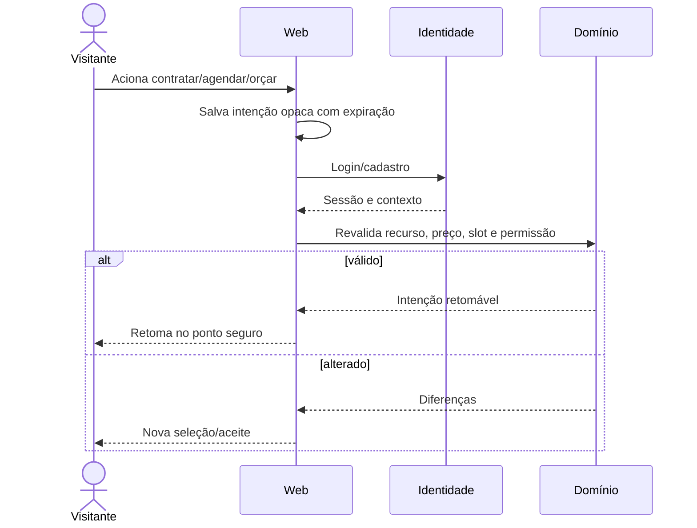
```mermaid
sequenceDiagram
    actor V as Visitante
    participant W as Web
    participant I as Identidade
    participant D as Domínio
    V->>W: Aciona contratar/agendar/orçar
    W->>W: Salva intenção opaca com expiração
    W->>I: Login/cadastro
    I-->>W: Sessão e contexto
    W->>D: Revalida recurso, preço, slot e permissão
    alt válido
      D-->>W: Intenção retomável
      W-->>V: Retoma no ponto seguro
    else alterado
      D-->>W: Diferenças
      W-->>V: Nova seleção/aceite
    end
```

## 30.10 Acessibilidade e pesquisa

| Tema | Aceite |
|---|---|
| Teclado/foco | Todos os controles e fluxos completos sem mouse; foco visível e lógico |
| Foco não obscurecido | Elemento focado não fica totalmente coberto por header, toast ou modal; scroll automático preserva contexto |
| Leitor de tela | Landmarks, headings, labels, estados/valores e anúncios moderados |
| Contraste/cor | WCAG AA; estado nunca só por cor |
| Reflow/zoom | 320 CSS px e 200% sem perda; alternativa a tabela/grade/mapa |
| Tempo | Aviso/renovação compatível; pagamento não exige página aberta |
| Movimento/alvo | Reduced motion, sem flash; alvo mínimo conforme WCAG 2.2 ou espaçamento/exceção documentada |
| Formulário | Label, instrução, erro associado, autocomplete e colagem |
| Autenticação | Password manager, colagem e WebAuthn; desafio cognitivo tem alternativa e CAPTCHA acessível |
| Mídia/linguagem | Alt/legenda/tipo/tamanho; pt-BR direto, data/zona/moeda claras |

Validação antes do build: entrevistas com 8-12 clientes e 8-12 profissionais; protótipo com 5-8 por jornada/perfil; piloto observado por categoria. Antes do lançamento: teclado, NVDA/Chrome, VoiceOver/Safari móvel, zoom/reflow, contraste e testes com pessoas com deficiência.

---

# 31. Administração

## 31.1 Princípios

- Aplicação/host administrativo separado, sem indexação, com MFA, sessão curta e reautenticação.
- Não existe papel operacional “admin total”; módulos, ações e escopo são explícitos.
- Caso, fila atribuída e finalidade controlam acesso sensível.
- Mutação grava motivo, policy/version, before/after digest, ator, aprovador, tempo e correlation ID.
- Financeiro usa comandos e compensação, nunca edição de saldo/entry.
- Taxa, policy, categoria e risco têm versão, vigência futura, simulação, aprovação e rollback.
- Impersonação fica desabilitada; visão de suporte é mascarada e somente leitura.

## 31.2 Módulos

| Módulo | Objetivo/ações | Perfis | Controle específico |
|---|---|---|---|
| Fila | Prioridade, SLA, dependência; assumir/transferir/escalar | Todos por equipe | Nota interna separada; detectar cherry-picking |
| Usuários | Identidade, contexto, sessão e estado; revogar/suspender | Sup/Risk/Identity | PII mascarada; fiscal exige reverificação |
| Profissionais | Perfil, serviço, verificação e sanção | Verification/Mod/Risk | Selos e escopos separados |
| Verificações | Resultado, evidência, validade e recurso | Verification/Risk | Override four-eyes; sem download ordinário |
| Catálogo | Taxonomia, risco e requisito | Mod/Product/Admin | Vigência/migração; alto risco com Jurídico |
| Conteúdo | Mídia, pedido, review e anúncio | Mod | Policy/evidência/recurso/preview seguro |
| Financeiro | Ordem, PSP, ledger, refund e conciliação | Fin | Sem edit; alçada, key e divergência |
| Repasses | Elegibilidade, reserva e falha | Fin/Risk | Bloqueador não libera sozinho |
| Disputas | Timeline, snapshot, evidência, decisão/recurso | Dispute/Fin/Legal | Decisão e efeito financeiro separados |
| Fraude | Sinais, reason codes, revisão e hold | Risk | Humano em alto impacto; medir falso positivo |
| Conduta | Denúncia, reincidência e segurança | T&S/Mod | SLA urgente e bem-estar do moderador |
| Segurança | Sessões, anomalia, incidente/runbook | Security/SRE | Log fora do alcance do operador |
| Suporte | Ticket, contexto, macro e SLA | Support | PII sob demanda e QA amostral |
| Configuração | Taxa, policy, limite, template e flag | Config admin + approver | Diff, simulação, rollout/kill switch |
| Auditoria | Ações, consulta e exportação | Audit/Security/GRC | Append-only; alerta de busca abusiva |
| Analytics | Fila, SLA, qualidade e perda | Gestor do domínio | Agregado, sem PII/texto |

## 31.3 Alçadas

A tabela de valores da seção 6.5 é a única baseline monetária deste documento e permanece **[HIP]**. O backend calcula a alçada pela versão vigente.

| Classe | Exemplos | Regra |
|---|---|---|
| Financeira | Refund, crédito, ajuste, retry de repasse | Valor/policy; proponente diferente de aprovador; step-up |
| Moderação | Ocultar até 72h, remover, suspender, banir | Gravidade/escopo/prazo; permanente exige dupla revisão |
| Privacidade | Ver documento/chat, exportar dados | Case/finalidade/tempo; exportação com aprovação |
| Configuração | Taxa/policy/regra global | Simulação, segundo aprovador, vigência futura, sem retroação |
| Segurança | Revogar sessão, break-glass | Contenção imediata quando necessária; revisão pós-ação |

Critérios:

- mesma identidade não propõe/aprova;
- mudança do objeto ou expiração invalida aprovação;
- frontend não autoriza por valor;
- nova versão de alçada não altera processo em andamento sem regra explícita.

## 31.4 Fluxo de comando privilegiado

```mermaid
stateDiagram-v2
    [*] --> Draft
    Draft --> Proposed: motivo + evidência
    Proposed --> AwaitingApproval: alçada
    Proposed --> Executable: sem 2A
    AwaitingApproval --> Executable: aprovador distinto
    AwaitingApproval --> Rejected
    Executable --> Executed: comando idempotente
    Executable --> Expired: prazo/estado mudou
    Executed --> Verification
    Verification --> Completed: efeito conciliado
    Verification --> Failed: divergência
    Failed --> Proposed: compensação
```

## 31.5 Prevenção de abuso interno

- Busca prioriza case/contract/payment/public ID; CPF/telefone/e-mail exige motivo.
- Campos ficam mascarados até finalidade compatível.
- Alertar consulta massiva, fora de turno/escopo, conta de operador ou pessoa relacionada.
- Exportação é job assíncrono minimizado, marcado, expirável e aprovado.
- Registrar leitura de campo sensível.
- Revisar 100% de break-glass, ban, ajuste e exportação.
- Recertificar acesso trimestralmente e revogar no desligamento.
- Desenvolvimento nunca recebe dados reais.

## 31.6 Indicadores

Primeira ação útil, resolução conciliada, reabertura 7/30d, reversão em recurso, concordância de revisão cega, acesso indevido, compensação por causa e satisfação separada do resultado financeiro.

---

# 32. SEO

## 32.1 Limite

SEO capta intenção local e leva a busca, perfil ou pedido. Não autoriza indexar pedido, endereço, chat, documento, rota autenticada ou página programática sem valor. Conteúdo principal indexável é SSR/estático e retorna HTTP correto sem depender de JavaScript tardio.

## 32.2 Matriz de indexação

| Página/rota | Indexar? | Gate |
|---|---:|---|
| `/` | Sim | Conteúdo único e navegação |
| `/servicos/{categoria}` | Sim | Categoria aprovada e conteúdo útil |
| `/{uf}/{cidade}/{categoria}` | Condicional | Oferta mínima/conteúdo local não duplicado |
| `/{uf}/{cidade}/{subcategoria}` | Condicional estrito | Demanda/oferta e conteúdo próprio |
| `/profissional/{slug}-{id}` | Sim/opt-out | Publicado, elegível, suficiente e não suspenso |
| `/profissional/{id}/servicos/{slug}-{id}` | Condicional | Serviço distinto; senão canonical do perfil |
| `/ajuda/*`, `/como-funciona` | Sim | Revisado, datado e público |
| `/buscar?...` | Não | `noindex,follow`; fora do sitemap |
| `/pedidos/{id}` | Não no MVP | Privacidade/fraude/conteúdo fino |
| Login/checkout/contrato/chat/pagamento | Não | Auth, private cache e fora do sitemap |
| Administração | Não | Host/auth separados; robots não é segurança |
| Removido/suspenso | 404/410/noindex | Sem motivo sensível |

**[PEND]** Limiar de página local. Hipótese: ao menos cinco ofertas elegíveis ou conteúdo editorial local robusto; não divulgar o número como garantia.

Perfil usa `search_engine_indexing=false` em rascunho. Na publicação, profissional escolhe separadamente permitir indexação externa após ver prévia e aviso de persistência em caches; recusar não remove o perfil da busca interna. Retirada:

1. grava preferência e serve `noindex`/retira canonical indexável imediatamente;
2. remove de sitemap e purga CDN em até 15 minutos;
3. solicita remoção à ferramenta do buscador em até 1 dia útil quando necessário;
4. monitora até sumir, sem prometer prazo de terceiro;
5. registra evento, versão e falha de purga.

**VALIDAÇÃO JURÍDICA OBRIGATÓRIA** da base e do texto; privacy by default permanece enquanto pendente.

## 32.3 URL e ciclo

- Slug + ID opaco; slug antigo `301`.
- Canonical absoluto; tracking/filtro/ordem não cria concorrente.
- Paginação tem links HTML e fallback a “carregar mais”.
- Geolocalização não redireciona cidade sem escolha.
- Remoção real usa 404/410, não soft 404.
- Conteúdo temporário usa status/cache coerentes.

## 32.4 Metadados e structured data

| Elemento | Regra |
|---|---|
| Title/description | Únicos, factuais, sem promessa ou stuffing |
| Headings/breadcrumb | Hierarquia real e breadcrumb visível |
| Open Graph | Somente mídia pública segura |
| Schema | Só tipo aplicável ao conteúdo visível; plataforma não é prestadora universal |
| Review aggregate | Apenas reviews elegíveis/visíveis; validação SEO/jurídica |
| Person/Organization | Natureza declarada; sem endereço residencial |
| FAQ | Conteúdo realmente visível e mantido |

Feature flag desliga markup divergente. Pipeline compara schema com conteúdo.

## 32.5 Sitemap, conteúdo e performance

- Sitemaps separados por tipo; `lastmod` só em mudança relevante.
- Somente canonical indexável `200` entra.
- Suspensão remove de sitemap/cache em até 15 minutos; buscador externo segue monitorado sem garantia de prazo.
- Não gerar combinações cidade/bairro/filtro sem valor.
- Faixa de preço só com amostra, período, região, metodologia e aviso.
- Proibido inventar oferta, preço, disponibilidade, avaliação ou segurança.

Metas de campo p75 móvel:

| Métrica | Meta |
|---|---:|
| LCP | <= 2,5 s |
| INP | <= 200 ms |
| CLS | <= 0,1 |

## 32.6 Privacidade e aceite

- Tags não essenciais aguardam decisão aplicável e não recebem PII/texto sensível.
- Recusa de marketing não degrada produto.
- URL não contém PII/token; Referrer-Policy reduz vazamento.
- Perfil sem JS contém title, conteúdo, canonical e metadata.
- Rota autenticada não expõe dado a crawler.
- Perfil suspenso sai de busca/sitemap/cache.
- Página abaixo do gate recebe `noindex` ou não é gerada.

---

# 33. Analytics

## 33.1 North Star Metric e regra de maturação

A North Star Metric é **SCSP: Serviços Concluídos com Sucesso e Pagos internamente**.

```text
SCSP da coorte =
  contagem distinta de contract_id
  em que:
    Contract.status = COMPLETED
    completion_mode IN (CLIENT_CONFIRMED, AUTO)
    gross_paid_minor > 0
    net_paid_minor > 0
    unresolved_severe_dispute = false
    severe_dispute_confirmed = false
    fraud_confirmed = false
    test_account = false
    maturity_window_elapsed = true
```

`net_paid_minor = gross_paid_minor - confirmed_refund_minor - confirmed_chargeback_minor`. Esta é a mesma definição canônica da seção 3.1.

**[OBR]** O contrato é a unidade de contagem, não a parcela, tentativa de pagamento, proposta, etapa ou profissional substituto. O painel mostrará:

- `pré-SCSP`: satisfaz todos os critérios exceto `maturity_window_elapsed`; é projeção operacional e não entra na North Star oficial;
- `SCSP maduro`: satisfaz a fórmula canônica completa e entra na North Star oficial;
- `SCSP revisado`: valor histórico recalculado quando surge fato tardio, com versão e explicação.

**[HIP]** A janela inicial de maturação será de 30 dias após a conclusão, além da janela de 72 horas para confirmação automática. A definição por categoria exige histórico de chargeback e disputa.

| Caso-limite | Tratamento no SCSP | Razão |
|---|---|---|
| Reembolso integral | Excluir/reclassificar | O valor transacional não permaneceu realizado |
| Reembolso parcial | Contar uma vez se restar valor pago e não houver falha grave; marcar redução | Evita tratar ajuste legítimo como fracasso integral |
| Disputa aberta ainda não decidida | Não entra no maduro; permanece pré-SCSP bloqueado | Resultado ainda é incerto |
| Conclusão automática | Pré-SCSP até maturação | Evita premiar silêncio que vire contestação |
| Pagamento por etapas futuro | Conta uma vez por contrato | Etapas não multiplicam valor entregue |
| Chargeback tardio | Reclassificar e manter trilha da revisão | O risco financeiro materializou-se |
| Cupom de 100% financiado pela plataforma | Fora do SCSP se `paid_amount=0`; medir separadamente | Ativação promocional não prova disposição a pagar |
| Cancelamento seguido de contrato substituto | Só o substituto concluído conta | Evita duplicidade na cadeia de reposição |

### Por que SCSP é a métrica principal

| Métrica isolada | Falha | Como SCSP corrige |
|---|---|---|
| Cadastros | Mede aquisição, não oferta/demanda ativa | Exige transação e entrega |
| Visitas e buscas | Podem crescer com tráfego desqualificado | Exige resolução da necessidade |
| Propostas | Podem ser infladas por spam | Exige aceite, pagamento e conclusão |
| Contratações criadas | Ignoram falha de pagamento e cancelamento | Exige fato financeiro e operacional |
| GMV | Pode crescer com ticket, fraude ou reembolso | Conta unidades bem-sucedidas e usa guardrails |
| Receita | Pode subir com taxa maior e piorar liquidez | Mantém sucesso bilateral como objetivo |

SCSP não é suficiente isoladamente. Deve ser acompanhado por margem, qualidade, concentração, segurança, satisfação, oferta e demanda.

## 33.2 Árvore de métricas

```mermaid
flowchart TD
    NSM[SCSP maduro]
    NSM --> DEM[Demanda qualificada]
    NSM --> OFE[Oferta elegível]
    NSM --> LIQ[Liquidez]
    NSM --> PAY[Pagamento interno]
    NSM --> CON[Conclusão]
    NSM --> QUA[Qualidade e risco]
    DEM --> REQ[Pedidos elegíveis]
    DEM --> DIR[Intenções diretas]
    OFE --> PRO[Profissionais ativados]
    OFE --> AVA[Disponibilidade útil]
    LIQ --> COV[Coverage rate]
    LIQ --> MAT[Proposal match rate]
    LIQ --> FIL[Fill rate]
    LIQ --> TFP[Tempo até primeira proposta]
    PAY --> CHK[Conversão de checkout]
    PAY --> APS[Aprovação de pagamento]
    CON --> COM[Taxa de conclusão]
    CON --> REP[Repetição]
    QUA --> DIS[Disputa grave]
    QUA --> REF[Reembolso]
    QUA --> CHA[Chargeback]
```

Decomposição diagnóstica, não identidade contábil:

```text
SCSP ≈ oportunidades elegíveis
       x coverage rate
       x proposal match rate
       x taxa de aceite e checkout
       x taxa de pagamento aprovado
       x taxa de conclusão
       x (1 - taxa de falha grave madura)
```

## 33.3 Catálogo de KPIs

| Grupo | KPI | Definição auditável | Guardrail/fonte |
|---|---|---|---|
| Aquisição | Cadastro concluído | Identidade criada e canal primário verificado | Excluir teste, bot e duplicata |
| Ativação | Profissional ativado | Verificação mínima, perfil e ao menos um serviço publicado, área e disponibilidade válidas | Catálogo/Verificação |
| Uso | Usuário ativo | Pessoa distinta com ação autenticada de valor em D7/D30 | Page view não basta |
| Retenção | Repeat SCSP rate | Clientes com novo SCSP dentro da janela / clientes com primeiro SCSP | Coorte do primeiro SCSP |
| Retenção | Repeat booking rate | Clientes com nova contratação paga dentro da janela / clientes com primeira contratação paga | Não confundir com sucesso maduro |
| Oferta | Oferta elegível | Profissional publicado, não suspenso, apto à categoria/região/modalidade | Cadastro bruto não conta |
| Demanda | Pedido elegível | Pedido válido, moderado, não duplicado nem teste | Pedidos |
| Liquidez | Coverage rate | Oportunidades com oferta elegível apresentada/notificada / oportunidades elegíveis | Mede cobertura, não resposta |
| Liquidez | Proposal match rate | Pedidos com proposta qualificada / pedidos elegíveis maduros | Prazo de observação fixo |
| Liquidez | Fill rate | Pedidos com contrato confirmado na janela / pedidos elegíveis | Janela por categoria |
| Liquidez | Tempo até primeira proposta | Mediana e p90 da publicação à primeira proposta qualificada | Não usar só média |
| Conversão | Proposta para aceite | Propostas aceitas / propostas visualizadas elegíveis | Excluir expiradas antes de visualização |
| Conversão | Checkout para pagamento | Ordens pagas / checkouts elegíveis iniciados | Deduplicar retentativa |
| Qualidade | Taxa de conclusão | Contratos concluídos / confirmados com janela madura | Separar no-show/cancelamento |
| Qualidade | Sucesso sem disputa grave | SCSP / contratos confirmados e pagos internamente cuja coorte completou a janela de maturação | Indicador central; mesma definição da seção 3.2 |
| Qualidade | Cancelamento/no-show | Ocorrências / compromissos elegíveis, por ator e causa | Decisão e evidência |
| Reputação | Cobertura de avaliação | Contratos elegíveis avaliados / concluídos | Nota sem cobertura engana |
| Financeiro | GMV bruto/líquido | Valores conforme política contábil antes/depois de reversões definidas | Ledger; validação contábil |
| Financeiro | Take rate efetivo | Receita líquida elegível / GMV elegível | Ledger; segmentar subsídios |
| Financeiro | Margem de contribuição | Receita menos PSP, incentivos, perdas e custo variável definido | **VALIDAÇÃO CONTÁBIL/TRIBUTÁRIA OBRIGATÓRIA** |
| Financeiro | Conciliação | Fatos conciliados sem divergência / fatos devidos | Ordem + PSP + ledger + payout |
| Financeiro | Prazo/falha de repasse | p50/p95 e falhas por motivo | Payout interno + PSP |
| Risco | Chargeback | Quantidade e valor por pagamento/coorte madura | Separar método e causa |
| Risco | Fraude confirmada | Casos/valor decididos por taxonomia | Score não equivale a fraude |
| Risco | Falso positivo | Decisões revertidas ou liberadas / decisões revisadas | Amostra e recurso |
| Operação | SLA de caso | Primeira ação útil e resolução por prioridade | Pausar relógio de modo explícito |
| Operação | Recurso/reversão | Recursos e reversões por tipo/operador | Mede consistência |
| Segurança | Incidentes | Quantidade, severidade, contenção e recuperação | Meta não desestimula reporte |

**[OBR]** Todo KPI oficial terá nome, fórmula, fonte, dono, versão, dimensões, exclusões, janela de maturação, timezone e política de correção. Valores financeiros oficiais vêm do ledger conciliado, nunca da ferramenta de analytics.

## 33.4 Segmentos e limites de privacidade

Os KPIs relevantes serão cortáveis por:

- região agregada, categoria, subcategoria, modalidade e tipo de contratação;
- cliente novo/recorrente e profissional novo/estabelecido;
- dispositivo, canal, versão da aplicação e experimento;
- método de pagamento, parcelamento e PSP;
- orgânico/patrocinado, plano e coorte;
- estado de verificação e faixa de risco, sem expor sinal individual.

**[OBR]** Bairro, pequenas categorias e cruzamentos raros serão suprimidos abaixo de limiar aprovado pelo DPO. Atributo sensível ou proxy só poderá ser usado em auditoria de equidade restrita, com finalidade, base legal e análise de risco; não será dimensão livre de dashboard.

## 33.5 Taxonomia de eventos

| Evento | Gatilho autoritativo | Propriedades permitidas | Proibido |
|---|---|---|---|
| `search_submitted` | Busca aceita | `search_id`, termo normalizado/categórico, região agregada, filtros, quantidade de resultados | Endereço e texto bruto com PII |
| `professional_profile_viewed` | Conteúdo exibido | ID pseudônimo, posição, origem, patrocinado | Nome, contato e endereço |
| `request_published` | Domínio publica | ID pseudônimo, categoria, modalidade, região agregada | Descrição e anexos |
| `proposal_sent` | Revisão enviada | IDs, versão, faixa de valor/prazo | Escopo e mensagem |
| `proposal_accepted` | Snapshot aceito | IDs, versão, fluxo, faixa de valor | Anexo e PII |
| `slot_hold_created` | Hold confirmado | IDs, duração, categoria e fuso | Local exato |
| `checkout_started` | Snapshot criado | IDs, métodos, componentes de preço booleanos | Cartão, CPF, endereço |
| `payment_status_changed` | Ordem interna muda | IDs, estado interno, método, faixa, motivo categórico | Payload PSP, token e instrumento |
| `contract_status_changed` | Transição válida | IDs, anterior, novo, ator e `reason_code` | Justificativa/evidência livre |
| `amendment_accepted` | Aceite persistido | IDs, versão, impacto em faixas | Texto de escopo |
| `service_completed` | Conclusão autoritativa | IDs, manual/automática, duração categórica | Evidência |
| `dispute_opened` | Caso criado | IDs, motivo enumerado, severidade e faixa | Narrativa/anexos |
| `refund_issued` | Reembolso confirmado | IDs, parcial/integral, motivo e faixa | Conta bancária |
| `payout_status_changed` | Repasse muda | IDs, estado, motivo e faixa | Dados bancários |
| `review_created` | Review elegível criada | IDs, nota, critérios e presença de texto | Comentário/foto |

Envelope analítico:

```json
{
  "event_id": "019ad70a-0b84-7a8e-9f31-4c6e841d1342",
  "event_name": "contract_status_changed",
  "event_version": 1,
  "occurred_at": "2026-07-18T15:20:31.842Z",
  "received_at": "2026-07-18T15:20:32.107Z",
  "environment": "production",
  "source": "contracts-module",
  "actor_type": "CLIENT",
  "actor_id_pseudonym": "hmac:v1:3d8...",
  "correlation_id": "019ad70a-0c01-70b5-a924-f588fc8d2cbe",
  "entity_type": "CONTRACT",
  "entity_id_pseudonym": "hmac:v1:93a...",
  "properties": {
    "from_status": "AWAITING_CLIENT_CONFIRMATION",
    "to_status": "COMPLETED",
    "transition_reason": "CLIENT_CONFIRMED",
    "category_id": "cat_electrical",
    "region_cluster": "pilot_core"
  },
  "processing_context": {
    "processing_purpose": "PRODUCT_ANALYTICS_FIRST_PARTY",
    "legal_basis_candidate": "LEGITIMATE_INTEREST_PENDING_VALIDATION",
    "collection_tier": "FIRST_PARTY_MINIMIZED",
    "policy_version": "2026-07-01"
  }
}
```

Regras:

- fatos críticos são emitidos no backend a partir da transação autoritativa, via outbox;
- clique de interface mede intenção, mas não substitui pagamento, conclusão ou repasse;
- `event_id` deduplica ingestão e `event_version` permite evolução;
- testes, bots e contas internas são marcados por regra versionada;
- texto livre, URL, conteúdo de chat, documento e identificador direto não entram;
- pseudonimização não será tratada como anonimização;
- atraso, queda de volume e quebra de schema geram alertas de qualidade.

Pipelines são separados:

1. evento de domínio operacional, necessário para executar/auditar o contrato;
2. analytics first-party minimizado, com finalidade e base candidata aprovadas;
3. telemetria comportamental ou marketing opcional, bloqueada até escolha válida quando exigida.

“Essencial” não é base legal nem finalidade. Um opt-out de tracking opcional não apaga fatos contratuais, e um fato contratual não autoriza copiar conteúdo para analytics.

## 33.6 Funis, coortes e experimentos

```text
Cliente:
busca/pedido -> oferta/proposta -> aceite -> checkout -> pagamento aprovado
-> confirmado -> iniciado -> concluído -> pré-SCSP -> SCSP maduro -> repetição

Profissional:
onboarding -> verificação -> serviço publicado -> oferta elegível -> proposta
-> aceite -> execução -> conclusão -> repasse conciliado -> retenção D30/D90
```

Cada taxa terá denominador elegível e janela declarados. Coorte de aquisição, contratação, conclusão e maturação não será misturada sem rótulo.

Experimentos exigem hipótese, unidade de randomização, população, métrica primária, guardrails, efeito mínimo detectável, duração e regra de parada. É proibido experimentar ocultação de taxa, retirada de suporte, consentimento enganoso, degradação de segurança ou tratamento desigual de grupo protegido. Guardrails mínimos: disputa, cancelamento, reembolso, denúncia, acessibilidade, performance, concentração, margem e SLA.

## 33.7 Dashboards, alertas e governança

| Dashboard | Público | Cadência | Conteúdo |
|---|---|---|---|
| North Star/liquidez | Liderança, Produto, Operações | Diário/semanal | pré-SCSP/SCSP maduro, funil, coverage/proposal match/fill e concentração |
| Financeiro | Financeiro, SRE, Risco | Quase real time/diário | Aprovação, webhook, conciliação, divergência, payout |
| Região/categoria | Operações, Produto, Growth | Diário/semanal | Oferta, demanda, tempo, fill, ticket, cancelamento |
| Trust & Safety | Risco, Moderação, Segurança | Quase real time/semanal | Denúncia, fraude, falso positivo, recurso, SLA |
| Experiência | Produto, UX, Engenharia | Semanal | Funis, erros, zero-result, acessibilidade, performance |
| Executivo | Liderança | Semanal/mensal | SCSP, receita, margem, retenção, liquidez e risco |

Alertas de negócio/qualidade:

- queda de aprovação de pagamento por método/PSP;
- webhook atrasado ou efeito duplicado;
- qualquer divergência não explicada de ledger;
- repasse parado acima do SLA;
- dupla reserva confirmada;
- pico de chargeback, fraude, denúncia urgente ou takeover;
- mudança brusca de zero-result, fill rate ou concentração;
- ausência de eventos críticos, que pode ser falha de telemetria.

Catálogo e linhagem rastrearão evento, ingestão, transformação, tabela e dashboard. Mudança de definição ocorre por revisão, versionamento, changelog e avaliação de backfill. Dashboard certificado será distinguido de análise ad hoc.

## 33.8 Critérios de aceite

- Dado webhook duplicado, quando processado, então a métrica de pagamento registra um fato de negócio, sem multiplicar GMV ou SCSP.
- Dado contrato com várias etapas futuras, quando concluído, então conta uma vez no SCSP.
- Dado reembolso integral tardio, quando a coorte amadurece, então o contrato é reclassificado e a revisão fica explicada.
- Dado evento de chat, quando chega ao analytics, então não contém conteúdo, telefone, e-mail, URL ou anexo.
- Dada métrica financeira oficial, quando publicada, então reconcilia com o ledger dentro de tolerância documentada.
- Dado corte abaixo do limiar de privacidade, quando consultado, então retorna agregado ou suprimido.

---

# 34. Requisitos não funcionais

## 34.1 Metas mensuráveis do MVP

**[HIP]** O dimensionamento inicial considera até 100 mil MAU, 20 mil profissionais cadastrados, 2 mil usuários concorrentes, 50 requests/s sustentados e pico de 250 requests/s. A capacidade será recalibrada com tráfego real e testada a 2 vezes o pico previsto.

| Categoria | Meta | Medição e aceite |
|---|---|---|
| Disponibilidade | 99,9% mensal para páginas/busca/core; 99,95% para autenticação e comandos internos de checkout | Probes externos; 50% do error budget em 7 dias congela mudanças de risco, 100% congela features |
| Web | LCP p75 <=2,5 s, INP p75 <=200 ms, CLS p75 <=0,1 nas páginas públicas | RUM móvel/desktop por 28 dias; regressão superior a 10% bloqueia release |
| APIs | Rotas comuns p95 <=500 ms/p99 <=1,5 s; busca p95 <=700 ms; comando interno de checkout p95 <=800 ms | Histogramas por rota/status, separando terceiro/cache |
| Capacidade | 250 rps por 15 min, 2 mil conexões, burst de 500 mensagens/s e 100 webhooks/s | Erro <1%; nenhuma perda/duplicidade; invariantes 100% |
| Agenda | Uma reserva ativa por slot/capacidade; hold expirado liberado em <=60 s | Constraint e teste concorrente 50:1 com zero conflito confirmado |
| Financeiro | Cada efeito correlacionável, balanceado, idempotente e conciliável | Débitos=créditos por moeda; nenhuma edição de lançamento; divergência alerta |
| Segurança | OWASP ASVS nível 2 aplicável e controles reforçados para finanças/admin | Sem achado crítico/alto explorável sem exceção formal vigente |
| Privacidade | Todo dado/finalidade inventariado; localização pública nunca exata | Scanner de log/evento e testes ABAC; retenção falha >24 h alerta |
| Backup | PITR, snapshot diário, cópia isolada e storage versionado | Relatório diário e restore trimestral com hash, permissões e smoke |
| Terceiros | Degradação sem duplicar efeito; fallback manual/assíncrono | Fault injection, timeout, circuit breaker e fila |
| Compatibilidade | Duas versões estáveis recentes de Chrome, Edge, Firefox e Safari; Chrome Android e Safari iOS relevantes | Fluxos P0 na matriz; aviso acessível para versão não suportada |
| Acessibilidade | WCAG 2.2 AA em toda tela/fluxo habilitado em produção | Zero violação automática séria/crítica; checklist manual, foco não obscurecido, alvo e autenticação acessível |
| SEO | SSR/canonical/sitemap/schema coerentes e zero URL privada indexável | Crawler pré-release e monitoramento |
| Observabilidade | 100% dos comandos financeiros com correlation/trace; RED/USE | Fluxo sintético ponta a ponta e zero segredo/PII restrita |
| Manutenção | Dependências modulares acíclicas; cobertura crítica >=90% de branches e geral >=75% como sinal | Teste arquitetural; exceção com dono/prazo |
| Testabilidade | Relógio/IDs injetáveis, adapters externos e fixtures determinísticas | Suite P0 sem flaky tolerado |

## 34.2 RPO, RTO e recuperação

| Domínio | RPO | RTO | Estratégia/aceite |
|---|---:|---:|---|
| Ledger, pagamentos, repasses | 0 para falha de AZ coberta por replicação síncrona; regional **[PEND]** | 2 h para falha AZ; regional **[PEND]** | WAL/PITR, outbox e conciliação com PSP antes de payout |
| Contratos, propostas, aditivos, agenda | <=5 min | 2 h | PITR/replay; validar snapshots, constraints e slots |
| Identidade | <=5 min para conta; sessões podem ser revogadas | 2 h | Restaurar conta, rotacionar e forçar login se houver incerteza |
| Perfis, catálogo, pedidos, disputas | <=15 min | 4 h | PITR e storage versionado; disputa ativa priorizada |
| Chat/anexos | <=1 h para mensagem aceita | 8 h | Versionamento/replicação e comunicação de lacuna |
| Busca/reputação | Até 24 h, reconstruível | 4 h para fallback; 24 h para índice | Reconstrução da fonte |
| Notificações | <=1 h; financeiras reconstituíveis | 4 h | Replay outbox/inbox com dedupe |
| Analytics | 24 h | 48 h | Replay; não priorizar sobre core |

DR semestral restaurará banco, objetos, configuração e segredos em ambiente isolado, executará smoke P0 e conciliação e registrará RPO/RTO efetivos. PITR na mesma região não comprova desastre regional. **[PEND]** RPO/RTO regional só serão publicados após BIA, cópia/WAL e chaves cross-region, runbook e teste real; até lá, não há meta regional garantida.

## 34.3 Resiliência e manutenção

- Banco e workloads críticos Multi-AZ; backups em conta isolada.
- Timeouts explícitos, pools limitados, backpressure e bulkheads.
- Retry de mutação somente com chave idempotente e estado observável.
- Circuit breaker por operação, não apenas por fornecedor.
- Analytics/recomendação sofrem load shedding antes de identidade, contrato e financeiro.
- Liveness não consulta terceiro; readiness comprova capacidade local mínima.
- Mudança de fee, cancelamento, alçada e payout é versionada, aprovada e tem vigência futura.
- SLO de terceiro é medido separadamente e também no fluxo end-to-end.

Referências de metas e controles: [WCAG 2.2](https://www.w3.org/TR/WCAG22/), [OWASP ASVS](https://owasp.org/www-project-application-security-verification-standard/) e [OWASP API Security Top 10](https://owasp.org/API-Security/editions/2023/en/0x04-release-notes/).

---

# 35. Observabilidade

## 35.1 Telemetria

Logs JSON contêm `timestamp`, `level`, `service`, `environment`, `release`, `event_name`, `message_code`, `correlation_id`, `trace_id`, `span_id`, `actor_type`, ID pseudônimo opcional, recurso, rota, status, duração, resultado, código de erro e contagem de retry. Body não é registrado por padrão e a redação acontece antes da serialização.

- RED por rota/consumer: taxa, erro e duração.
- USE por recurso: utilização, saturação e erro.
- Controle: hold expirado, conflito, webhook/outbox/DLQ age, divergência, payout age e fila de risco.
- IDs individuais ficam em trace/log restrito, não em labels de métrica.
- OpenTelemetry cobre frontend, API, banco, fila e adapters.
- Erros e fluxos financeiros usam amostragem integral; sucessos comuns usam amostragem adaptativa.

## 35.2 SLIs e SLOs

| Fluxo | SLI bom/total | SLO mensal | Latência/freshness |
|---|---|---:|---:|
| Login | Tentativas válidas processadas sem 5xx/timeout | 99,95% | p95 <=500 ms; OTP end-to-end p95 <=10 s |
| Busca | Consultas válidas respondidas corretamente | 99,9% | p95 <=700 ms; índice <=2 min |
| Checkout interno | Um recurso/efeito lógico por comando idempotente | 99,95% | p95 <=800 ms interno |
| Confirmação | Aprovações PSP refletidas em contrato, ledger e agenda | 99,99% | 99% <=2 min; reconciliação <=15 min |
| Webhook | Evento válido persistido/processado idempotentemente | 99,99% | ACK p95 <=300 ms; processamento p99 <=2 min |
| Agenda | Hold/booking elegível sem conflito indevido | 99,95% | p95 <=500 ms; expiração <=60 s |
| Chat | Mensagem válida persistida e disponibilizada | 99,9% | Persistência p95 <=500 ms; online <=2 s |
| Repasse | Payout elegível instruído e conciliado | 99,9% | 99% em até 2 dias úteis +1 h; falha detectada <=15 min |

Recusa legítima do emissor não é erro interno, mas aparece no SLI end-to-end. Evento incompatível do PSP conta como falha de integração. Alertas de burn rate: page com 14,4x em 1 h junto de 6x em 6 h; ticket com 3x em 24 h junto de 1x em 72 h. Qualquer divergência de ledger, cobrança duplicada, perda de dados ou incidente crítico gera page sem aguardar error budget.

## 35.3 Dashboards e alertas

| Painel | Indicadores | Alertas |
|---|---|---|
| Reliability | SLO, budget, incidentes, GMV afetado | Burn rate e SEV1/2 |
| Checkout | Conversão, latência, `UNKNOWN`, webhook age | Pago sem ledger/booking; erro PSP |
| Ledger | Lotes, clearing, divergência, ajustes | Diferença >0; ajuste sem aprovação |
| Payout | Elegível, bloqueado, processando, falho e aging | Atraso, falha permanente, hold vencido |
| Agenda | Holds, expiração, capacidade, conflitos | Dupla reserva; lag >60 s |
| API/web | RED/USE, deploy, Core Web Vitals | Pool >80%, burn rate |
| Filas | Profundidade, oldest age, retry, DLQ | Qualquer DLQ crítica |
| Trust & Safety | Fila, SLA, fraude, recurso e ATO | Emergência sem triagem |
| Privacidade | Direitos, retenção, break-glass e PII scan | Prazo, falha de retenção ou acesso anômalo |

Todo alerta tem owner, severidade, runbook, dedupe e condição de encerramento. CPU isolada não basta como page; o alerta primário deve representar sintoma, SLO ou invariante.

## 35.4 Runbooks críticos

| Runbook | Detecção | Ações obrigatórias | Saída segura |
|---|---|---|---|
| PSP timeout/indisponível | Erro/latência e `UNKNOWN` | Abrir incidente, circuit break, não recriar cobrança, consultar PSP, manter hold controlado e reconciliar | Cada ordem comprovadamente paga ou falha; zero duplicidade |
| Webhook/DLQ | Age >2 min ou DLQ crítica | Validar ingress/assinatura, pausar replay amplo, corrigir, dry-run, replay e conciliar | Backlog e divergência zero |
| Divergência de ledger | Reconciliador diferente de zero | Congelar payout, preservar evidência, localizar etapa e usar compensatório aprovado | Balanceamento e postmortem |
| Dupla cobrança | Dois fatos no mesmo contexto | Impedir payout excedente, correlacionar, acionar PSP e reembolsar duplicata confirmada | Cliente informado e ledger conciliado |
| Repasse falho | `FAILED` ou aging | Classificar erro, preservar obrigação, notificar, step-up para destino e retry idempotente | Pago ou ação pendente clara |
| Dupla reserva | Violação de invariante | Bloquear novas confirmações do slot, priorizar contrato pago e oferecer solução | Um booking ou resolução consentida |
| Banco degradado | Latência, pool, lag | Shed de não críticos, reduzir workers, failover, validar outbox/escrita | Integridade antes de payout |
| Incidente de dados | Detector/relato | Conter, revogar, preservar, acionar Segurança/DPO/Jurídico | Escopo, decisão de comunicação e monitoramento |
| Scanner/storage falho | Scan age/error | Manter quarentena, nunca bypass, reprocessar por hash | Nenhum arquivo não analisado publicado |

## 35.5 Prática SRE e aceite

- On-call primário/secundário com escalonamento Financeiro, Segurança e DPO.
- Postmortem para SEV1/SEV2 e quase-incidente financeiro, sem foco em culpa.
- Marcadores de deploy e sintéticos a cada cinco minutos.
- Revisão semanal de SLO/DLQ/divergência e mensal de capacidade/custo.
- Dado pagamento aprovado no PSP, quando o webhook é perdido, então reconciliação o reflete em contrato/ledger no SLO.
- Dado alerta, quando dispara, então possui operador, runbook e condição verificável de resolução.

---

# 36. Testes

## 36.1 Estratégia e gates

| Tipo | Escopo | Momento | Gate |
|---|---|---|---|
| Unitário | Invariantes, dinheiro, máquinas, ranking e regras de risco | PR | Todos os branches de fee, ledger, cancelamento, aditivo, autorização e transição; mutation score >=80% nesses módulos |
| Integração | PostgreSQL/PostGIS, Redis, fila, constraints, outbox/inbox e migrations reais | PR | Sem mock de banco em concorrência; determinístico |
| Contrato | OpenAPI e adapters de PSP/KYC/notificação | PR/nightly sandbox | Breaking change bloqueia |
| API | Validação, envelope, idempotência, paginação, rate limit e authz por objeto/campo | PR | Matriz positiva e negativa |
| E2E P0 | Cadastro até avaliação/disputa/admin | PR reduzido e release completo | Nenhum flaky P0 tolerado |
| Segurança | SAST, DAST, SCA, secrets, IaC/container, BOLA, XSS, CSRF, SSRF e upload | PR/nightly/release | Crítico/alto explorável bloqueia |
| Carga/soak | API, fila e webhook a 2x pico e 2 h nominal | Pré-lançamento/mudança grande | Metas da seção 34 e invariantes 100% |
| Acessibilidade | Axe, teclado, NVDA e VoiceOver | PR/release | WCAG 2.2 AA em toda superfície que entra em produção |
| Recuperação | PITR, storage, replay, failover e rotação | Trimestral/semestral | RPO/RTO comprovados |
| Pagamento/webhook | Simulador determinístico e sandbox | PR financeiro/nightly | Zero efeito duplicado |
| Concorrência | 50 a 200 workers em slot, aceite, cupom, refund e payout | PR/nightly | Um vencedor quando aplicável; ledger balanceado |
| Fraude/authz | Corpus sintético, falso positivo, revisão, recurso e ABAC | Versão de regra | Limite aprovado e nenhuma ação irreversível automática |
| Migração | Banco vazio e snapshot irreversivelmente anonimizado | Toda migration | Expand/contract e compatibilidade N/N-1 |
| Chaos proporcional | Kill worker, duplicar/atrasar fila, cache off, timeout e replica lag | Homologação mensal | Degradação prevista, sem corrupção |

Cobertura é sinal, não substitui assertiva de invariante.

## 36.2 Cenários críticos

| Cenário | Ação de teste | Resultado obrigatório |
|---|---|---|
| Pagamento duplicado | Duas criações e callbacks concorrentes | Uma ordem, um recebimento no ledger e resposta idempotente |
| Chave igual/body diferente | Reusar key alterando valor | `409 IDEMPOTENCY_KEY_REUSED`; nenhuma chamada PSP |
| Webhook repetido | Entregar o mesmo ID vinte vezes | Um inbox/evento/efeito; demais ACK sem efeito |
| Webhook fora de ordem | Permutar `paid`, `refund`, `pending` | Fatos permanecem; projeção só muda por transição válida; captura tardia abre reconciliação/late case |
| Assinatura/replay inválido | Alterar body ou timestamp expirado | Nenhum efeito; sinal de segurança |
| Dupla reserva | Cinquenta clientes no mesmo slot | No máximo a capacidade; nenhum checkout sem hold |
| Aprovação após hold expirar | PSP aprova tarde | `PaymentOrder=PAID`, nenhum booking/payout; rebooking consentido ou refund SUCCEEDED encerra contrato corretamente |
| Preço mudou | Checkout usa versão antiga | `409` e novo breakdown antes de pagar |
| Aditivo não aceito | Tentar cobrar diferença | Negado; snapshot original intacto |
| Duplo aceite | Aceitar duas revisões simultâneas | Um contrato e um snapshot vencedor |
| Refund/chargeback concorrente | Refunds e chargeback excedem captura | Trava compartilhada limita alocação; fato bruto sobreposto abre conciliação |
| Chargeback após payout | Disputa do emissor tardia | Payout histórico preservado; chargeback/saldo/reserva lançados |
| Repasse falho | Conta inválida e retry duplicado | Obrigação preservada, sem débito duplo |
| Repasse desconhecido | PSP não responde após instrução | Mesma tentativa fica `UNKNOWN`; nenhum novo saque até consulta autenticada |
| Disputa versus payout | Abrir disputa e processar payout simultaneamente | Locks serializam; se disputa vencer, payout fica bloqueado sem chamada PSP |
| Conta suspensa | Há contrato/payout pendente | Ações de risco bloqueadas; suporte e direitos mantidos |
| IDOR/BOLA | Trocar IDs de contrato/chat/endereço/payout | `403/404`, sem vazamento, com auditoria sensível |
| Upload malicioso | EICAR, MIME falso, SVG, zip bomb e EXIF | Quarentena/reencode; sem URL pública |
| Conexão perdida | PSP aceitou, resposta não chegou | Retry com mesma key recupera recurso |
| Timeout PSP | Resultado desconhecido | `UNKNOWN/PENDING`, consulta e sem nova cobrança |
| Outbox parada | Commit ocorre e relay cai | Evento é publicado uma ou mais vezes; cada consumidor produz um efeito lógico via inbox |
| DLQ replay | Falha após efeito parcial | Inbox/transação impedem duplicidade |
| No-show/cancelamento | Variar ator, prazo, material e etapa | Preview igual ao efeito final e política versionada |
| Auto conclusão com disputa | Job vence durante hold | Não conclui nem libera payout; registra motivo |
| Review fraudulenta | Sem contrato, autoavaliação ou repetida | `403/409/422`; sem peso |
| Admin acima da alçada | Proponente tenta aprovar | Negado; segundo aprovador, MFA e auditoria |
| Exclusão com legal hold | Disputa ativa | Remove o dispensável e restringe o necessário com motivo/prazo |

## 36.3 Autorização, dados e confiabilidade

Cada recurso testa: dono; contraparte quando aplicável; usuário alheio; visitante; operador sem caso; operador com caso/finalidade; privilégio fora da alçada; conta suspensa; objeto inexistente; ID inválido; enumeração em lista.

Property-level authz impede cliente de mudar fee/status/profissional, profissional de mudar nota/verificação, suporte de injetar decisão/valor e frontend admin de conceder direito ausente na API.

- Dados de teste são sintéticos; produção não é copiada para homologação.
- Relógio, UUID, PSP, mapas e fila têm fakes determinísticos.
- Sandbox real roda em job separado e não substitui simulador.
- Flaky P0 é defeito; quarentena exige owner e prazo máximo de cinco dias úteis.
- Evidência de release associa commit, SBOM, scans, testes e aprovadores.

---

# 37. DevOps

## 37.1 Ambientes

| Ambiente | Finalidade | Dados/acesso |
|---|---|---|
| Local | Desenvolvimento e integração em containers | Sintético; segredos descartáveis |
| Preview PR | UI/API efêmera com TTL | Sintético; SSO do time |
| Desenvolvimento | Integração contínua | Sintético; PSP/KYC sandbox |
| Homologação | E2E, carga controlada e DAST | Sintético; topologia lógica equivalente |
| Produção | Usuários e transações reais | JIT, MFA, menor privilégio; sem DB direto de dev |
| DR isolado | Restore e exercícios | Backup cifrado e integrações incapazes de cobrar/notificar |

Contas cloud, KMS, rede, secrets, billing e IAM são separados. Egress é limitado aos fornecedores necessários.

## 37.2 IaC, configuração e CI/CD

- Terraform versionado, state remoto cifrado/bloqueado e `plan` revisado.
- Policy as code bloqueia storage público acidental, DB sem backup/cifra/Multi-AZ, porta administrativa aberta, IAM wildcard e log desativado.
- Fee, cancelamento, alçada e prazo de payout ficam em configuração de negócio versionada com schema, vigência, autor, aprovador e rollback.
- Drift diário abre incidente/ticket.

```mermaid
flowchart LR
    PR[Pull request] --> FAST[format, lint, tipos<br/>unitário e arquitetura]
    FAST --> SEC[secret, SAST, SCA<br/>IaC e container]
    SEC --> INT[integração, authz<br/>migration e contrato]
    INT --> BUILD[build reproduzível<br/>SBOM e provenance]
    BUILD --> SIGN[assinatura]
    SIGN --> HOM[preview/homologação]
    HOM --> E2E[E2E P0, DAST<br/>a11y e smoke]
    E2E --> APP[aprovação por risco]
    APP --> CAN[canary]
    CAN --> VER[SLO e invariantes]
    VER --> FULL[rollout]
    VER -->|falha| RB[rollback/flag off]
```

Branch protection exige PR, checks, commit assinado e CODEOWNERS. Mudança comum requer um reviewer; autenticação, política, pagamento, ledger, payout, retenção, IaC ou migration destrutiva exigem dois, incluindo o dono. Autor não aprova o próprio merge. O mesmo digest assinado é promovido, sem rebuild.

## 37.3 Deploy, flags e banco

| Mudança | Estratégia | Guardrails | Rollback |
|---|---|---|---|
| API/web | Canary 5%, 25%, 100% | 5xx, p95, budget, DB e conversão | Digest anterior |
| Financeiro | Coorte interna, 1%, 10%, 100% | Divergência zero, idempotência e webhook age | Kill switch + digest; conciliar |
| Worker | Consumidor canary N/N-1 | Lag, DLQ e duplicata | Pausar/reverter; inbox permite replay |
| Frontend | CDN versionada | Web Vitals, JS error e funil | Manifest anterior |
| Mobile futuro | Rollout das lojas | Crash-free, ANR e compatibilidade | Interromper e usar remote config segura |

Feature flag tem owner, hipótese, público, expiração máxima de 90 dias, default seguro e testes nos dois estados. Não substitui autorização ou migration. Kill switch financeiro é server-side, restrito e auditado.

Migrations seguem expand/contract:

1. adicionar estrutura compatível;
2. implantar leitura/escrita compatível;
3. backfill em lotes com checkpoint;
4. validar constraint/dados;
5. mudar leitura;
6. parar escrita antiga após ciclo observado;
7. remover em release separado.

`DROP`, rewrite grande, alteração monetária/status e backfill de PII exigem análise de lock, restore e aprovação. Migration não roda concorrente no startup de todas as réplicas.

## 37.4 Segredos, supply chain e continuidade

- CI usa OIDC curto; nenhum access key permanente.
- Produção exige SSO e MFA resistente a phishing; acesso JIT máximo de quatro horas.
- SSH direto e DB de produção em workstation são proibidos; sessão gerenciada é auditada.
- Break-glass alerta, exige justificativa, rotaciona após uso e é revisado no dia útil seguinte.
- Secrets Manager entrega por workload identity; segredos não ficam em código, log ou imagem.
- Lockfile e actions por SHA; registry privado/cache; SBOM CycloneDX/SPDX; imagem não-root, mínima e por digest.
- Artefato e provenance são assinados e verificados na admissão.
- Backup usa conta isolada, imutabilidade e credenciais distintas para resistência a ransomware.

| Ativo | Proteção | Verificação |
|---|---|---|
| PostgreSQL | Multi-AZ, PITR >=35 dias proposto, snapshot e cópia isolada | Restore trimestral, smoke e conciliação |
| Object storage | Versioning, proteção de exclusão e lifecycle | Amostra mensal e inventário/hash |
| Ledger/audit | Backup e export append-only/WORM | Soma/hash e replay |
| IaC/config/schema | Git protegido, registry e state backup | Recriar ambiente mínimo |
| Chaves/segredos | KMS e runbook de rotação | Exercício sem expor material |

## 37.5 Mudança e prontidão

| Tipo | Aprovação | Regra |
|---|---|---|
| Baixo risco | Owner técnico e pipeline | Canary em horário com cobertura |
| Alto risco | Dois reviewers + dono; Financeiro/Security/DPO quando aplicável | Janela assistida, rollback e reconciliação |
| Emergencial | Incident commander + owner | Mudança mínima, auditada e postmortem |
| Configuração de negócio | Produto + Jurídico/Financeiro/DPO conforme campo | Simulação, vigência futura e comunicação |

Gate de produção:

1. IaC recria homologação sem configuração crítica manual.
2. O mesmo digest passou por P0, scans, migration rehearsal e homologação.
3. Restore completo atingiu RPO/RTO.
4. Alertas/runbooks críticos foram ensaiados.
5. Sandbox PSP cobriu duplicidade, ordem invertida, reembolso parcial, chargeback e payout falho.
6. Pentest não deixou achado crítico/alto explorável.
7. Inventário LGPD, retenção, direitos, fornecedores e canal DPO estão operacionais.
8. On-call multidisciplinar realizou tabletop.
9. Ledger e agenda resistiram à concorrência e reconciliação.
10. Rollback, kill switch e freeze de payout foram ensaiados sem editar fatos.

---

# 38. Suporte

## 38.1 Canais, prioridades e SLAs

| Prioridade | Exemplos | Entrada | Primeira ação útil | Atualização/resolução-alvo |
|---|---|---|---:|---:|
| P0 | Indisponibilidade sistêmica financeira, vazamento ativo, risco coletivo | Monitoramento e plantão interno | 15 min | Atualização a cada 30 min até contenção |
| P1 | Ameaça física em andamento, conta tomada, payout/reembolso relevante bloqueado | Canal urgente web/in-app e telefone operacional | 30 min para segurança 24x7; 2 h financeiro em horário ampliado | Atualização em até 4 h |
| P2 | Disputa, duplicidade, no-show, solicitação de privacidade | Ticket, chat e e-mail | 1 dia útil | 5 dias úteis sem contraditório; disputa simples até 10 dias úteis desde evidência mínima |
| P3 | Cadastro, documento, conteúdo e dúvida de uso | Central e ticket | 2 dias úteis | 7 dias úteis |
| P4 | Sugestão e feedback | Formulário | 5 dias úteis | Sem compromisso de implementação |

**[DEP]** O SLA P1 24x7 somente será publicado após escala, treinamento, telefonia e fornecedor estarem operacionais. Até então, o produto informa horário real e orienta a buscar serviços públicos de emergência quando houver perigo imediato; a plataforma não se apresenta como substituta desses serviços.

Primeira ação útil significa triagem com compreensão do caso, contenção ou pedido específico de evidência, não resposta automática de recebimento. O relógio só pausa aguardando usuário/terceiro se o motivo e a próxima data forem visíveis.

## 38.2 Processo de caso

```mermaid
stateDiagram-v2
    [*] --> Open
    Open --> Triaged
    Triaged --> InProgress
    InProgress --> WaitingUser
    InProgress --> WaitingThirdParty
    WaitingUser --> InProgress
    WaitingThirdParty --> InProgress
    InProgress --> Escalated
    Escalated --> InProgress
    InProgress --> Resolved
    Resolved --> Reopened
    Reopened --> InProgress
    Resolved --> Closed
```

Todo caso registra:

- ID opaco, categoria, prioridade, canal e timestamps;
- usuário, contrato, ordem e conversa relacionados;
- finalidade/base para acesso a dado restrito;
- timeline, evidência, responsável e SLA;
- decisão, fundamento, alçada, comunicação e recurso;
- correlation ID e auditoria de acessos/alterações.

Macros não afirmam culpa, garantia, obrigação ou prazo não validado. Caso com conflito de interesse muda de operador. O encerramento exige resumo, resolução e próximo direito do usuário.

Escalonamento:

```text
Suporte geral
-> especialista de pagamento, disputa, verificação ou moderação
-> Risco, Segurança, Privacidade/DPO ou Jurídico
-> liderança/incident commander conforme severidade
```

## 38.3 RACI operacional

Legenda: `R` executa; `A` responde pela decisão; `C` é consultado; `I` é informado.

| Processo | Suporte | Financeiro | Risco | Moderação | Segurança/DPO | Jurídico | Produto/Engenharia |
|---|---|---|---|---|---|---|---|
| Pagamento duplicado/falho | R | A | C | I | I | I | C |
| Repasse falho | R | A | C | I | I | I | C |
| Cancelamento padronizado | R/A na alçada | C | I | I | I | C | I |
| Disputa complexa | R/A dentro da alçada | C | C | C | C | A excepcional/acima da alçada | I |
| Fraude/chargeback | C | R | A | I | C | C | C |
| Incidente de segurança | I | I | C | I | A/R | C | R |
| Verificação profissional | R | C para conta | A para risco | C | C | C para regulado | I |
| Conteúdo/conduta | C | I | C | A/R | C | C | I |
| Direito LGPD | I | C | C | I | A/R DPO | C | R para extração |
| Serviço perigoso | R na triagem | I | R | C | A para segurança | C | I |

## 38.4 Controles e qualidade

- PII, chat e documentos ficam mascarados e são revelados apenas por caso/finalidade.
- Reembolso, ajuste e sanção obedecem alçada; valor acima do limite exige aprovador distinto.
- Exportação, download sensível, suspensão, banimento e alteração financeira alertam e auditam.
- Impersonação fica desativada no MVP. Se futuramente indispensável, exige consentimento contextual, banner, modo somente leitura por padrão, duração curta e gravação integral.
- Runbooks mínimos: pagamento duplicado, webhook parado, payout falho, chargeback, takeover, endereço exposto, ameaça física, vazamento e PSP indisponível.
- QA mensal amostra por agente, categoria, valor, prioridade e resultado.

KPIs: primeira ação útil, resolução, FCR, reabertura 7/30d, recurso/reversão, SLA, CSAT separado de resultado financeiro, custo por SCSP e acesso indevido.

Critério: dado caso P1, quando triado, então há operador treinado, orientação segura, evidência preservada e escalonamento dentro da capacidade publicada.

---

# 39. Jurídico e tributário

## 39.1 Posição das partes

| Parte | Papel operacional proposto | Limite |
|---|---|---|
| Plataforma | Facilita descoberta, registro, contratação, integração de pagamento, suporte e mediação privada | A realidade operacional prevalece; termos não eliminam responsabilidade legal |
| Cliente | Informa necessidade/local, escolhe, aceita escopo, paga e coopera | Direitos legais não podem ser renunciados por interface |
| Profissional | Define/aceita escopo, executa, mantém licenças e cumpre obrigação fiscal | O rótulo “parceiro” não elimina risco trabalhista, civil, consumerista ou tributário |
| PSP | Processa pagamento, recebedores, split, KYC/KYB e payout conforme contrato/regulação | A plataforma não promete recurso não homologado |
| Suboperadores | Hosting, comunicação, verificação, antimalware e analytics | DPA, finalidade, segurança, subcontratação e saída |

O marketplace prestará suporte e mediação privada, sem se declarar tribunal, seguradora, garantidor, empregador universal, banco ou custodiante.

## 39.2 Gates obrigatórios

**VALIDAÇÃO JURÍDICA OBRIGATÓRIA:**

- papel da plataforma na cadeia de consumo por fluxo e categoria;
- direito de arrependimento e suas consequências em serviço agendado/iniciado;
- textos de preço, cancelamento, ausência, conclusão automática, garantia, reembolso e disputa;
- validade do aceite eletrônico e preservação de evidência;
- retenção/bloqueio proporcional, saldo negativo, compensação e recurso;
- KYC/KYB, menores, serviço regulado, antecedente, biometria e cooperação com autoridades;
- moderação, review, evasão, sanção, publicidade e direito de resposta;
- propriedade intelectual/licença sobre portfólio, chat e anexos;
- bases legais, agentes, RIPD, cookies, geolocalização, fraude e transferência internacional.

**VALIDAÇÃO CONTÁBIL/TRIBUTÁRIA OBRIGATÓRIA:**

- principal versus agente e natureza econômica da comissão, taxa, cupom e subsídio;
- momento do reconhecimento da receita e tratamento de reembolso/chargeback;
- tributos aplicáveis, município competente e regime da pessoa jurídica;
- split e repasse a PF/PJ, retenções e obrigações acessórias;
- plano de contas e conciliação entre contrato, PSP, ledger e contabilidade;
- tratamento de material, deslocamento, parcelamento, inadimplência e créditos;
- conteúdo dos relatórios e documentos fiscais.

**VALIDAÇÃO COM PROVEDOR DE PAGAMENTO:**

- autorização/cobertura regulatória, modelo de marketplace e recebedores;
- split, KYC/KYB, liquidação, payout, reserva e saldo negativo;
- Pix, cartão, parcelamento, 3DS, chargeback e contestação;
- cancelamento, estorno, reembolso parcial e webhook;
- portabilidade de recebedores/dados, DPA, SLA, continuidade e encerramento.

**VALIDAÇÃO OPERACIONAL:**

- equipe e horário para P1;
- alçadas, treinamento, matriz de categoria, evidência e recurso;
- capacidade de conciliar diariamente e bloquear payout em incidente;
- atendimento de direitos LGPD e comunicação de incidentes.

## 39.3 Documentos necessários

| Documento/política | Conteúdo mínimo | Gate |
|---|---|---|
| Termos do cliente | Conta, contratação, preço, pagamento, conduta, cancelamento, disputa e responsabilidade | Antes do beta |
| Termos/contrato profissional PF/PJ | Elegibilidade, autonomia, execução, comissão, payout, fiscal, conteúdo, sanção e saída | Antes do onboarding |
| Privacidade | Agentes, dado, finalidade, base, direitos, retenção, compartilhamento e transferência | Antes de tratar produção |
| Cookies | Categorias, finalidade, fornecedor, duração, escolha e revogação | Antes de tag não essencial |
| Cancelamento/reembolso/no-show | Matriz, cálculo, evidência, exceção, prazo e recurso | Antes do checkout |
| Avaliações/conteúdo | Elegibilidade, licença, moderação, resposta, denúncia e recurso | Antes de publicar |
| Categorias proibidas/reguladas | Allowlist, documento, validade, revalidação e suspensão | Antes do catálogo |
| Conduta e segurança | Assédio, discriminação, residência, menores, ameaça e emergência | Antes do beta |
| Disputa/mediação | Escopo privado, evidência, contraditório, alçada, decisão e recurso | Antes do primeiro pagamento |
| Patrocínio/anúncios | Identificação, orçamento, segmentação, limites e não garantia | Fase 2 |
| Segurança/divulgação | Canal, escopo, triagem, preservação e SLA de correção | Antes do lançamento |
| Contratos de fornecedores | SLA, segurança, DPA, incidente, auditoria, subcontratação, saída | Antes de produção |

## 39.4 Fiscal e documentos

**[OBR]** No MVP, a plataforma não emitirá documento fiscal em nome do profissional. O profissional é orientado sobre sua obrigação, sem a plataforma presumir o documento ou regime correto. A plataforma emite seu próprio documento apenas conforme sua receita e parecer contábil.

Relatório financeiro ao profissional deve separar:

- valor do serviço, material e deslocamento;
- desconto e seu financiador;
- comissão da plataforma;
- custo/juros atribuível;
- reembolso, chargeback e ajuste;
- valor líquido, data e estado de payout;
- identificação suficiente do contrato, sem expor dado excessivo.

**[RISCO]** A forma de precificar, punir, controlar agenda ou impor exclusividade pode aumentar exposição trabalhista. Preservar autonomia real, evitar exclusividade e revisar incentivos/algoritmo. Controles de segurança devem ser proporcionais e fundamentados, não disfarçar subordinação.

## 39.5 Referências oficiais e critério de uso

Estas referências orientam o levantamento, mas não substituem parecer aplicado ao modelo final:

- [Lei Geral de Proteção de Dados, texto compilado](https://www.planalto.gov.br/ccivil_03/_ato2015-2018/2018/lei/l13709compilado.htm);
- [ANPD: direitos dos titulares](https://www.gov.br/anpd/pt-br/assuntos/titular-de-dados-1/direito-dos-titulares);
- [ANPD: Relatório de Impacto à Proteção de Dados](https://www.gov.br/anpd/pt-br/canais_atendimento/agente-de-tratamento/relatorio-de-impacto-a-protecao-de-dados-pessoais-ripd);
- [ANPD: comunicação de incidente de segurança](https://www.gov.br/anpd/pt-br/canais_atendimento/agente-de-tratamento/comunicado-de-incidente-de-seguranca-cis);
- [ANPD: transferência internacional](https://www.gov.br/anpd/pt-br/assuntos/assuntos-internacionais/transferencia-internacional-de-dados) e [Resolução CD/ANPD nº 19/2024](https://www.gov.br/anpd/pt-br/acesso-a-informacao/institucional/atos-normativos/regulamentacoes_anpd/resolucao-cd-anpd-no-19-de-23-de-agosto-de-2024);
- [ANPD: guia sobre cookies](https://www.gov.br/anpd/pt-br/centrais-de-conteudo/materiais-educativos-e-publicacoes/guia-orientativo-cookies-e-protecao-de-dados-pessoais.pdf);
- [Marco Civil da Internet](https://www.planalto.gov.br/ccivil_03/_ato2011-2014/2014/lei/l12965.htm) e [Decreto nº 8.771/2016](https://www.planalto.gov.br/ccivil_03/_ato2015-2018/2016/decreto/d8771.htm);
- [Decreto do comércio eletrônico nº 7.962/2013](https://www.planalto.gov.br/ccivil_03/_Ato2011-2014/2013/Decreto/D7962.htm);
- [Banco Central: instituições de pagamento](https://www.bcb.gov.br/estabilidadefinanceira/instituicaopagamento) e [FAQ de liquidação centralizada/subcredenciador](https://www.bcb.gov.br/estabilidadefinanceira/faq-liquidacao-centralizada).

Critério: Jurídico, DPO, Contábil/Tributário e Financeiro assinam uma matriz requisito-fluxo-documento-teste. Produção é bloqueada se houver parecer pendente para preço, pagamento, repasse, cancelamento, categoria ou privacidade de alto risco.

---

# 40. MVP

## 40.1 Objetivo, recorte e equipe

Validar em uma região metropolitana se 3 a 5 categorias de risco baixo/moderado geram SCSP com liquidez, pagamento interno, qualidade, reconciliação e margem potencial.

**[HIP]** Com 12 a 16 pessoas dedicadas, mais especialistas jurídicos, tributários e de segurança fracionados, discovery até beta fechado demanda aproximadamente 7 a 10 meses. Não é compromisso: RFP do PSP, validações legais, recrutamento de oferta e nível de qualidade alteram o prazo. Equipe mínima recomendada:

- PM/PO, Product Designer e Research/Ops;
- líder técnico/arquiteto, 4 backend e 3 frontend;
- 2 QA/automação, 1 DevOps/SRE;
- Segurança, Dados/Analytics, Risco/Fraude, Financeiro e Jurídico compartilhados;
- suporte/moderação treinados antes do piloto.

Reduzir significativamente a equipe exige reduzir categorias, contratação imediata ou canais, nunca ledger, idempotência, auditoria, privacidade ou operação de exceção.

## 40.2 Entregas

| Entrega | Por que entra | Critério de saída |
|---|---|---|
| Home, busca categoria/cidade e perfil público | Descoberta e aquisição | Só oferta elegível; localização aproximada |
| Cadastro, contato verificado, sessão e recuperação | Identidade e retorno | Antienumeração, revogação e rate limit |
| Onboarding/verificação profissional | Qualifica oferta | Selos específicos e allowlist |
| Serviço versionado, área e agenda básica | Oferta contratável | Mudança não retroage |
| Pedido e anexos seguros | Captura demanda variável | PII protegida e moderação |
| Proposta versionada e comparação | Formaliza escopo | Snapshot imutável no aceite |
| Contratação imediata padronizada | Testa demanda com preço/agenda conhecidos | Hold, revalidação e checkout |
| Pix/cartão integral e comprovante | Valida monetização transacional | Idempotência, webhook e conciliação |
| Chat texto/imagem/documento | Conversão e evidência | Antimalware, denúncia e rate limit |
| Execução, conclusão, aditivo simples e cancelamento | Fecha ciclo | Máquinas e política aplicada |
| Reembolso, disputa básica e payout | Integridade bilateral | Alçadas, recurso e ledger |
| Review verificada e resposta | Confiança pós-serviço | Vínculo e moderação |
| Admin, suporte, risco por regras e auditoria | Operabilidade | Nenhuma ação sensível sem trilha |
| Ledger e reconciliação diária | Integridade financeira | Fechamento sem diferença inexplicada |
| LGPD, acessibilidade, segurança e observabilidade | Não adiáveis | Gates da seção 45 |

## 40.3 Cortes explícitos

**[FDE MVP]** Apps nativos, assinatura, patrocínio, lead pago, WhatsApp, boleto, calendário externo, recorrência, equipe, IA, preço dinâmico, etapas arbitrárias, antecipação, seguro, B2B, emissão fiscal em nome de terceiros, serviço regulado e operação nacional.

Pagamento integral é obrigatório no MVP. Visita técnica paga é um contrato separado de preço conhecido; não é etapa informal. Aditivo simples permite uma diferença após aceite, sem motor genérico de milestones.

## 40.4 Sequência de incrementos

| Incremento | Conteúdo | Gate |
|---|---|---|
| 0. Decisões | Pesquisa, categorias, política, RFP PSP, threat/RIPD | Questões P0 decididas |
| 1. Fundação | Identidade, RBAC/ABAC, audit, CI/CD, observabilidade | Segurança e trilha ponta a ponta |
| 2. Liquidez | Perfil, catálogo, busca, pedido e proposta | Teste moderado e oferta piloto |
| 3. Transação | Agenda, contrato, pagamento, ledger | Sandbox e concorrência aprovados |
| 4. Execução | Chat, início, conclusão, cancelamento e aditivo | E2E de exceções |
| 5. Operação | Disputa, payout, review, admin e suporte | Simulação por alçada |
| 6. Hardening | Pentest, carga, a11y, DR e game days | Gate de produção |
| 7. Beta | Coorte limitada por região/categoria/GMV | 30 dias conciliados e sem P0 |

## 40.5 Gates do piloto

**[HIP]** Candidatos a meta, a calibrar com baseline e unit economics:

- no mínimo 100 SCSP maduros antes de decidir expansão;
- coverage rate >=70%, proposal match rate >=50% e sucesso sem disputa grave >=90%;
- p90 de primeira proposta dentro da expectativa definida por categoria;
- chargeback, fraude, no-show e reembolso abaixo de limites aprovados;
- 30 dias de reconciliação sem divergência material inexplicada;
- nenhum P0 aberto e backlog P1 dentro da capacidade;
- no beta, margem de contribuição pode ser negativa apenas com subsídio, teto, prazo e hipótese registrados; expansão exige margem não negativa nas duas coortes maduras da seção 1.5, salvo exceção executiva temporária com fonte de financiamento e plano de correção.

Não expandir apenas por cadastros ou GMV. **[PEND]** Cidade, categorias, ticket, orçamento de subsídio e limites finais.

---

# 41. Fase 2

| Capacidade | Por que fica depois | Pré-condição |
|---|---|---|
| Android/iOS | Custo só se frequência e uso justificarem | Repeat rate e tráfego mobile |
| Assinatura/parceiro | Monetização recorrente pode distorcer piloto | Benefício mensurável e billing maduro |
| Patrocínio identificado | Requer orgânico confiável e controle de concentração | Métricas/diversidade e política |
| Métricas profissionais avançadas | Precisa volume e definições estáveis | Dados certificados |
| Pagamento por etapas e sinal/saldo | Amplia alto ticket e disputas | Ledger, PSP e operação maduros |
| Calendários externos | Reduz conflito após agenda interna provar-se | Modelo de conflito estável |
| Cupons/créditos | Growth adiciona fraude e contabilidade | Unit economics e antifraude |
| Push/WhatsApp oficial | Recuperação e comunicação | Apps/consentimento/templates |
| Antifraude assistivo avançado | Escala revisão sem perder recurso | Labels e avaliação de falso positivo |
| Serviços recorrentes | Eleva retenção com nova cobrança/agenda | Cancelamento e billing maduros |
| Boleto/débito/carteiras | Métodos adicionais têm conversão e conciliação próprias | Evidência de demanda e suporte PSP |
| Vídeo em perfil/pedido/chat | Transcodificação, moderação e acessibilidade são caras | Pipeline seguro, legenda/transcrição e capacidade operacional |
| Login social | Vinculação de identidade pode duplicar/tomar conta | IdP PoC e fluxo assistido de conflito |
| Organização e representantes PJ | KYB, poderes temporais, recebedor e fiscal não cabem no piloto PF | Q-09 aprovada, PSP PF/PJ homologado e lifecycle/API testados |

Fase 2 não autoriza decisão irreversível por automação nem promessa de posição, contratação ou avaliação em plano pago.

---

# 42. Fase 3

| Capacidade | Motivo da postergação | Gate |
|---|---|---|
| Expansão nacional | Cada praça exige liquidez e operação | Playbook/coortes regionais sustentáveis |
| Matching/recomendação inteligente | Precisa dados confiáveis e auditoria de viés | Avaliação offline/online e explicação |
| Sugestão de preço | Pode induzir erro ou coordenação | Dados, pesquisa e validação jurídica |
| Seguro de terceiro | Produto regulado e sinistro complexo | Parceiro autorizado e contrato |
| Marketplace B2B | Jornada, SLA, fiscal e permissões distintos | Business case/unidade separados |
| Gestão de equipes | Introduz hierarquia e vínculo operacional | Demanda empresarial comprovada |
| Internacionalização | Moeda, idioma, tributo, PSP e lei mudam | Decisão país a país |
| Serviços distribuídos | Custo operacional só se gargalo real | ADR com escala, equipe e SLO medidos |
| Precificação/recomendação avançada | Requer governança de dados/modelos | Model risk e monitoramento |

**[FDE até novo business case]** Folha própria, licitação, leilão reverso, franquia, banco/carteira/seguro próprio, emissão fiscal indiscriminada em nome de terceiros e qualquer categoria proibida. Produto físico e material vendido isoladamente exigem marketplace e logística próprios.

---

# 43. Backlog

Estimativa relativa:

- `S`: até um sprint de uma squad;
- `M`: um a dois sprints;
- `L`: dois a quatro sprints;
- `XL`: precisa ser fatiado antes do compromisso.

Estimativa inclui código, UX, testes, analytics, segurança, documentação, operação e observabilidade; não representa cronograma.

| Épico | História | Descrição | Critérios de aceitação | Prioridade | Dependência | Risco | Estimativa |
|---|---|---|---|---|---|---|---:|
| Políticas | Matriz de categorias | Classificar categoria, risco, documentos e fluxo permitido | **Dado** categoria sem aprovação, **quando** alguém tenta publicar, **então** a API rejeita e registra motivo; categoria aprovada aplica requisitos versionados | P0 | Jurídico/Ops/Risco | Serviço perigoso | L |
| Políticas | Tabela comercial versionada | Definir base, pagador, basis points, desconto, arredondamento, vigência e reconhecimento | **Dado** contrato elegível, **quando** cria snapshot, **então** referencia política aprovada e fecha total/comissão/líquido; sem política vigente, checkout é bloqueado | P0 | Financeiro/Jurídico/Tributário/PSP | Cobrança incorreta | L |
| Identidade | Cadastro e verificação | Criar identidade única por e-mail/telefone | **Dado** contato novo, **quando** confirma OTP e termos, **então** conta e consentimento versionado são criados; contato existente não é enumerado | P0 | E-mail/SMS | Duplicidade/takeover | L |
| Identidade | Sessões seguras | Access curto, refresh rotativo, dispositivos e revogação | **Dado** refresh reutilizado, **quando** detectado, **então** a família é revogada, sessões de risco encerram e o usuário é alertado | P0 | Cache/segredos | Sequestro de sessão | M |
| Identidade | Recuperação/step-up | Recuperar sem enfraquecer finanças | **Dado** troca recente de senha/destino, **quando** pede payout ou refund sensível, **então** exige MFA/revisão e cooling-off | P0 | Risco/notificação | ATO | M |
| Profissional | Onboarding progressivo | PF no MVP, identidade, banco e selos específicos; PJ é Fase 2 após Q-09 | **Dado** documento PF exigido válido, **quando** aprovado, **então** apenas o selo correspondente aparece; vencimento pausa serviço dependente; tentativa PJ retorna `FEATURE_DISABLED` sem coletar CNPJ | P0 | KYC/Jurídico | Documento falso/viés | L |
| Catálogo | Publicar serviço | Rascunho, análise, versão, preço e área | **Dado** serviço completo e permitido, **quando** enviado e aprovado, **então** fica publicado; mudança de preço cria versão e não altera contrato | P0 | Categoria/moderação | Serviço proibido | L |
| Portfólio | Mídia segura | Upload, processamento e moderação | **Dado** mídia permitida, **quando** passa por scanner/reencode, **então** publica a versão segura; malware permanece em quarentena | P1 | Storage/scanner | Malware/direito autoral | M |
| Busca | Descobrir oferta | Texto, categoria, geografia, filtros e ranking | **Dado** consulta no MVP, **quando** executada, **então** retorna apenas elegíveis orgânicos, localização aproximada e paginação estável; patrocínio permanece desabilitado por feature flag | P0 | Catálogo/PostGIS | Discriminação/scraping | L |
| Pedidos | Publicar necessidade | Formulário estruturado, anexo e visibilidade | **Dado** pedido válido, **quando** publicado, **então** endereço/anexo restritos não ficam públicos e profissionais elegíveis são notificados | P0 | Storage/moderação | PII/fraude | L |
| Propostas | Enviar/revisar/aceitar | Escopo, preço, validade e snapshot | **Dado** revisão vigente, **quando** o cliente aceita, **então** um contrato único recebe o snapshot; revisão expirada/concorrente retorna conflito | P0 | Pedido/contrato | Corrida/escopo | L |
| Agenda | Regras e exceções | Disponibilidade semanal, bloqueio, buffer e fuso | **Dado** regra e exceção, **quando** consulta slots, **então** duração, deslocamento, bloqueio e timezone são aplicados | P0 | Serviço/localização | Horário incorreto | L |
| Agenda | Hold e booking | Reserva temporária transacional | **Dado** último slot, **quando** cem clientes tentam, **então** confirma no máximo a capacidade; demais recebem indisponibilidade sem cobrança | P0 | PostgreSQL/PSP | Dupla reserva | XL |
| Contratação | Imediata | Preço e agenda conhecidos | **Dado** serviço padronizado, **quando** cliente submete o pagamento, **então** preflight revalida antes da chamada PSP; se aprovação assíncrona chegar após perda do hold, não cria booking, abre resolução e reembolsa/reagenda com consentimento | P1 | Agenda/pagamento | Preço/slot obsoleto | L |
| Contratação | Proposta para contrato | Converter aceite em snapshot | **Dado** proposta aceita, **quando** transação conclui, **então** contrato contém partes, escopo, anexos, política, preço e hash imutáveis | P0 | Proposta/auditoria | Repúdio | M |
| Pagamento | Pix/cartão integral | Ordem, adapter, webhook e comprovante | **Dado** mesma idempotency key ou webhook repetido, **quando** processado, **então** há uma cobrança e um efeito de ledger, com resposta repetível | P0 | PSP/ledger | Duplicidade | XL |
| Pagamento | Conciliação | Comparar ordem, PSP, ledger, contrato e payout | **Dado** relatório/fato do PSP, **quando** job diário executa, **então** correspondências são fechadas e divergências viram caso com alçada | P0 | PSP/ledger | Perda financeira | L |
| Chat | Mensagens e anexos | Comunicação contextual e sistema | **Dado** participante, **quando** envia arquivo limpo, **então** a mensagem fica disponível; malware/phishing é bloqueado e auditado | P0 | Realtime/storage | PII/phishing | L |
| Contrato | Execução/conclusão | Início, pausa, marcação, confirmação e auto conclusão | **Dado** profissional marca concluído, **quando** cliente confirma, **então** contrato conclui; sem resposta, só auto conclui após 72 h, notificações e ausência de bloqueio | P0 | Notificação/risco | Liberação indevida | L |
| Contrato | Aditivo | Diff de escopo, valor, prazo e aceite | **Dado** aditivo não aceito, **quando** tentam cobrar o adicional, **então** a ordem é negada; aceito e pago aplica versão sem sobrescrever o original | P0 | Pagamento/agenda | Cobrança indevida | L |
| Cancelamento | Aplicar matriz | Preview, evidência, cálculo e recurso | **Dado** ator, antecedência, etapa, material e motivo, **quando** cancela, **então** breakdown e efeitos usam a política do snapshot e fecham o valor capturado | P0 | Jurídico/refund | Cálculo inválido | L |
| Reembolso | Integral/parcial | Alçada, PSP, compensação e notificação | **Dado** pagamento capturado, **quando** reembolso parcial é aprovado, **então** acumulado não excede captura e comissão/ledger revertem conforme política | P0 | PSP/ledger | Saldo incorreto | L |
| Disputas | Abrir/analisar/recorrer | Evidência, contraditório, SLA, decisão e payout hold | **Dado** contrato elegível, **quando** disputa abre, **então** payout relacionado é bloqueado quando possível, partes têm prazo e decisão registra fundamento/recurso | P0 | Suporte/Financeiro | Decisão abusiva | XL |
| Reputação | Avaliar e responder | Nota 1 a 5, critérios e review verificada | **Dado** contrato concluído e pago, **quando** parte avalia, **então** cria uma review verificada; usuário alheio/segunda review é rejeitado | P0 | Contrato/moderação | Conluio | M |
| Ledger | Dupla entrada | Lotes imutáveis e projeção de saldo | **Dado** fato financeiro, **quando** postado, **então** débito=crédito por moeda; correção é compensatória, nunca update/delete | P0 | Pagamentos | Integridade financeira | XL |
| Repasse | Elegibilidade e falha | Agendar, bloquear, instruir, conciliar e corrigir destino | **Dado** conclusão, liquidação e janela, **quando** elegível, **então** payout é instruído; erro permanente preserva obrigação e pede correção segura | P0 | PSP/KYC | Payout errado | L |
| Notificações | Transacionais e preferências | In-app/e-mail/SMS essenciais e marketing separado | **Dado** evento financeiro, **quando** notificado duas vezes tecnicamente, **então** o usuário recebe uma mensagem coerente; quiet hours não bloqueiam segurança | P1 | Fornecedores | Spam/omissão | M |
| Moderação | Denunciar e decidir | Conteúdo, usuário, evidência, sanção e recurso | **Dado** sanção relevante sugerida por automação, **quando** aplicada, **então** há revisão humana, razão, prazo e recurso | P0 | Ops/Risco | Falso positivo | L |
| Fraude | Regras e revisão | Risk score, limites e fila humana | **Dado** sinal alto, **quando** afeta pagamento/payout, **então** a ação é proporcional, temporária, explicável e revisável | P0 | PSP/Dados/Ops | Fraude/viés | XL |
| Administração | Alçadas e auditoria | Módulos, MFA, JIT e dupla aprovação | **Dado** refund acima da alçada, **quando** proposto, **então** aprovador distinto decide e before/after/correlation são registrados | P0 | IAM | Abuso interno | XL |
| Suporte | Tickets e SLA | Filas, evidências, macros e escalonamento | **Dado** denúncia de risco físico, **quando** enviada, **então** recebe prioridade real, preserva evidência e orienta emergência sem promessa falsa | P0 | Operação | SLA inexequível | L |
| Privacidade | Direitos e retenção | Inventário, consentimento, solicitações, exclusão e legal hold | **Dado** pedido de exclusão com disputa ativa, **quando** processado, **então** remove o dispensável e restringe o necessário com fundamento/prazo | P0 | DPO/Jurídico | Exclusão excessiva/insuficiente | XL |
| Analytics | SCSP e métricas | Eventos canônicos, catálogo e dashboards | **Dado** webhook repetido, **quando** ingerido, **então** GMV e SCSP não duplicam; dado financeiro reconcilia com ledger | P1 | Outbox/ledger | Decisão por dado incorreto | L |
| Acessibilidade | Fluxos WCAG 2.2 AA | Teclado, foco, leitor, reflow, alvo, tempo e autenticação | **Dado** qualquer tela candidata a produção, **quando** testada por teclado e leitor, **então** tarefa completa sem foco oculto, perda a 320px/200% ou barreira de autenticação | P0 | Design system/QA | Exclusão | L |
| SEO | Público encontrável sem PII | SSR, metadata, indexação e remoção | **Dado** perfil público elegível, **quando** carregado sem JS, **então** conteúdo/metadata existem e nenhuma PII é indexada | P1 | Web/catálogo | Vazamento | M |
| SRE | Operação resiliente | SLO, alertas, backup e runbooks | **Dado** webhook parado, **quando** age viola limite, **então** alerta aciona runbook e replay idempotente restaura sem divergência | P0 | Infra/equipe | Falha silenciosa | L |

## 43.1 Ordem e dependências críticas

```mermaid
flowchart LR
    POL[Políticas, categorias e PSP] --> ID[Identidade, autorização e auditoria]
    ID --> SUP[Catálogo, busca e pedidos]
    SUP --> CON[Proposta, agenda e contrato]
    CON --> FIN[Pagamento e ledger]
    FIN --> EXE[Execução, cancelamento e aditivo]
    EXE --> OPS[Disputa, payout, review e suporte]
    OPS --> PIL[Piloto controlado]
```

Pagamento sem ledger, contrato sem snapshot, agenda sem constraint e administração sem alçada não chegam a produção. Histórias `XL` são quebradas por fluxo vertical, preservando invariantes desde o primeiro incremento.

## 43.2 Definition of Ready e Done

Ready exige objetivo, ator, regra, dados, estados, permissão, dependência, risco, evento, erro e critérios testáveis. Done exige revisão de código, testes proporcionais, authz negativa, observabilidade, analytics sem PII, documentação, acessibilidade, threat/privacy check e aceite operacional.

---

# 44. Riscos

Escalas: probabilidade `Baixa`, `Média`, `Alta`; impacto `Médio`, `Alto`, `Crítico`. O dono revisa indicador e risco residual ao menos mensalmente no piloto.

| Risco | Probabilidade | Impacto | Mitigação | Responsável | Indicador | Plano de contingência |
|---|---|---|---|---|---|---|
| Enquadramento consumerista divergente | Média | Alto | Parecer por fluxo/categoria e textos coerentes com operação | Jurídico | Reclamações/decisões | Suspender fluxo/categoria e corrigir |
| Vínculo trabalhista/subordinação | Média | Alto | Autonomia real, sem exclusividade e revisão de incentivos/sanções | Jurídico/Produto | Litígios e sinais de controle | Redesenhar política/operação |
| Tributação/receita incorreta | Média | Crítico | Parecer, plano de contas e conciliação | Financeiro/Contábil | Divergência e autuação | Provisionar, corrigir documento/processo |
| PSP inadequado ou lock-in | Média | Alto | RFP, adapter, SLA, portabilidade e saída | Fintech/Arquitetura | Custo, falha e rejeição | Segundo PSP/migração controlada |
| Baixa oferta | Alta | Alto | Recrutar antes da demanda e concentrar geografia | Marketplace Ops | Elegíveis por 100 pedidos | Pausar aquisição e reforçar oferta |
| Baixa demanda | Média | Alto | Piloto, pesquisa e canais locais medidos | Growth/Produto | Pedidos/profissional | Reduzir praça/categoria/custo |
| Baixa liquidez/match | Alta | Alto | Densidade, janela, matching e gates | Produto/Ops | Match, fill e tempo | Pausar expansão/concentrar |
| Evasão para fora | Alta | Alto | Valor interno, transparência e medida gradual com recurso | Produto/Risco | Sinais/contratos pagos | Educação, revisão e sanção proporcional |
| Chargeback/fraude de cartão | Média | Crítico | 3DS/PSP, score, evidência e reserva permitida | Risco/Financeiro | Chargeback por valor/coorte | Bloquear payout, contestar e ajustar limites |
| Conta/perfil/documento falso | Alta | Alto | Verificação progressiva, device signals e revisão | Risco | Rejeição/reincidência | Suspensão cautelar e investigação |
| Profissional inadequado | Média | Crítico | Allowlist, verificação, histórico e denúncia | Trust & Safety | Incidente por categoria | Suspender usuário/categoria e apoiar afetados |
| Serviço perigoso/regulado | Média | Crítico | Matriz documental e publicação bloqueada | Jurídico/Ops | Publicação irregular | Retirar categoria e preservar evidência |
| Violência/assédio em residência | Baixa/Média | Crítico | Minimização de endereço, conduta e canal urgente | Segurança/Ops | Casos P1 | Bloquear, preservar e orientar autoridade |
| Dupla reserva | Média | Alto | Constraint DB, hold e teste concorrente | Engenharia | Conflitos por mil | Reacomodar/reembolsar e incidente |
| Cobrança/webhook duplicado | Média | Crítico | Idempotência, inbox e conciliação | Engenharia/Financeiro | Duplicidade | Congelar efeito, reembolsar e postmortem |
| Webhook perdido/fora de ordem | Média | Alto | Retry, poll, DLQ e estado monotônico | SRE/Financeiro | Age e divergência | Consultar PSP e replay controlado |
| Falha/recusa de pagamento | Alta | Médio/Alto | Mensagem correta, alternativas e estado `UNKNOWN` | Produto/Fintech | Aprovação por causa | Fallback de método/PSP quando disponível |
| Repasse incorreto/falho | Média | Crítico | Estado separado, KYC, cooling-off, alçada e conciliação | Financeiro | Falha/atraso/valor | Congelar lote, corrigir e comunicar |
| Ledger divergente | Baixa/Média | Crítico | Dupla entrada, imutabilidade e fechamento | Financeiro/Engenharia | Diferença não explicada | Parar payout e reconciliar |
| Vazamento de endereço/documento/chat | Média | Crítico | ABAC, cifra, mascaramento, DLP e logs | Segurança/DPO | Acesso/anomalia | Conter, avaliar comunicação e apoiar |
| Upload malicioso/phishing | Alta | Alto | MIME, scanner, reencode, URL segura e rate limit | Segurança | Quarentena/clique | Revogar conteúdo/sessão e investigar |
| Abuso administrativo | Média | Crítico | MFA, JIT, segregação, dupla aprovação e audit append-only | Segurança/Auditoria | Ação fora do padrão | Revogar acesso e investigação independente |
| Avaliação manipulada/conluio | Média | Alto | Vínculo, grafo/regras, peso e revisão | Risco | Cluster/anomalia | Remover peso/publicação e revisar contas |
| Discriminação em ranking/risco | Média | Alto | Fatores legítimos, auditoria de impacto e recurso | Produto/Risco/DPO | Disparidade por proxy | Desativar fator/modelo e recalibrar |
| Dependência de mapas/SMS/storage | Média | Médio/Alto | Timeout, circuit breaker, fallback e fornecedor alternativo | SRE | SLA/latência | CEP/manual, fila e canal alternativo |
| Conclusão automática indevida | Média | Alto | 72 h, avisos, holds e reabertura | Produto/Ops | Reabertura/refund | Bloquear payout e decidir |
| Moderação excessiva/insuficiente | Média | Alto | Taxonomia, QA, revisão e recurso | Trust & Safety | Reversão/recorrência | Restaurar/remover e treinar |
| Reputação pública enganosa | Média | Alto | Selos específicos, média bayesiana e explicação | Produto/Jurídico | Reclamação/conversão | Corrigir rótulo e recalcular |
| Crescimento antes da operação | Média | Alto | Gates de SCSP, qualidade, conciliação e SLA | Liderança | Backlog P0/P1 | Pausar mídia/expansão |
| Incidente cloud/ransomware | Baixa/Média | Crítico | Conta isolada, backup imutável e restore | SRE/Security | Backup/restore/RTO | Ativar DR, congelar payout e reconciliar |
| Falha de privacidade por analytics | Média | Alto | Allowlist de propriedades, pseudônimo e DLP | DPO/Dados | Evento bloqueado/PII | Parar coleta, excluir e avaliar incidente |
| Unit economics inviável | Média | Alto | Testar 15%, custo por categoria e margem de contribuição | Financeiro/Produto | Margem/SCSP | Alterar recorte/taxa após pesquisa e comunicação |

## 44.1 Tratamento

Risco crítico sem mitigação/dono bloqueia go-live. Aceite de risco possui escopo, justificativa, responsável executivo, expiração e controle compensatório. Seguro, fornecedor ou termo não transfere integralmente risco operacional da plataforma.

---

# 45. Critérios de aceite

## 45.1 Gates de produto e operação

| Gate | Critério objetivo | Evidência |
|---|---|---|
| Oferta | Allowlist, documentos, verificação e moderadores treinados | Matriz assinada e casos |
| Preço | Todas as linhas, juros, política e cronograma antes da confirmação | E2E e snapshot |
| Contrato | Proposta, aditivo e política versionados/recuperáveis | Hash e auditoria |
| Agenda | Zero dupla reserva sob concorrência; hold/price revalidados | Teste de integração/carga |
| Pagamento | Duplicidade, timeout e ordem de webhook cobertos | Simulator e sandbox PSP |
| Ledger | 100% dos lotes balanceados; nenhum postado editável | Constraints, permissões e replay |
| Repasse | Só elegível após regras; falha preserva obrigação | E2E e conciliação |
| Cancelamento | Preview explicável igual ao efeito final | Cenários Dado/Quando/Então |
| Aditivo | Nenhum adicional sem aceite e condição financeira | Teste negativo/concorrente |
| Disputa | Contraditório, hold proporcional, alçada e recurso | Simulação operacional |
| Localização | Resposta pública nunca contém endereço/coordenada exata | Authz, API e crawler |
| Admin | Conta individual, MFA, JIT, justificativa e dupla aprovação | IAM/audit |
| Segurança | ASVS aplicável, pentest e incident response | Evidências/gameday |
| Privacidade | Inventário, direitos, retenção, DPA e RIPD quando aplicável | Sign-off DPO |
| Suporte | Fila, SLA real, macros e runbooks ensaiados | Tabletop e amostra |
| Jurídico/fiscal | Documentos, pareceres e contrato PSP aprovados | Sign-off formal |

## 45.2 Critérios por fluxo crítico

- **Cadastro:** dado contato duplicado, quando tenta cadastrar, então a resposta externa não enumera e o fluxo seguro de acesso é oferecido.
- **Publicação:** dado serviço regulado sem documento vigente, quando envia, então fica bloqueado com razão e recurso.
- **Proposta:** dado aceite concorrente, quando dois comandos chegam, então somente uma revisão vira snapshot.
- **Agendamento:** dado último slot, quando múltiplos checkouts concorrem, então no máximo a capacidade é confirmada.
- **Pagamento:** dado timeout desconhecido, quando o cliente tenta novamente, então a mesma key consulta/retorna a ordem sem cobrar outra vez; captura após expiração nunca confirma contrato sem nova reserva válida.
- **Conclusão:** dado disputa ou risco aberto, quando vence a janela automática, então o job não conclui nem libera payout.
- **Aditivo:** dado ausência de aceite, quando tenta cobrar, então nenhuma ordem ou ledger é criado.
- **Cancelamento:** dado preview aceito, quando efetiva, então valores e reason codes são idênticos, salvo novo fato explicitamente revalidado.
- **Reembolso:** dado refunds e chargeback concorrentes, quando disputam a mesma captura, então a trava compartilhada impede alocação acima do capturado e preserva eventual fato bruto divergente para conciliação.
- **Disputa:** dado decisão, quando comunicada, então ambas as partes recebem fundamento, efeito financeiro e prazo de recurso.
- **Avaliação:** dado usuário sem vínculo, quando avalia, então não cria review nem altera reputação.

## 45.3 Checklist obrigatório de qualidade

A marcação `[x]` abaixo confirma cobertura e coerência interna desta especificação após revisão cruzada de Produto/Operações, Arquitetura/Dados e UX/Governança em 18/07/2026; não substitui homologação, teste de implementação ou os aceites jurídicos, tributários e do PSP.

- [x] 1. Todas as taxas, financiadores, descontos, juros e bases estão explícitos antes da confirmação.
- [x] 2. Ordem interna, estado do PSP, contratação, repasse e ledger estão separados.
- [x] 3. Webhook duplicado, replay, assinatura inválida e ordem invertida têm critério e teste especificados.
- [x] 4. Constraint, hold, expiração e pagamento tardio protegem contra dupla reserva.
- [x] 5. Aditivo possui versão, diff, aceite e condição financeira.
- [x] 6. Ausência, atraso, serviço iniciado, material e força maior têm tratamento.
- [x] 7. Chargeback antes e depois do repasse possui ledger, reserva/negativo e operação.
- [x] 8. Repasse falho, conta inválida e retry mantêm a obrigação sem duplicidade.
- [x] 9. Ledger de dupla entrada é imutável e conciliado.
- [x] 10. Ação sensível e acesso a dado restrito são auditados.
- [x] 11. Sanção, disputa, retenção e decisão de alto impacto permitem recurso.
- [x] 12. Endereço e coordenada exatos estão protegidos em API, UI, log, analytics e SEO.
- [x] 13. Serviço regulado fica bloqueado até política e documento.
- [x] 14. Administração usa conta individual, MFA, alçada e dupla aprovação.
- [x] 15. Spam, assédio, fraude, phishing, evasão e abuso interno têm controles proporcionais.
- [x] 16. O MVP permanece sem etapas, app, assinatura, patrocínio e outras features de Fase 2.
- [x] 17. Hipóteses e decisões pendentes estão marcadas com dono/gate.
- [x] 18. Riscos jurídicos, tributários, trabalhistas, consumeristas e regulatórios estão destacados.
- [x] 19. Regras P0 possuem critérios testáveis Dado/Quando/Então.
- [x] 20. Pagamento, contrato, repasse e refund fecham sem contradição material identificada.
- [x] 21. Arquitetura, capacidade e equipe são proporcionais ao piloto.

**Go-live:** todos os P0 aprovados; zero vulnerabilidade crítica/alta explorável aberta; zero divergência financeira inexplicada; restore e runbooks ensaiados; PSP homologado; pareceres assinados; operação treinada. Exceção não pode dispensar integridade financeira, autorização, proteção de dado ou obrigação legal.

---

# 46. Registro de Decisões Arquiteturais e de Produto

Todos os ADRs abaixo têm status **Proposto**. Só passam a **Aceito** por sign-off das dependências e registro da evidência. Mudança posterior cria ADR substituto; não apaga a decisão histórica.

| ID | Título | Contexto | Decisão | Alternativas | Consequências | Riscos | Data | Responsável | Status |
|---|---|---|---|---|---|---|---|---|---|
| ADR-001 | Arquitetura do MVP | Equipe inicial e domínio transacional fortemente consistente | Monólito modular, API REST e outbox | Microsserviços; serverless integral | Menor operação e transações locais; módulos extraíveis | Acoplamento se boundaries não forem testados | 18/07/2026 | Arquitetura | Proposto |
| ADR-002 | Stack principal | Web-first e mercado de contratação TypeScript | Next.js/React, NestJS/Node LTS, PostgreSQL/PostGIS, Valkey/Redis e workers | Kotlin/Spring; .NET; Django | Produtividade e tipos compartilhados | Async/ORM mal usados em finanças | 18/07/2026 | Engenharia | Proposto |
| ADR-003 | Seleção do PSP | Split, recebedor, refund, chargeback e payout são eliminatórios | RFP + PoC com adapter; fornecedor só após validação | Acoplamento direto; custódia própria | Portabilidade e teste de exceções | Prazo/custo maior e capacidade prometida não contratada | 18/07/2026 | Fintech/Financeiro | Proposto |
| ADR-004 | Split | Plataforma não operará custódia própria | Split/recebedores no PSP; ledger espelha obrigações/fatos | Receber e repassar; pagamento externo | Reduz exposição e melhora trilha | Dependência regulatória/comercial do PSP | 18/07/2026 | Jurídico/Fintech | Proposto |
| ADR-005 | Repasse | Conclusão, liquidação, contestação e risco precisam ser separados | Elegibilidade após janela de disputa de 7 dias; instrução em até 2 dias úteis; crédito segue PSP; reserva/negativo só se contratado | Imediato; semanal; manual | Reduz payout durante disputa e mantém previsibilidade | Prazo ao profissional e capacidade PSP | 18/07/2026 | Produto/Financeiro | Proposto, bloqueado por Q-13/Q-17 |
| ADR-006 | Busca | Piloto precisa texto, sinônimo e geografia com baixo custo | PostgreSQL FTS, `pg_trgm` e PostGIS; motor dedicado por gatilho | OpenSearch/Algolia desde o início | Menor custo e consistência | Relevância/facetas/escala limitadas | 18/07/2026 | Arquitetura/Produto | Proposto |
| ADR-007 | Agenda | Consistência de reserva é P0 | PostgreSQL é autoridade; `CalendarReservation(HOLD)` usa lock/constraint e só cria `Booking` ao converter atomicamente para `BOOKING`; Redis apenas acelera cache | Redis-only; hold embutido no agregado de compromisso; agenda externa | Evita dupla reserva e separa intenção de compromisso | Complexidade de intervalo/fuso e hotspot | 18/07/2026 | Backend | Proposto |
| ADR-008 | Chat | Conversa é operação e evidência, com moderação | Módulo próprio, persistência, WebSocket/SSE e storage privado | SaaS; E2EE | Controle, vínculo e auditoria | Custo de construir/moderar; sem promessa E2EE | 18/07/2026 | Arquitetura/Segurança | Proposto |
| ADR-009 | Arquivos | Mídia/documento não cabe no banco e pode ser hostil | Object storage privado, URL curta assinada, quarentena, scanner e CDN só para público | Disco local; blob no DB | Escala e isolamento | Misconfiguration, egress e retenção | 18/07/2026 | Infra/Segurança | Proposto |
| ADR-010 | Autenticação | Web e mobile futuro exigem sessão robusta | IdP OIDC é fonte de credencial/MFA/token; plataforma guarda subject/sessão de referência | Identity interno; Keycloak próprio | Reduz implementação sensível e fonte duplicada | Lock-in/custo e requisitos podem falhar na PoC | 18/07/2026 | Segurança/Identidade | Proposto, bloqueado por Q-19 |
| ADR-011 | Identificadores | API pública não pode ser enumerável | UUIDv7 opaco; authz em todo objeto | ULID; UUIDv4; inteiro sequencial | Ordenação aproximada e não enumeração | Índice maior e informação temporal aproximada | 18/07/2026 | Dados/Backend | Proposto |
| ADR-012 | Aplicativo mobile | MVP é web; app só após recorrência | Web responsiva agora; React Native + Expo como hipótese após spike na Fase 2 | Flutter; nativo; PWA apenas | Evita custo prematuro e compartilha linguagem | Ajustes de API/push e lock-in Expo | 18/07/2026 | Produto/Mobile | Proposto |
| ADR-013 | Moderação | Conteúdo multimodal e sanção de alto impacto | Automação para triagem; humano para sanção relevante; recurso | Manual puro; remoção automática | Escala com devido processo | Custo operacional e exposição durante fila | 18/07/2026 | Trust & Safety | Proposto |
| ADR-014 | Antifraude | Poucos labels e alto custo de falso positivo no início | Regras explicáveis + score de sinais + revisão; ML após dados | ML decisório terceirizado; bloqueio binário | Auditável e incremental | Sofisticação menor e revisão custosa | 18/07/2026 | Risco/Fraude | Proposto |
| ADR-015 | Monetização MVP | Validar transação antes de premium | Comissão hipótese de 15% do profissional; fee cliente R$0; PSP absorvido na comissão | Lead fee; assinatura; fee do cliente | Preço simples e alinhado ao SCSP | Margem/elasticidade e base tributária incertas | 18/07/2026 | Produto/Financeiro | Proposto |
| ADR-016 | Conclusão automática | Contratos podem ficar sem resposta | 72 h corridas, avisos e bloqueio por disputa/risco; reabertura/recurso | Sem auto; 24 h; 7 dias | Evita estado indefinido | Conclusão indevida e atraso de payout | 18/07/2026 | Produto/Jurídico | Proposto |
| ADR-017 | Modelo de dados financeiros | PSP não é fonte única e fatos não podem sumir | Ledger de dupla entrada append-only, valores em centavos, compensações | Saldo PSP; tabela simples de transação | Reconstrução e auditoria | Complexidade contábil e necessidade de especialista | 18/07/2026 | Financeiro/Dados | Proposto |
| ADR-018 | Eventos | Commit e efeitos assíncronos precisam ser atômicos | Outbox/inbox, at-least-once, consumidores idempotentes e DLQ | Dual write; exactly-once alegado | Recuperação/replay confiáveis | Duplicatas e operação de DLQ se mal implementado | 18/07/2026 | Arquitetura/SRE | Proposto |

## 46.1 Gatilhos de revisão

- Microsserviços: SLO, escala, isolamento regulatório ou autonomia de equipe comprovadamente incompatíveis com o módulo.
- Busca dedicada: relevância, faceta, volume ou p95 não atendidos após otimização.
- Segundo PSP: concentração, indisponibilidade, cobertura, rejeição ou custo excedem limiar aprovado.
- Repasse/comissão: margem, chargeback, elasticidade, regra fiscal ou contrato diverge da hipótese.
- Mobile: recorrência e comportamento móvel justificam custo total.
- ML antifraude/ranking: labels, benchmark, monitoramento, explicabilidade e recurso estão prontos.

---

# 47. Questões pendentes

## 47.1 Decisões que bloqueiam congelamento ou produção

| ID | Contradição/pergunta | Impacto | Opções | Recomendação | Decisor e gate |
|---|---|---|---|---|---|
| Q-01 | Região e 3 a 5 categorias piloto | Liquidez, documento e operação | Capital ampla; microrregião; vertical remota | Uma região densa e categorias baixo/moderado risco | Sponsor/Produto/Ops antes do roadmap |
| Q-02 | Comissão e base de material/deslocamento | Margem, fiscal e evasão | 15% sobre tudo; só mão de obra; faixas | Testar hipótese de 15% sobre total contratado, com linhas separadas | Financeiro/Tributário antes do preço |
| Q-03 | Integral versus sinal no MVP | Conversão de alto ticket e complexidade | Integral; sinal; etapas | Integral; visita paga como contrato separado | Produto/PSP antes do escopo final |
| Q-04 | PSP | Viabilidade financeira/regulatória | RFP de 2 a 3 candidatos | PoC com refund, chargeback, payout e portabilidade | Fintech/Jurídico antes do build financeiro |
| Q-05 | Janela de conclusão/contestação | UX e risco | 48 h; 72 h; por categoria | 72 h configurável, sujeito a parecer | Produto/Jurídico antes dos termos |
| Q-06 | Prazo/alçada de disputa | Custo e exposição | Central; faixa por valor/categoria | Faixas e dupla aprovação acima do risco | Ops/Financeiro antes do piloto |
| Q-07 | Cancelamento/no-show | Conversão e validade | Política única; por categoria/fluxo | Matriz-base com exceções versionadas | Jurídico/Ops antes do checkout |
| Q-08 | Papel na cadeia de consumo | Responsabilidade e comunicação | Intermediação; responsabilidade adicional por fluxo | Parecer por fluxo, sem alegação absoluta | Jurídico antes do beta |
| Q-09 | PF/PJ e fiscal | Oferta, KYC e reporte | Só PF; só PJ; PF+PJ | PF no MVP; PJ somente após PSP, representação e parecer fiscal homologados | Tributário/PSP antes do onboarding |
| Q-10 | P1 24x7 | Segurança e promessa operacional | Interno; BPO; horário limitado | Publicar capacidade real; BPO só com DPA/treino | COO antes do lançamento |
| Q-11 | Pedido público | Aquisição versus privacidade | Público; autenticado; convite | Detalhe só a profissional elegível autenticado; resumo público fora do MVP | DPO/Produto antes do SEO |
| Q-12 | Biometria/prova de vida | Fraude versus dado sensível | Sempre; por risco; não usar | Apenas por risco/categoria e após RIPD/fornecedor | DPO/Risco/Jurídico |
| Q-13 | Reserva de chargeback/saldo negativo | Caixa e contrato | Sem reserva; PSP; risco segmentado | Operada pelo PSP, proporcional, com prazo e recurso | PSP/Jurídico/Financeiro |
| Q-14 | Garantia declarada pelo profissional | Expectativa de responsabilidade | Texto livre; template; proibir | Template com emissor, escopo, prazo e exclusões | Jurídico/Produto |
| Q-15 | GPS/check-in | Prova versus segurança/privacidade | Contínuo; pontual; manual | Opcional/pontual, alternativa por código/mensagem | DPO/Trust & Safety |
| Q-16 | Metas e orçamento piloto | Go/no-go e subsídio | Crescimento; qualidade; margem | Gates combinados de SCSP, liquidez, risco e conciliação | Liderança antes de GTM |
| Q-17 | Prazo exato/capacidade de repasse | Oferta e caixa | D+0; após 7 dias + D+2; semanal | Janela de disputa de 7 dias e instrução até D+2 úteis; crédito conforme PSP | PSP/Financeiro/Jurídico |
| Q-18 | Categorias de contratação imediata | Complexidade de agenda/escopo | Todas; nenhuma; allowlist | Somente serviço padronizado em allowlist | Produto/Ops antes do catálogo |
| Q-19 | IdP/IAM | Credencial, sessão, MFA e lock-in | SaaS OIDC; serviço cloud; Keycloak gerenciado | RFP/PoC com passkey, reuse detection, step-up, exportação e SLA | Segurança/Arquitetura/DPO antes do schema de identidade |

Q-01 a Q-10, Q-13, Q-17 e Q-19 bloqueiam produção financeira, identidade ou congelamento comercial. As demais possuem default seguro documentado, mas exigem decisão antes de habilitar a capacidade correspondente.

## 47.2 Contradições resolvidas nesta especificação

| Tensão original | Risco | Resolução adotada |
|---|---|---|
| Pagamento por etapas solicitado e MVP enxuto | Estados e disputa excessivos | Modelo preparado; implementação na Fase 2 |
| “Retenção/custódia” e ausência de licença própria | Regulação e perda financeira | PSP autorizado executa; plataforma mantém instrução/ledger |
| Pedido visível a visitante e endereço protegido | Risco físico/PII | Pedido detalhado privado; localização aproximada e opt-in futuro |
| Nota de 1 a 5 e zero como ausência | Média distorcida | Ausência é `null`; zero só em contagem analítica |
| “Verificado” genérico e múltiplas verificações | Indução sobre qualidade/segurança | Selos específicos com escopo/data |
| Um usuário cliente/profissional e finanças separadas | Vazamento e mistura contábil | Identidade única, contextos/perfis/recebedores separados |
| Disponibilidade pública e confirmação garantida | Corrida/scraping | Faixa indicativa; servidor revalida e cria hold |
| Pagamento externo e review verificada | Reputação sem prova | Só contratação interna concluída gera selo verificado |
| Patrocínio e ranking justo | Pay-to-win oculto | Elegibilidade antes do anúncio, rótulo, diversidade e limites |
| Conclusão automática e direito de contestar | Liberação indevida | 72 h, avisos, bloqueios, maturação e recurso |
| Fee do cliente e comissão do profissional | Dupla cobrança/confusão | Fee cliente R$0 no MVP; 15% do profissional como hipótese |
| Reembolso e lançamento imutável | Tentação de apagar histórico | Lançamento compensatório e estados separados |

---

# 48. Próximos passos

## 48.1 Sequência executiva

| Ordem | Ação | Entregável | Responsável | Critério de conclusão |
|---:|---|---|---|---|
| 1 | Aprovar tese, SCSP, região, categorias e cortes | Product charter e matriz de categoria | Sponsor/Produto/Ops | Q-01, Q-16 e Q-18 decididas |
| 2 | Pesquisar 15 a 20 clientes e 15 a 20 profissionais por segmento | Jobs, objeções, preço, cancelamento e sinal | UX Research/Produto | Hipóteses priorizadas com evidência |
| 3 | Executar pareceres jurídico, LGPD e tributário | Memorandos e textos-base | Jurídico/DPO/Contábil | Q-02, Q-05, Q-07, Q-08 e Q-09 decididas |
| 4 | Rodar RFP/PoC do PSP | Scorecard, sandbox e contrato proposto | Fintech/Financeiro/Engenharia | Q-04, Q-13, Q-17 e ADR-003/004 |
| 5 | Prototipar pedido, proposta, checkout, cancelamento e disputa | Protótipo acessível e relatório | Design/Research | >=80% concluem tarefas críticas em teste moderado, sem erro P0 |
| 6 | Fechar catálogo, RBAC/ABAC, alçadas e operação | Políticas, RACI, macros e runbooks | Ops/Risco/Security | Simulação sem lacuna crítica |
| 7 | Revisar threat model, RIPD e arquitetura | ADRs aceitos, controles e plano de tratamento | Arquitetura/Security/DPO | Revisão multidisciplinar |
| 8 | Elaborar OpenAPI, schemas/eventos e protótipo de ledger | Contratos técnicos versionados | Engenharia/Dados/Financeiro | Invariantes e exemplos aprovados |
| 9 | Fatiar backlog P0 e estimar capacidade | Roadmap por incrementos verticais | PO/Engenharia | Cada história Ready, com owner/dependência |
| 10 | Construir walking skeleton | Cadastro -> pedido -> proposta -> contrato teste -> evento/ledger simulado | Engenharia | Trace/audit ponta a ponta |
| 11 | Integrar PSP e ensaiar exceções | Duplicidade, timeout, ordem invertida, refund, chargeback e payout | Fintech/QA/SRE | 100% dos cenários financeiros P0 |
| 12 | Executar pentest, a11y, carga, restore e game days | Relatórios e correções | QA/Security/SRE/Ops | Gates da seção 45 |
| 13 | Iniciar beta limitado por região/categoria/GMV | Operação e dashboard diário | Produto/Ops | Limites e kill switches ativos |
| 14 | Fazer revisão go/no-go após coorte madura | Ata, métricas, riscos e decisão | Comitê executivo | Expandir, corrigir ou encerrar com evidência |

## 48.2 Artefatos derivados obrigatórios

Antes de implementar a vertical financeira em produção, derivar e aprovar:

1. Product charter e catálogo de hipóteses.
2. Service blueprint de pedido, contratação, cancelamento e disputa.
3. Protótipo navegável WCAG e relatório de pesquisa.
4. OpenAPI v1 e catálogo de eventos v1.
5. Modelo físico, migrations iniciais e plano de classificação de dados.
6. Threat model, matriz ASVS, RIPD quando aplicável e DPI de fornecedores.
7. RFP/PoC do PSP e desenho de reconciliação com arquivos reais.
8. Plano de contas/ledger aprovado por Financeiro e Contábil.
9. Termos, privacidade, cookies, cancelamento, disputa, conduta e categorias.
10. Manual de suporte/moderação/risco, alçadas e runbooks.
11. Plano de testes, SLOs, dashboards, DR e checklist de go-live.
12. Backlog fatiado e estimativa com a equipe efetivamente alocada.

## 48.3 Condição de encerramento da especificação

Esta versão é suficiente para discovery, prototipação, RFP, planejamento técnico e refinamento. Ela **não autoriza go-live nem cobrança**. A especificação passa de `Proposta` para `Aprovada para implementação` somente quando:

- decisões bloqueadoras da seção 47 estiverem registradas;
- ADRs aplicáveis estiverem aceitos;
- Jurídico, DPO, Financeiro/Contábil, Operações e PSP tiverem assinado seus gates;
- backlog P0 estiver estimado e com donos;
- nenhuma contradição financeira, de autorização ou de privacidade permanecer sem tratamento.

Qualquer mudança de comissão, custódia, categoria regulada, política de cancelamento, prazo de repasse, conclusão automática ou papel jurídico exige revisão conjunta de produto, contrato, UX, dados, ledger, suporte e testes.
